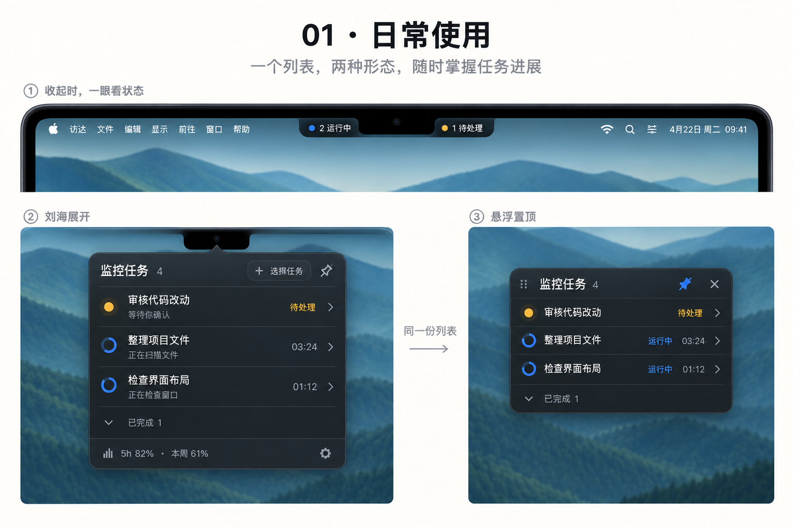

# Codex Top

原生 macOS Codex 任务监控工具：在屏幕顶部查看状态，将同一份任务列表悬浮置顶。

**开发中。** 当前 M1 已完成只读任务接入、状态解析和监控规则；图形界面与应用安装包正在实现。以下图片是设计概念，不是已发布应用的截图。



## 计划体验

- 刘海、普通屏幕顶部和置顶浮窗，共用一份关注列表。
- 历史任务搜索、多选、全选当前结果；新任务自动加入。
- 待处理优先，已完成折叠，子任务归入主任务。
- 支持外接显示器、固定屏幕选择、断开后找回窗口。
- 只读本地 Codex 数据；不读取认证文件或上传任务内容。

## 当前可运行的诊断工具

要求 macOS 14+、Xcode 的 Swift 6 工具链。无需第三方 Swift 依赖或 API Key。

```sh
swift test
swift build -c release
.build/release/codex-top-inspect
```

默认使用 `CODEX_HOME` 或 `~/.codex`，也可以指定 `--root /path/to/codex-home`。诊断只输出任务数量、状态分布、读取字节数与耗时，不输出标题或对话正文。

## 数据与限制

任务状态来自 Codex 已落盘的本地数据库与日志，不等于跨进程实时状态。15 分钟没有新活动的运行记录显示未知；未明确识别的批准请求不会伪造为待处理。仅存在于远程/云端、尚未同步到本机的任务不在当前接入范围。

额度读取日志中的实际窗口；缺失时不显示模拟数值。Codex 内部格式可能变化，适配失败会明确提示。

## 文档与贡献

- [文档入口](docs/README.md)
- [当前状态和下一步](docs/STATUS.md)
- [需求与验收](docs/REQ-001-任务监控/requirement.md)
- [M1 验收记录](docs/validation/M1.md)

反馈问题时请描述 macOS、Codex 版本和复现步骤，不上传原始 `.codex`、认证文件或包含私人任务的截图。

## License

Copyright (c) 2026 BuTangTang. Licensed under [GNU GPL v3](LICENSE).

这是独立社区项目，与 OpenAI 没有官方关联。
