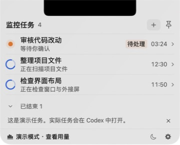
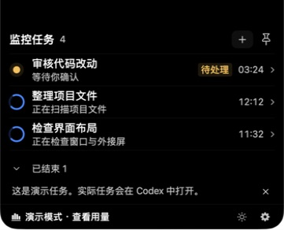
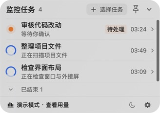
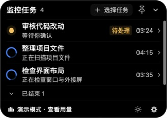
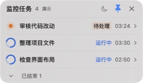

# Codex Top

**简体中文** · [English](README.en.md)

原生 macOS Codex 任务监控工具。在刘海附近、桌面浮窗或 44pt 小圆环中查看关注任务，不必频繁切回 Codex。

目前为 **Beta 预览版**。本轮 beta.3 修正主题扩散时快照与面板圆角不一致的问题；发布状态、校验值与验收范围以[版本说明](https://github.com/BuTangTang/Codex-Top/releases/tag/v0.1.0-beta.3)为准。

## 安装

要求 **macOS 14+**，提供 **Apple Silicon / Intel 通用 DMG**。真实任务需要本机 Codex 及已落盘的任务记录；账户额度需要官方 Codex CLI 已登录，无需在本工具中填写 API Key。

1. 从 [v0.1.0-beta.3 下载页](https://github.com/BuTangTang/Codex-Top/releases/tag/v0.1.0-beta.3)下载 DMG。
2. 打开 DMG，把 `Codex Top.app` 拖到“应用程序”。
3. 启动应用，左键点击状态栏图标查看任务；右键打开菜单，选择任务、显示方式或设置。

测试包使用 ad-hoc 签名，尚无 Developer ID 签名或 Apple 公证。若 macOS 阻止打开，请核实下载来源后按 [Apple 的说明](https://support.apple.com/zh-cn/102445)操作，不要关闭系统全局保护。

## 实际截图

以下均为**实际程序窗口**，来自独立测试副本，使用合成任务保护私人信息；不是设计概念图。示例模式不读取真实账户额度，下载包默认使用真实数据。截图仅展示静态外观，不代表帧率或全部场景已验收。

**刘海模式：beta.3，内置刘海屏，75% 显示比例。**

| 浅色玻璃 | 深色 |
|---|---|
|  |  |

**圆环展开面板：beta.2，80% 显示比例。**

| 浅色玻璃 | 深色 |
|---|---|
|  |  |

**桌面圆环与常驻浮窗：beta.2；圆环固定 44pt，浮窗为 80%。**

| 待处理圆环 | 紧凑浮窗 |
|---|---|
|  |  |

## 功能

四种显示方式共用一份关注列表：

| 模式 | 交互 |
|---|---|
| 刘海模式 | 左侧待处理优先，右侧剩余额度；悬停展开、离开收回，无刘海屏幕显示在上沿 |
| 常驻浮窗 | 紧凑任务列表持续置顶，顶部标题和留白可直接拖动，按钮除外 |
| 圆环 | 左键从圆环原位展开；移开鼠标保持，点击面板外、收起按钮或 Escape 缩回；右键打开菜单 |
| 仅状态栏 | 透明背景的状态计数；左键显示/收回任务，右键打开菜单 |

- **任务选择**：搜索、多选、全选当前结果；新建并开始的任务默认自动加入，手动排除优先。子任务归入主任务，待处理优先，已结束可折叠。任务创建、回答和批准仍在 Codex 中完成。
- **状态提醒**：运行蓝弧持续旋转，圆环中心显示运行数量；待处理有提醒底色与 `!`，浅色主题用橙色、深色用琥珀色，失败红色，完成绿色。需要处理时轻微呼吸，系统“减少动态效果”保留静态提示。
- **固定耗时**：待处理标签后的 `mm:ss` 表示本轮开始到当前等待开始的经过时间，等回答时不增长；缺少有效时间不估算。它不是 CPU 用时，也不扣除本轮更早的等待。
- **外观与位置**：黑色/浅色玻璃一键切换，从点击处向外扩散；beta.3 让快照匹配实际圆角边、曲线和缩放。显示比例为 60%–120%，每 5% 一档，可恢复 100%；圆环保持 44pt。外接屏和常驻浮窗采用紧凑字号，60%–75% 的选择入口缩为加号。
- **自由拖动**：常驻浮窗与展开圆环的顶部除按钮外均可拖动。拖到屏幕顶部不会自动吸附或切状态栏，显示方式由菜单切换；展开圆环移动后收回到新的球位置。
- **任务与额度入口**：点击任务尝试打开对应 Codex 对话，点击额度打开[官方用量网页](https://chatgpt.com/codex/settings/usage)。额度自动约 60 秒刷新、手动最短 5 秒，单次超时 15 秒；悬停可看来源、更新时间和重置时间。

应用激活时，`⌘,` 打开设置，`⌘T` 显示任务。详细操作见[使用说明](docs/usage.md)。

## 数据与限制

- 默认使用 `CODEX_HOME` 或 `~/.codex`，也可手动选择数据目录。只读任务元数据和增量日志，不修改 Codex 数据，不上传任务内容；账户认证由官方 CLI 管理，本工具不直接读取或复制认证文件。
- 状态来自已落盘记录，不等于跨进程实时状态。运行记录 15 分钟无新活动显示未知；未同步到本机的远程/云任务不在接入范围。初次有限尾读可能缺少更早的等待事件，增量积压时显示“正在同步任务活动…”。
- 主额度只使用当前账户接口。日志额度单独标为历史，读取失败不拿旧账号或日志回填，也不补造缺失周期。“暂停任务刷新”不暂停额度；外部换号在下一次实际读取时反映，不保证瞬时检测。
- Codex 内部格式可能变化；任务跳转终点、真实换号、物理拔插/合盖、完整鼠标拖动和动画帧率仍有未验范围，详见[当前状态](docs/STATUS.md)与[验收对照](docs/validation/acceptance-matrix.md)。
- **目前仅实现 macOS 版。** [Windows 开发提示词](docs/handoff/windows-implementation-prompts.md)用于后续交接，不代表已有 Windows 软件。

## 本地构建

需要 macOS 14+、Swift 6 工具链（Xcode）。采用 SwiftUI、AppKit 和系统 SQLite，无第三方 Swift 运行依赖。

```sh
swift test
bash scripts/build-app.sh
```

打开 `dist/Codex Top.app` 使用真实任务。仅体验示例界面时：

```sh
bash scripts/build-app.sh --demo
```

`dist/Codex Top Demo.app` 使用独立设置和合成任务，不读取本机任务或账户额度。切回真实使用前先退出 Demo。

构建脚本默认本机架构和 ad-hoc 签名；通用构建、ZIP/DMG 打包与只读诊断工具见[开发说明](docs/development.md)。测试通过不代替实际应用和物理设备验收。

## 文档与贡献

- [使用说明](docs/usage.md) · [开发与打包](docs/development.md)
- [文档与提示词入口](docs/README.md) · [Windows 开发提示词](docs/handoff/windows-implementation-prompts.md)
- [当前状态](docs/STATUS.md) · [实际验收记录](docs/validation/notch-orb-refinement.md)

欢迎通过 [Issues](https://github.com/BuTangTang/Codex-Top/issues)反馈或提交 Pull Request。请提供 macOS/Codex 版本与复现步骤，不上传原始 `.codex`、认证文件或私人任务截图。

Copyright © 2026 BuTangTang。使用 [GNU GPL v3](LICENSE) 许可证。独立社区项目，与 OpenAI 没有官方关联。
