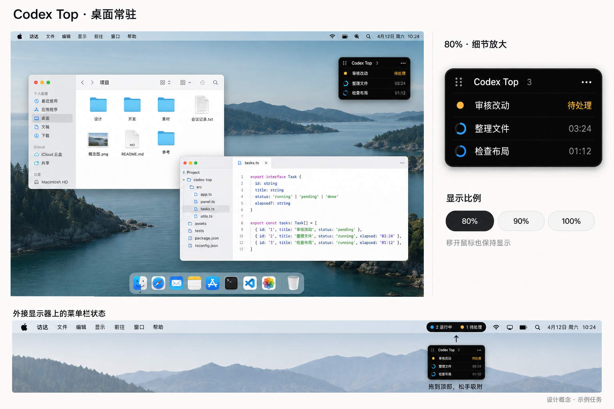

# Codex Top

原生 macOS Codex 任务监控工具。在刘海附近查看任务，也可以留下一个很小的桌面圆环或常驻浮窗。

**开发预览版。** 原生界面和本地只读数据接入已可运行，尚未发布正式版本。外接屏拔插、真实悬停和动画流畅度等验收仍在继续，详见[当前状态](docs/STATUS.md)。

## 四种显示方式

| 模式 | 使用方式 |
|---|---|
| 顶部 | 刘海两侧显示数量，普通屏使用顶部胶囊；悬停展开 |
| 常驻浮窗 | 紧凑任务列表，移开鼠标仍保留；拖动左上角手柄移动 |
| 圆环 | 44pt 单细环常驻，悬停或点击原位放大成任务窗口，收起变回圆环 |
| 仅状态栏 | 运行/待处理计数放入系统状态栏，通过菜单显示任务 |

四种模式共用同一份关注列表。拖动浮窗或圆环到屏幕顶部附近，松手可收进状态栏。展开列表支持 80% / 90% / 100% 显示比例、纯黑和浅色玻璃配色。圆环用蓝色旋转、琥珀呼吸、红色提示、绿色完成动画表达任务状态。

历史任务可搜索、多选、全选当前结果；新建并开始的任务默认自动加入。待处理优先、已结束折叠、子任务归入主任务。任务创建、输入和批准仍在 Codex 中完成。

下面是**设计概念图**，含示例任务，并非当前应用截图：



## 本地构建

要求 macOS 14+ 和 Swift 6 工具链（Xcode）。无需第三方 Swift 依赖或 API Key。

```sh
swift test
bash scripts/build-app.sh --demo
```

双击 `dist/Codex Top Demo.app` 试界面。演示包使用独立设置和合成任务，不读取本机 Codex 数据。

构建实际监控应用：

```sh
bash scripts/build-app.sh
```

双击 `dist/Codex Top.app`。状态栏菜单可选择任务、改变显示方式、打开设置和找回窗口。应用激活时 `⌘,` 打开设置，`⌘T` 显示任务。

构建脚本默认使用本机架构和 ad-hoc 签名，尚无 Developer ID 签名或 Apple 公证。ZIP 打包和 universal 参数见[开发说明](docs/development.md)。

## 数据与限制

默认使用 `CODEX_HOME` 或 `~/.codex`，可在设置里选择其他 Codex 数据目录。应用只读本地任务元数据和增量日志，不读取认证文件或上传任务内容。

任务状态来自已经落盘的记录，不等于跨进程实时状态。15 分钟没有新活动的运行记录显示未知；没有明确等待事件时不假称需要批准。仅存在于远程/云端、尚未同步到本机的任务暂不在接入范围。

额度读取日志实际窗口，缺失时显示不可用。Codex 内部格式可能变化，适配失败会提示。当前几何规则覆盖多屏/负坐标/断开回退，但物理拔插与合盖尚未全部实测。

只读诊断工具可用于反馈数量和耗时，不输出标题或对话正文：

```sh
swift build -c release
.build/release/codex-top-inspect
```

## 文档与贡献

- [使用说明](docs/usage.md)
- [开发说明](docs/development.md)
- [文档入口与阶段计划](docs/README.md)
- [实际验收记录](docs/validation/M2.md)

反馈时请描述 macOS、Codex 版本和复现步骤，不上传原始 `.codex`、认证文件或私人任务截图。

Copyright (c) 2026 BuTangTang. Licensed under [GNU GPL v3](LICENSE)。独立社区项目，与 OpenAI 没有官方关联。
