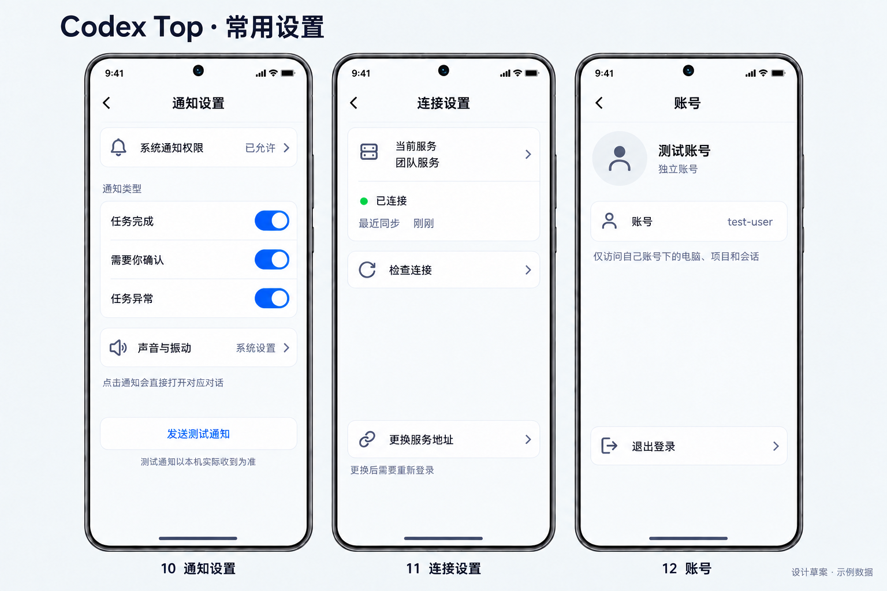

# 详细设计 v0.2：简化账号设置图

2026-09-24。用户确认账号精简并要求修改后划分 tasks；用内置 imagegen 对 [v0.1 设置板](../design-v0.1/02-settings.png)做局部编辑，不覆盖原图。



当前账号页只保留账号标识、独立账号说明和退出登录；已去掉“修改密码”行，标题收敛为“账号”。左侧通知、中间连接沿用原方案。已检查新增内容与禁用功能入口、中文和遮挡，图为 1536 × 1024 设计示例，不是运行截图。

当前实现依据为[设计 v0.2](../../detailed-design.md)和[任务总表](../../tasks/progress.md)。原始输入保持留档，以下是完整编辑提示词：

```text
Use case: precise-object-edit / ui-mockup. Edit the supplied Codex Top settings design board. This is a narrow content simplification approved by the user. Preserve the entire left “10 通知设置” phone and middle “11 连接设置” phone, top heading “Codex Top · 常用设置”, board geometry, fonts, colors, crisp Chinese, margins, phone frames, background and footer exactly. Change ONLY the RIGHT phone and its label: rename the topbar “账号与安全” to “账号”; preserve the small avatar, “测试账号”, “独立账号”; preserve the account identifier row “账号  test-user”; COMPLETELY REMOVE the “修改密码” row and its lock icon/chevron, collapse the vacated row so only a compact account identifier card remains. Preserve the explanation “仅访问自己账号下的电脑、项目和会话” below the smaller card. Preserve the quiet “退出登录” button near the bottom and back arrow. Outside phone change label to “12 账号”. No password change, registration, activation, recovery codes, reset, device management or QR actions anywhere in this account page. Leave clean white space, do not add replacement feature cards. Landscape opaque image same dimensions. This is a design board, not implemented app.
```

