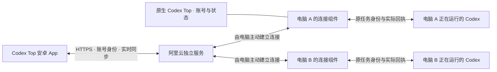
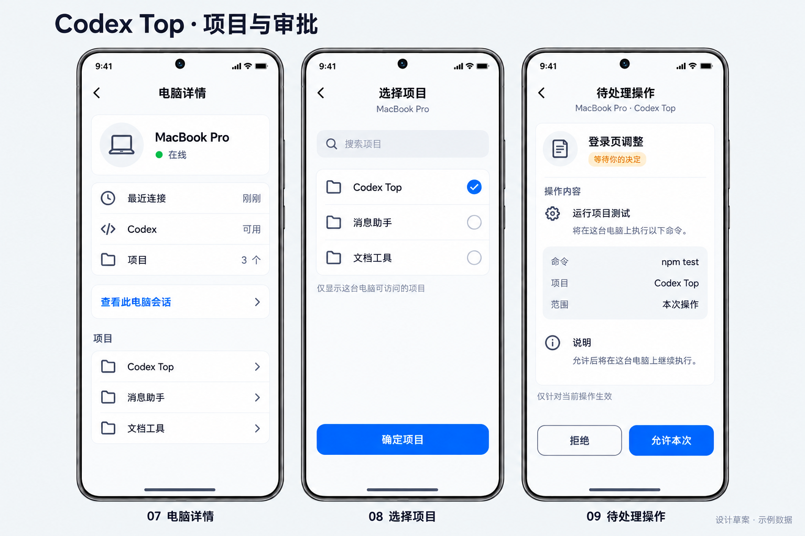
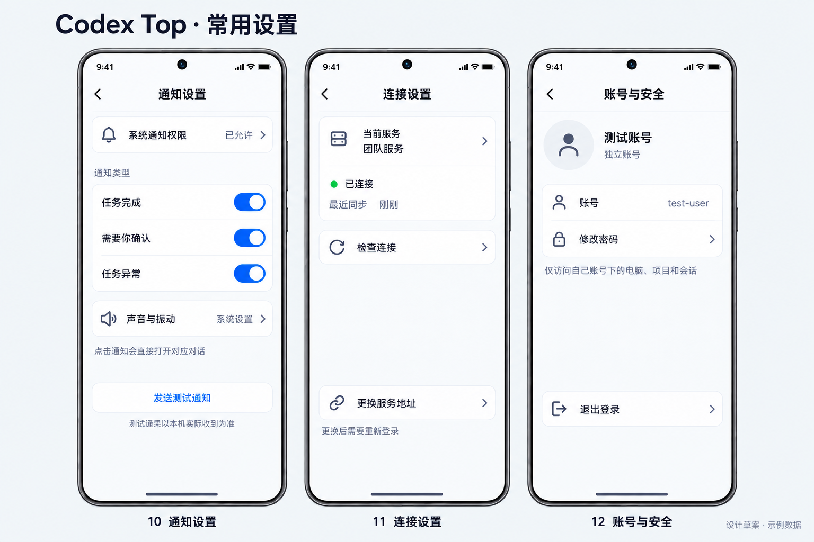
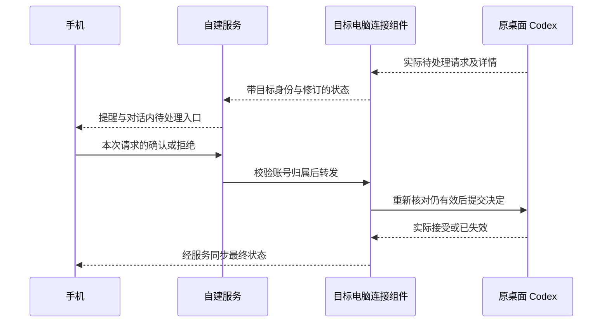

# REQ-002 详细设计

版本：v0.1 设计草案，2026-09-24，待用户审核。

依据：[需求 v0.9](requirement.md)、U-01 两板六页、D-01 全部可访问历史、D-02 手机审批、D-03 独立账号。提交完整需求审核后，用户回复“下一步”，按该上下文记录为通过需求、进入详细设计。本文件中的实现选择和新增页面是本阶段提案，不表示用户此前逐项批准，也不表示功能已实现。

本轮只读核对现有源码并整理设计；不编写产品代码、不创建账号、不发送真实任务或审批、不安装 APK、不部署服务。本阶段不创建 tasks。

## 1. 设计结论

保留原生 macOS Codex Top 监控界面，增加账号与电脑连接入口；手机复用已有 React Native 客户端的会话、导航、消息和通知基础。阿里云服务负责账号、路由、数据同步和通知转发；任务始终由所选电脑已打开的 Codex 管理。

日常界面只有“会话 / 电脑 / 我的”。所有可访问的原任务统一显示，以电脑与项目筛选；底层来源标识继续用于校验，不再要求用户区分“云端会话”“电脑会话”或安装执行器。复用开源代码不等于接受其默认界面或接管流程。

电脑不用开放公网入站端口。架构中的“电脑 B”是多电脑目标，不表示 Windows 适配已完成；当前桌面私有接入仍有平台和版本限制。

## 2. 现状与复用边界

本表为 2026-09-24 本地源码核查，未提交的代码也算“存在”，不算“已交付”。旧 `android/bridge/relay` 实验目录只保留历史；不另外扩大为第二套产品。

| 能力 | 复用位置 | 当前结论和设计约束 |
|---|---|---|
| 手机主导航、列表、对话、设置 | `MobileBottomChromeHost`、`TabBar`、`SessionsList`、`SessionView`、`SettingsView` | 在既有 owner 内调整，统一列表；不平行新建另一套聊天界面。 |
| 多电脑历史 | `DAEMON_DIRECT_SESSIONS_CANDIDATES_LIST`、`listCodexSessionCandidates` | 查询不以 follow 为前提；分页、归档、完整性和账号范围仍须实测。查询用的进程不得用于接管执行。 |
| 原任务文本收发 | `desktopSessionControl`、`desktopIpc`、机器 RPC | 已有发现原 owner、发送与核对回执路径；历史 1.0.4 有空闲任务收发证据，本轮未重跑。 |
| 原任务状态观察 | `desktopConversationObservation` | 能识别待处理标识，但缺完整审批详情和决定提交；不能把其他执行器的权限接口视为可直接复用。 |
| 真实项目和 Desktop 原生新建 | 手机新建现走 `machineSpawnNewSession` | 独立 spawn 不满足原桌面任务目标。项目目录也不能仅以历史工作目录猜测；这是必补能力。 |
| 账号密码 | 密码参数／登录路由、协议封套、手机登录 helper | 已有候选源码，未完成两端真实验收；原生 Mac 尚无 Codex Top 产品账号登录。 |
| 通知路由 | `notificationRouting`、`pendingNotificationNav` | 保留目标和账号作用域；未登录冷启动、切服换号、重复通知仍需验证。 |
| 自建业务服务 | 原 Dockerfile `server` target、账号／机器／消息／推送注册 | 可复用；业务服务自托管不等于手机推送链路完全自托管。 |

证据入口见第 12 节。当前查询、渲染或静态测试成功不能替代真实桌面收发、审批或小米送达验收。

## 3. 页面与交互

### 3.1 已确认六页

沿用 [U-01 日常使用](assets/ui-2026-09-24/01-daily-use.png)与 [U-01 登录和设置](assets/ui-2026-09-24/02-login-create-settings.png)，不重新选择视觉方向。

| 页面 | 细化行为 | 返回及状态保留 |
|---|---|---|
| 会话 | 选择电脑、搜索、按项目或状态过滤；列出全部可访问历史；无关注前置要求。 | 同一账号内保留电脑筛选、滚动位置和搜索条件；换号清空。 |
| 对话 | 标明电脑／项目；消息流、发送区、待处理操作入口共用同一任务身份。 | 返回会话列表原位置；草稿按账号、电脑、任务分区，不因列表筛选改变目标。 |
| 电脑 | 紧凑显示在线、离线及上次连接；点击进入电脑详情。 | 回到电脑列表原位置；单台离线不清空其他电脑。 |
| 登录 | 账号、密码、登录；连接设置为次级入口；字段旁显示错误。 | 登录成功恢复该账号可访问的通知目标，否则到会话；不消费其他账号通知。 |
| 新建 | 先电脑、再该电脑真实项目、再首条内容。更换电脑后清除原项目选择，保留输入草稿。 | 创建成功进入真实任务；创建与首条发送分别显示结果，失败不丢草稿。 |
| 我的 | 小型账号区；账号安全、通知、外观、连接、关于和退出分组。 | 所有设置子页用返回导航；不出现上游产品、扫码或终端安装入口。 |

图中的“全部电脑”只聚合已属于当前账号的电脑；首次可默认此视图。查询未完成显示加载状态或尚有更多，不能把一页数据当作全部历史。无项目关联的已有会话明确显示“未关联项目”，不造一个项目归属。

### 3.2 二级页面与补充草图

以下为本版设计提案；静态图片中的成功状态均是示例。

| 页面 | 内容与操作 | 异常处理 |
|---|---|---|
| 电脑详情 | 电脑名、连接状态、最近连接、Codex 可用情况、查看该电脑会话、真实项目列表。 | 离线保留已知信息并标记上次更新时间；不能把“服务器连接正常”当作该电脑可执行。 |
| 选择项目 | 当前电脑、搜索、项目列表、选中项、确定项目。 | 无项目给出“这台电脑暂无可用项目”；项目消失或无权访问时清除失效选择，不改发到其他目录。 |
| 待处理操作 | 任务与电脑、待批操作的真实说明、必要命令或文件范围、“拒绝”“允许本次”。 | 已处理／过期显示实际状态并禁用决定；拿不到完整详情时不开放盲目批准。 |
| 通知设置 | 系统权限、完成／待处理／异常分类、声音与振动的系统入口、测试通知。 | 权限关闭、通道不可用、测试未收到分别显示；服务器回执不能标为本机已收到。 |
| 连接设置 | 当前服务、连接状态、最近同步、检查连接；更换地址进入二级表单。 | 更换服务需要明确提交并重新登录；输入格式错误留在表单，不先清除当前有效连接。 |
| 账号与安全 | 账号标识、独立账号说明、修改密码、退出登录。 | 修改密码需恢复原账号密钥；不把“新建账号”描述成恢复原历史。 |
| 外观 | 跟随系统／浅色／深色；统一背景、分隔线、状态色与键盘配色。 | 保持选择并返回；不展示对用户无意义的渲染或模糊参数。 |
| 关于 | 原 Logo、Codex Top、实际安装版本、开源许可。 | 日常品牌统一，但依法保留依赖许可信息，不冒称上游政策或服务。 |

修改密码表单为旧密码、新密码、再次输入；提交中禁用重复提交，错误就近显示。成功后说明哪些设备需要重新登录。开通及恢复策略见第 4 节，尚未审核的细节不通过假按钮宣称可用。

通知点击先进入对话；如果有有效待处理请求，在对话内定位并展开相应审批详情，而不是先绕经独立通知列表。系统通知本身先不提供直接批准按钮，避免绕过查看详情；这是本设计建议，手机内确认／拒绝能力保持。

### 3.3 空态、异常及连续操作

- 没有电脑：显示“还没有连接电脑”，说明在电脑 Codex Top 登录同一账号；不展示扫码或 CLI 教程。
- 有电脑但尚未读到列表：加载占位与正文行接近，不能闪成“暂无会话”；失败提供原位重试。
- 电脑离线：缓存只作上次查看记录，输入仍可编辑；发送按钮说明暂不可发送，不自动积压指令。
- 发送结果未知：显示“正在核对发送结果”，保留原操作标识；先查结果，不生成新标识盲发第二次。
- 审批中被桌面先处理：原位更新“已在电脑处理”，不会再次提交相反决定。
- 正在执行时追加消息：目标体验为同任务追加；仅在接入版本已验证后开放。未具备能力时保留草稿并说明正在执行，不偷换为停止或接管。
- 登录失效：展示登录入口并保留受限的目标定位信息；不显示上一账号正文。切换其他账号不自动跳到原账号任务。
- 返回键先收起键盘，再回上一级；新建退出有未提交内容时保留本账号草稿。首条输入的发送结果不明时不退化为新的创建请求。

离线仅留草稿、审批先看详情和忙时能力门禁是本设计提案，不回写成用户先前已经提出的要求。

### 3.4 尺寸与切换流畅性

维持现有图片密度：主标题约 20sp、正文 16sp、次级 12–13sp、横向边距 16dp，顶栏约 52dp、底部导航约 56dp。列表以 64–72dp 为默认起点，长文字或字体放大允许增高；图标约 22dp但交互热区至少 48dp，不能为了紧凑缩小可点击范围。

同级主导航保持各自滚动位置，使用既有导航容器；子页使用单次系统式过渡，建议 180–240ms，尊重减少动画设置。网络读取不阻塞开始导航，旧页面不在新页面未就绪时突然变白。快速连续点击只打开一个目标；返回后迟到请求不得把页面带走。键盘、安全区域、底部手势条与输入框由同一个布局 owner 管理，避免重复加底部空白。

验收使用打包后的真机连续操作，并记录首屏、切换、滚动和键盘交互。性能目标是普通切换保持设备刷新节奏、无可见长停顿；以录屏和帧分析定位问题，不凭静态图宣称流畅。对照明暗主题、放大字体、长标题和长回复，保留来源名称可辨认。

### 3.5 原生 macOS 入口

在原 Codex Top 设置中增加“账号与手机连接”分组，不再新增第二份监控面板。未登录态包含小 Logo、账号、密码、登录与次级连接设置；已登录态显示账号、本机名称、服务连接及 Codex 可用情况，并提供退出。按现有 SwiftUI / AppKit 窗口规范布局，不用手机大卡片复制成桌面首页。

本机监控继续独立工作；账号服务失效只影响跨设备功能，不能清空或重置本机关注列表。Codex Top 服务账号与 Codex/OpenAI 账号是两个身份；现有“账户额度”不是本产品登录状态。电脑换号先停止旧账号的远程访问，再建立新账号连接，不能将旧账号历史自动归到新账号。

## 4. 账号、密钥与隔离

### 4.1 统一账号 owner

使用服务端原 `Account` 作为唯一产品身份。手机复用认证上下文、密钥解封和安全存储；Mac 原生表单通过本项目受限的本机连接组件调用同一认证逻辑，不能另存一套身份，也不能改 Codex 的 `.codex` 认证文件。连接组件使用独立产品目录，敏感输入不出现在命令行参数或日志中；仅允许当前系统用户调用。

已有候选登录链路为取密码参数、派生登录认证值、服务器认证、取得账号 token 和加密封套、客户端解封并校验账号公钥。**取得 token 和能够读取旧历史是两项独立条件**；二者一致后才提交新的登录状态。

现有代码使用标准密码派生和加密库组合，但这套组合协议本身并未完成安全审核，也不是 OPAQUE。派生登录认证值仍是可用于登录的敏感凭据，必须使用 HTTPS、限流且禁止记录；参数版本、密钥用途隔离、封套绑定账号和篡改拒绝均需验证。密码规则与派生参数不由 UI 各写一份，也不在本设计中凭猜测替换密码学协议。

### 4.2 建议的首次开户和恢复方案

为满足“先给同事一个账号”且保持日常登录简单，建议采用：

1. 部署管理员创建一个待激活的独立账号，生成一次性、限时的临时密码；它只授予该账号的激活权限，不能取得普通会话、读取历史或注册电脑。不建设公众注册页面。
2. 同事首次在 App 输入账号和临时密码后设置正式密码；客户端生成自己的账号密钥并上传加密封套。正式凭据、公钥、封套写入与一次性凭据消费必须原子完成；并发激活和响应丢失后的重试只恢复同一结果，不创建第二个身份或替换已激活密钥。
3. 正常使用只显示账号、密码登录。管理员不持续托管可解密历史的明文恢复密钥，不用现有“管理员直接生成用户种子”脚本冒充已经落实本流程。
4. 修改密码须证明持有旧密码和原账号密钥，重新封装同一密钥，保留原历史；改密后旧登录凭据和其他设备会话的失效应有服务端校验。密码账号的密码、签名认证、配对和恢复入口必须统一执行撤销策略，不能让持有旧种子的设备绕过密码重新换取 token。保留历史解密密钥不等于继续认可它作为无条件登录凭据，也不能承诺撤销设备已经保存的明文或密钥。
5. 忘记密码优先由仍持有密钥的已登录设备恢复，或使用用户离线保存的恢复材料；两者都没有时不能承诺找回加密历史。服务端托管恢复密钥若另行选择，需要重新说明信任边界。

以上是待审核的具体设计选择，并非对“账号独立”的扩写确认。首次开通、改密与恢复所需逻辑尚不能全部由目前两个登录路由完成；列入能力缺口，不把未实现按钮当作完成。已有测试账号迁移单独执行保留密钥的绑定流程，不替换成新账号、不把旧数据复制给同事。

### 4.3 账号和电脑的边界

服务端从认证凭据确定账号，不信任客户端传来的账号标识；机器、项目、会话、审批和推送目标都二次核验归属。列表过滤只是展示，读取详情、写操作和通知投递必须各自执行同样校验。

一份电脑连接配置只属于一个产品账号；机器显示名不作授权标识。同一物理电脑更换账号不自动移交之前连接配置的任务或缓存。不同人员第一版使用独立系统用户及各自 Codex 数据源；仅工作空间或产品账号切换不能隔离共享系统用户能读取的凭据与本地数据。共享系统用户换产品账号时，尚未建立可信且可执行的历史归属边界就禁止接入该共享数据源，不能一经确认就将全部历史归给新账号。“全部可访问历史”指已建立隔离的授权来源；跨账号共享不在当前范围。

退出／换号顺序：停止旧账号订阅和待提交操作 → 注销该设备推送归属与会话 → 清除展示、草稿、通知和内存密钥 → 提交新账号状态 → 获取新账号列表。持久缓存按服务和账号分区，旧异步请求携带登录代次，迟到结果不能重新写回。

现有 token 和退出代码主要是本地清除，不能提供远程撤销保证。需要服务端会话撤销或认证代次，并在所有认证入口、HTTP、实时连接和机器操作中校验；旧连接重新鉴权和签名换取新 token 都不能绕过撤销；选择具体存储扩展前先核查原 owner，避免平行维护第二套会话表。离线退出立即清除本机，联网注销有可追踪结果，不能谎称其他设备已经退出。

## 5. 电脑接入、身份和消息顺序

### 5.1 固定路由身份

所有路径沿用同一逻辑身份：服务、账号、机器、来源、原任务。服务由规范化配置识别；账号来自鉴权；机器使用稳定 ID；来源与原任务保持原 Codex 身份。标题、项目名、当前筛选和消息正文都不能作为路由键。

底层关联用的客户端会话 ID 与 Desktop 原任务 ID 必须可核对映射，不相互替代。打开对话时锁定目标，发送、回执、审批、通知定位和历史分页均携带该目标；切换首页电脑筛选只影响列表。项目身份绑定电脑，在创建前由电脑核对；手机不提交任意本机绝对路径作为授权依据。

监听生命周期的身份只含稳定目标字段，不把关注开关、活动时间或状态回声放入身份键，避免重新挂载和永久加载。目标真的改变时释放观察和忙碌状态，再建立新观察。

### 5.2 桌面兼容能力

连接组件读取实际桌面版本并报告历史读取、发送、新建、忙时追加和审批能力。在线状态与这些能力分开；未知版本或入口失败时停止相应操作并明确提示，不回退到新执行器。

现有 macOS 路径是私有桌面协调协议，包含发现原 owner、跟随快照、向原 owner 发送等步骤；不能标成官方第三方稳定 API。必须验证原 owner 与任务一致，并在发送后核对真实轮次回执。Windows 当前路径明确不支持，Linux 的代码放行也不是实测通过。

不能将当前 Codex 对话中可用的工具当成可嵌入产品的 SDK，也不能启动独立 app-server 后 resume 原任务来冒充桌面同步。若原生新建或审批没有可验证入口，应报告设计阻断，不删掉需求，也不通过改写数据库或认证文件绕过。

### 5.3 历史与项目

历史列表复用候选查询和分页，不依赖通知关注；分页游标绑定机器、账号和查询条件。汇总结果保留不完整标记，同名任务按 ID 区分。正文在用户打开后按需读取，避免登录就复制所有电脑的全部正文；缓存按账号分区并有容量上限。

项目来自电脑真实可用的项目来源或明确配置的项目映射。历史会话的工作目录只能作为关联候选，不自动升级为“可创建项目”。打开历史与创建任务权限分别验证；归档历史也必须能按真实能力读取，不只展示当前已加载任务。

### 5.4 发送与创建

用户可见状态收敛为“发送中”“已送达”“结果待核对”“发送失败”；任务本身的运行／完成／待处理另行展示。已送达只能来自原 Codex 接受，不从服务接收或文本回显推断。

手机为一次操作保留稳定请求标识。服务和电脑对同一身份、标识及内容核对一致性；同一标识不同目标或内容拒绝。电脑在交给原 owner 前记录接收，在获得可对应的回执后记录结果；崩溃或断线后的不确定窗口保持未知，通过原任务证据核对，不承诺底层未提供的 exactly-once 语义。

新建与首条发送分两步追踪：创建请求只有取得原 Desktop 真实任务 ID 才成功；首条消息沿用发送流程。创建成功但首条失败时打开已创建任务并保留草稿，不再创建另一个任务。取消手机等待不等于撤销电脑已执行的动作。

## 6. 手机审批

审批对象必须来自原桌面真实待处理请求，至少能定位任务、轮次、请求、请求修订和允许的选项。UI 展示对应操作的真实内容及作用范围；不能把工具输出中的文字当作授权指令。

决定绑定本次请求，不更改该电脑全局审批策略。提交期间两个按钮一起禁用，重复点按沿用同一决定标识。桌面与手机同时处理时，以原 owner 的真实结果为准；请求已失效不提交后来的相反决定。迟到通知只是查看入口，不能重放授权。

尚无真实 owner 审批回执时，显示提交中或结果待核对；不能乐观移除卡片当作成功。断网前提交是否已到达不明时先查原请求状态。审批拒绝、审批过期、任务取消是不同结果，不统一显示“执行失败”。

## 7. 通知、实时同步与后台

前台对话使用既有实时同步；后台通知使用推送通道。完成、需要处理、异常只在真实状态变化时生成事件，以账号、机器、任务、事件标识去重；不能用通知关注集合限制历史列表。拟默认接收当前账号电脑的这些事件，可在设置关闭类别；关注状态仅作为通知偏好，不影响浏览权限。

推送载荷只带必要目标和状态，默认不含完整正文或命令。点击后验证账号和来源，再复用会话导航。未登录时暂存无正文目标，登录到匹配账号后恢复；登录另一账号时不读取原目标。重复通知只打开一份对话，不叠加相同路由。

Android 13 及以上通知权限需要用户授予，设计在用户启用通知时请求，拒绝后保留聊天能力并显示系统设置入口。[Android 通知权限](https://developer.android.com/develop/ui/compose/notifications/notification-permission)

目前 Android 推送候选通过 Expo 交给 FCM。Expo receipt 表示下游推送服务的接收情况，不是手机展示回执；同一通知可能重复或未送达，因此要独立验证小米后台、锁屏与进程被系统回收场景。[Expo 推送说明](https://docs.expo.dev/push-notifications/overview/)、[送达保证与排查](https://docs.expo.dev/push-notifications/faq/)

国内小米的系统服务与网络条件本轮未检查。正式路线先验证现有渠道；若不可用，再选择可用的厂商推送适配并补齐配置、凭据和验收，不用无期限后台轮询或前台长连接冒充可靠推送。通知设置中的“已允许”与“推送可用”分开呈现；测试按钮的结果不能只看服务器 200。

## 8. 最小契约与接口复用

以下列现有入口及必要逻辑增量；**不是已经冻结的新 API 清单**。增量名称只是能力名，选定 owner 和协议后才定义字段、版本、错误码与端点。

| 能力 | 已存在的入口或 owner | 需要补齐 |
|---|---|---|
| 密码登录 | `POST /v1/auth/password/parameters`、`POST /v1/auth/password/login` | 两端同账号解密、登录切换保护；激活／改密／恢复／撤销能力另核定，不能只靠登录接口假装已完成。 |
| 电脑及历史 | 机器列表、`daemon.directSessions.candidates.list` 和读取关联 | 所属账号校验、分页完整性、统一呈现、真实项目。 |
| 同任务消息 | 原机器 RPC、Direct Session 发送 owner | 固定请求身份、忙时能力、未知结果核对和真实回执。 |
| 原生新建 | 尚无符合本需求的已验证入口 | 输入为目标电脑和真实项目，输出为原 Desktop 任务 ID；不能复用 spawn 语义冒充。 |
| 审批决定 | 观察 owner 有待处理标识，缺完整详情和决定入口 | 真实请求、修订、选项、单次决定与最终回执。 |
| 推送注册与导航 | `POST /v1/push-tokens`、`GET /v1/push-tokens`、`DELETE /v1/push-tokens/:token`、通知 routing owner | 当前设备账号绑定、换号注销、未登录目标恢复、通道实机可用性。 |
| 能力与状态 | 既有机器状态及状态流 | 对外只展示用户可理解状态；内部区分连接、版本和各操作能力。 |

共用请求校验、路由、错误和回执 owner；不单独给每个页面创建业务接口，不引入平行自研中转协议。旧 [mobile-cloud-contract.md](mobile-cloud-contract.md)里的候选自研端点不作为本版接口依据。

## 9. 阿里云部署设计

部署位置建议继续使用 `/opt/codex-top`，内含独立 `compose.yaml`、受限环境文件、版本目录、持久数据和备份目录。使用自己的 Compose project、网络、数据卷、数据库、服务密钥与日志，绝不借用 PVTC 数据库或部署脚本。

复用已有 Dockerfile 的 `server` 构建目标，应用容器内端口为 3005，非 root 运行；宿主映射端口先做只读占用检查，并只绑定回环，通过独立 HTTPS 域名入口访问。域名、证书及现有代理归属未取得，本文不虚构可用地址，不改 PVTC 入口或开放未确认的外网端口。

起步可采用现有 light / SQLite 持久化模式，数据目录同时保存数据库、文件和服务主密钥；备份必须同一一致性时点，密钥独立受限保存，验证恢复后才视为可用。不能只备份数据库就承诺恢复完整服务。

资源限额根据部署前的只读 PVTC 基线确定：内存、CPU、进程数、日志轮转和备份占用都有限制；不在不了解主机余量时随意写固定配额。构建使用隔离环境，不在运行 PVTC 的宿主上无限占用构建资源。构建上下文先排除 `.local`、账号材料、服务数据和原始诊断产物。

发布、回退和停止均显式指定本项目；新版本先核对健康、账号和真实端到端操作，再更换入口。数据库变更有兼容与备份方案，回退旧镜像不自动回退不兼容数据库。部署前后对照 PVTC 健康、资源和端口；如资源不足，改用独立主机，不声称 Docker 能消除资源竞争。

## 10. 验证与交付门槛

这部分规定设计如何验收，不是已开始的实施任务清单。

| 领域 | 必须验证的场景 | 通过标准 |
|---|---|---|
| 账号 | 两个账号，两端登录，错密、换号、退出、旧异步回调、改密、恢复；激活并发、过期和响应丢失；持旧种子走旧认证入口、旧连接重新鉴权、共享数据源换号 | 身份与解密材料一致，临时凭据只可激活且不能替换已激活密钥；旧认证入口不绕过撤销，共享来源无可靠边界则拒绝接入，不泄漏旧账号正文。 |
| 历史 | 未关注任务、归档、多页、同名任务、离线和不完整列表 | 全部可访问范围可达，未加载不等于没有，不越权。 |
| 项目／新建 | 多台电脑同名项目、项目失效、重复创建、创建成功首条失败 | 原桌面真实任务存在，未重复创建或发送。 |
| 消息 | Desktop 同时开着，空闲、忙时、双端输入、断线和重启 | 原任务接收且回显；未知结果不自动二次执行，无接管执行器。 |
| 审批 | 允许、拒绝、过期、重复、桌面先处理、另一账号目标 | 原请求最终决定一致；过期和越权不能执行。 |
| 通知 | 前台、后台、锁屏、系统回收、冷启动、未登录、换号、重复和跨网 | 小米实际送达与点击定位分别留证；不拿服务 receipt 替代。 |
| 界面 | 所有主／子页、连点、返回、键盘、旋转／大字、明暗主题、长消息 | 不闪旧品牌、不叠页面、不遮输入、不丢目标，连续操作顺畅。 |
| Mac | 登录前后、服务中断、账号退出、内外接屏原监控 | 本机只读监控保持可用，跨设备状态真实，只有预期实例。 |
| 部署 | HTTPS、长连接、断线恢复、备份恢复、资源限额、PVTC 对照 | 新服务可恢复，PVTC 无非预期变更。 |

单元测试聚焦账号边界、身份稳定性、回执与时序，不用纯样式镜像测试替代实机。构建、APK 安装、服务健康、桌面行为、小米通知和公网验收分别记录；只有最后链路通过才描述为功能完成。

## 11. 设计审核重点与未解除的技术风险

本版具体建议包括：受控待激活账号、客户端生成账号密钥、单次审批先展示详情、离线只保留草稿、原生 Mac 复用统一认证 owner。请在审核设计时一并确认；这些不更改已经通过的独立账号、同任务收发、新建和审批目标。

下列是尚待验证的接入条件，不能通过批准设计自动视为已具备：

- Desktop 原生项目／新建、真实审批提交及忙时追加的可用入口与实际回执。
- 私有桌面协议的版本兼容和 Windows 适配；未知平台不能自动转入其他执行器。
- 密码候选协议、首次激活、旧密钥绑定和服务端会话撤销的完整性。
- 共享系统用户换账号时的本地历史授权边界；没有可执行隔离就禁止接入该来源，不能仅按目录可读性归属新账号。
- 小米推送实际渠道、正式推送配置及跨网送达；独立域名、证书和部署资源基线。

必要能力无法实现时，先把证据与可选方案交用户讨论；保持需求原文，不以隐藏入口或更换流程冒充满足。

## 12. 核对来源与审核记录

源码均为本地只读核对，链接指向相邻工作区，供维护者定位；本文件不含账号、密钥或真实对话正文。

- [桌面发送 owner](../../../happier/apps/cli/src/backends/codex/directSessions/desktop/desktopSessionControl.ts)、[桌面协议连接](../../../happier/apps/cli/src/backends/codex/directSessions/desktop/desktopIpc.ts)、[审批状态观察](../../../happier/apps/cli/src/backends/codex/directSessions/desktop/desktopConversationObservation.ts)。
- [机器 Direct Session RPC](../../../happier/apps/cli/src/api/machine/rpcHandlers.directSessions.ts)、[既有 RPC 常量](../../../happier/packages/protocol/src/rpc.ts)。
- [密码登录路由](../../../happier/apps/server/sources/app/api/routes/auth/registerPasswordAuthRoutes.ts)、[密码封套协议候选](../../../happier/packages/protocol/src/auth/passwordAuth.ts)、[手机登录 helper](../../../happier/apps/ui/sources/auth/flows/passwordLogin.ts)。
- [手机主导航 owner](../../../happier/apps/ui/sources/components/navigation/mobile/chrome/MobileBottomChromeHost.tsx)、[通知路由](../../../happier/apps/ui/sources/activity/notifications/notificationRouting.ts)、[待跳转作用域](../../../happier/apps/ui/sources/sync/domains/pending/pendingNotificationNav.ts)。
- [原生设置](../../Sources/CodexTop/Views.swift)、[原生额度协议](../../Sources/CodexTopCore/AccountUsageProtocol.swift)为核对边界，后者不等于产品账号。
- [历史手机验收](../validation/happier-mobile.md)、[早期接入调查](codex-integration-check.md)只引用其明确记录的时间和场景，不扩为本轮验收。
- [补图与生成提示词](assets/design-v0.1/prompts.md)。UI/UX 本地指南用于返回导航、键盘、触控区域与状态连续性；已确认 U-01 优先。

2026-09-24：用户在完整需求审核邀请后回复“下一步”，进入本设计阶段。详细设计 v0.1 尚未获用户审核；代码实施、设备调试与部署仍暂停。
