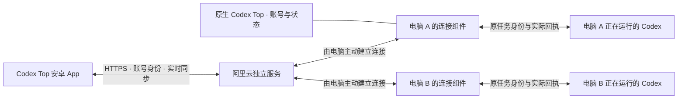
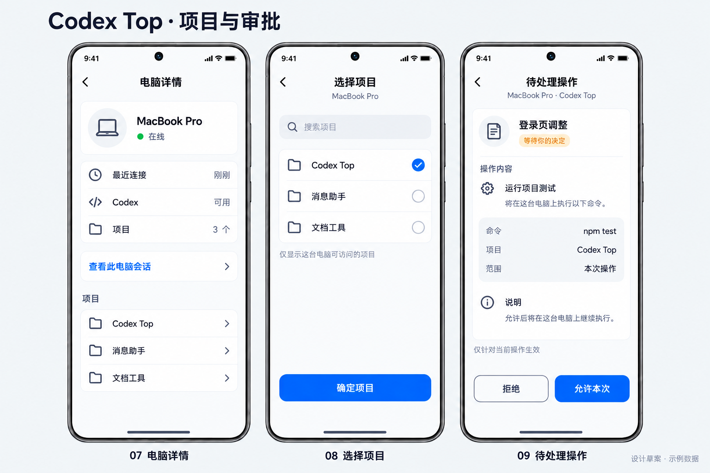
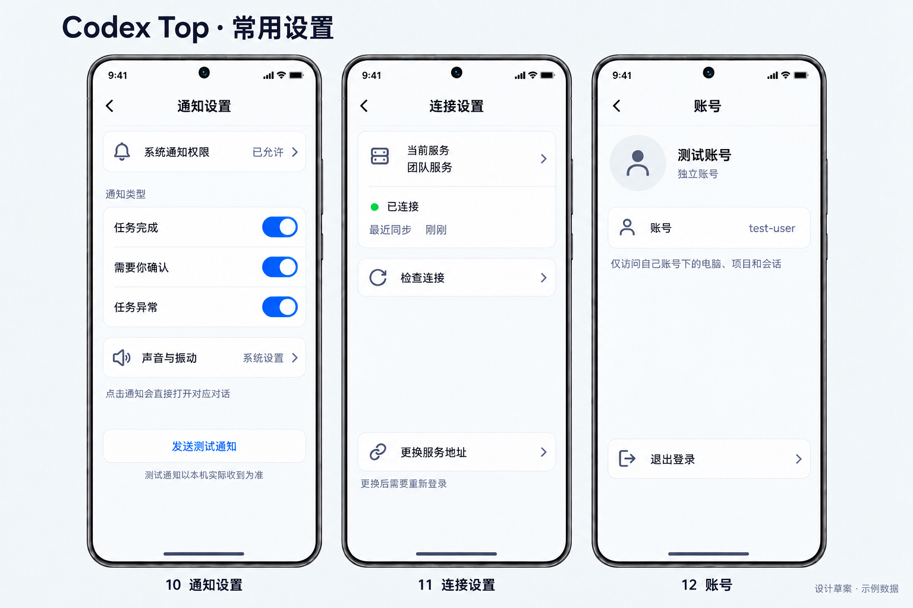
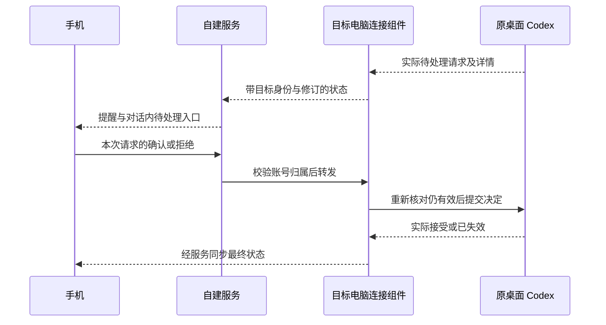

# REQ-002 详细设计

## 2026-10-02 内容摘要、额度本地恢复与风格探索增量

D-39覆盖下文D-36／D-38的副标题与状态位置：原`DialogCell`左侧第二行仅显示真实草稿／消息／附件预览，右侧时间下方独立布局状态及14dp原运行环。最新预览从现有`TranscriptWindow`取最后一个可见项，沿已有串行历史读写路径投影为原`MessageObject`；不再取任务时间或标题猜内容，不调用会触发新消息通知的上游更新路径。真实预览变更沿原消息文字更新事件重建所属Codex行，避免仅日期／标题Diff漏掉同秒消息或迟到预取。右列保留宽度、省略规则、主题、未读、多选与左右方向，不改状态有效性。

D-40在原Runtime额度所有权内增加被动本地存储，按服务器／产品账号隔离文件，内部按机器保存原实际快照和最后选中的机器。复用原本地JSON原子读写及后台本地读取队列，先恢复后发布已有缓存；网络沿原同账号代次／机器／连接的在途读取合并。失败保留原快照和采集时间；明确`account_changed`只清对应机器，晚到响应不能跨代次写盘。已有值后台读取时不清空页面、不显示初次读取占位；无缓存才保留原加载说明，页面回访仅缺失或过期时按需更新。不新增RPC、轮询、owner或弹窗。

D-41按用户选择采用清爽像素浅色与深色像素两套主题，沿原Day／Night Theme生命周期与自动夜间切换整合，不在每页进入时改全局颜色造成闪烁。首次迁移先确认日夜记忆键落盘，再提交主题与成功标记；失败保留重试资格且撤回失败提交的内存值。像素仅用于少量24dp单色底栏图标及细节，正文保留原字体和气泡几何；中央壁纸路径返回平色，不删除用户文件。电脑／项目复用原语义素材，会话行不画头像代理。Cursor素材任务与主题整合任务分别独占文件，主管负责实际验收。

2026-10-02 D-41可读性增量：只在原色表补两侧链接、发出侧转发／回复／站点／文件文字及回复线共13键。回复名称、正文、媒体说明和站点名用正文色，链接与转发名用强调文字色，文件说明用次要文字色；原回复区10%／12%着色背景也纳入合成对比度检查。按钮和错误填充上的白字符号、壁纸与主题生命周期不改。颜色算法通过不代表实际媒体或ResourcesProvider已逐项实拍。

设置单元格只由本Factory的Codex包装和浏览入口显式标记，不按包名、icon、value或id猜测；普通Telegram及UserInfo复用原Factory不受影响。标识标题／副标题一行省略，缓存和刷新说明副标题最多两行，浏览错误标题最多两行。非mini的标记行按真实子控件自然高度测量，原50／60dp为下限；原mini44dp、RTL顺序、宽度权重、value语义和点击身份保持。每次绑定先恢复普通行策略，额度CharSequence与RelativeSizeSpan保留；字体使用DIP，合成高度测试不是Android字体或像素测量。

D-42先核对同步与异步原生提问的读取／提交契约，复用原控制状态、顶栏入口与选择表单。运行状态和待回复可以同时存在，入口更新不能依赖将任务误标成暂停；原题ID、选项、自定义权限、已答／失效与账号／连接代次保护保持。轻量提示沿已有入口，禁止自动弹出。

提问身份固定原账号对象、代次、Telegram账号槽、watch页面、电脑、remote、连接、来源kind/home及非空linked。UI入队时捕获已知linked；原null才沿原open引导，CAS不同并发目标拒绝、同值接纳，不覆盖或迁移。原SessionStatus.Store只读返回请求起点加15秒的到期时刻；缺失、缓存、未知、离线、错电脑、倒退、到期与溢出均无票据。UI将不可变期限交原approvalQueue，执行及issued落盘后外发前重核，不借后到状态续期，不在后台读写UI状态Store。身份判定不含期限，以免误关原表单；过期／未知立即禁用并保留草稿。原canAnswer、题目修订、完整答案和服务端动作门禁保持，不新增lease参数或owner。

D-43已独立核对官方会话原状态中的threadGoal，字段缺失与显式null分别表示未知与当前无目标；六种原目标状态及原预算／用量只能只读展示。现有控制／观察严格投影未携带目标，跟随租约还会过滤同轮终态后的变更，不能仅加字段就宣布接通。先实施纯模型／解析基础，再串行处理兼容传输与会话原详情或顶栏；专用follower目标写入方法未发现，不开放创建／暂停／继续／清除按钮。原interrupt路径可能间接暂停目标，不能借它冒充目标动作。不从运行时长、消息条数或任务创建时间造完成率，不新增手机目标owner或执行器。

慢冷读取的独立反例为初始化4999ms＋发现4999ms＋历史超时15000ms，共24998ms。目标冷读须从home／open／discovery前的单调时间起算，新增历史等待至多2秒，且不得超过该起点15秒的正剩余预算；无剩余预算不发历史请求，目标为未知，保留已证明的原能力。此限制只约束新增目标等待，不覆盖文件系统／连接／认证HTTP／手机传输的完整截止。原路径不增加读取，原来源或lease撤销仍须中止，不能冷重开。

目标传输沿原`daemon.directSessions.status.get`显式`includeGoal: true`，成功响应的`goal`为可选兄弟字段，不塞入严格的`observation`或控制快照。未请求保持旧响应形状且不增加读取，旧组件缺字段仅为未知；预算／用量的null和真实0分开，原更新时间与耗时保留秒。沿原外部能力查询借用连续控制证明；冷读取在同一连接只发现一次owner并于finally关闭，目标解析先于控制详情的严格过滤。目标读取失败不能否定已证明的原发送能力，认证／来源／目标及原lease在等待后均须复核，撤销不得变成缺连接后的冷读。终态后的原修订仍可更新目标，不以生命周期运行中作为读取条件。原发现5秒与历史15秒即使不重复发现也不等于手机20秒RPC全链路保证，需另测网络与关联开销；本片不加重试或另一轮询。

Android当前聊天在同一次原STATUS显式取目标，原SessionStatus.Store独立保留请求起点与目标有效期；LIST更新生命周期不能给旧目标续期，迟到错误也必须通过账号／来源／关联会话／watch代次守卫。复用原48dp置顶容器和原会话详情，只显示实际状态与一行正文，不造消息对象。六状态均可显示；无正文的unknown／none／旧组件不占空栏，已有旧正文失效后标明“上次”。原搜索／多选隐藏，返回恢复，输入和原待回复／审批入口保持；原pin关闭／列表／长按跳转在该Codex栏停用。目标新增被动磁盘投影，只保存同账号、电脑、远端及来源的明确available／none；原SessionStatus仍为唯一事实owner，冷回放不能恢复有效期、linked或动作权限。读前2MiB、最多50整条及正文10000 UTF-16上限只限制本地投影；原全局队列串行写，原DialogStore临时写完后再检查身份并原子替换。一次冷恢复认领记在原Entry，LIST不重复读盘。九文件守卫通过、模拟器真实none已落盘，但离线旧目标显示及available冷恢复未实际闭合。此前原active目标与多选恢复已实拍，实体与目标切换仍待验。

## v0.3 原生手机端增量设计（2026-09-30，已审核）

2026-10-02 展示补核：none无正文不占空目标栏；冷恢复后unknown／offline详情显示未知或暂不可用符合D-43，不能据此判断缓存失败。独立原Store／Chat方法确认none墓碑阻止旧available目标复活；上文尚未闭合的实际冷恢复仅保留available旧正文场景。

浏览页沿原实例区分“已展示缓存”和“已发起读取”：电脑／项目／项目会话首次有缓存仍后台读取一次，已保留实例返回只更新原adapter，不再隐式刷新或失败自动重试。显式刷新、下一页及原失败游标重试保留，销毁与旧代次迟到响应继续拒绝；额度根页原缓存／过期按需读取规则不改。

**当前阶段：设计 v0.3 已通过，完成任务拆分，第一批实施中。** 2026-09-30，在展示本版并明确“请确认这版设计，确认后进入任务拆分”后，用户回复“下一步”，据此记录设计批准及任务拆分指令。[本批需求 v0.11](requirement.md#当前手机端需求汇总)此前已确认，无须重复审核。任务安排见[任务总表](tasks/progress.md)；技术接入条件与真实验收仍单独闭合，设计批准不等于这些能力已实现。

2026-10-01 按用户 D-35／D-36 增量反馈补充“我的”根页额度与空摘要副标题。会话列表／聊天／我的三屏静态图经普通 Markdown 重发后已确认可见，仅收图问题闭合；图中额度为示例，整套装饰、配色和布局尚未获批，不扩大本次原版控件适配范围。

只读源码基线：Codex Top `f2d7a8c`、Telegram Android `dc28c18`、Happier `2a84c29a5`；补核本机 `com.openai.codex` 程序资源版本 `26.924.51851 / 12111`。仅按 ASAR 成员偏移读取指定程序代码，未解包落盘、发实际 IPC、操作设备、读取真实认证或对话、调用在线额度接口。旧 RN 设计和 U-01 图片保留历史依据，当前视觉以所用 Telegram Android 版本为准。

2026-10-02 用户已授权开始界面优化，D-38 沿现有 `DialogCell`／`SettingCell` 收敛图标和内容层级：会话正常浏览不画大头像，回收前距，第二行保留真实内容并仅在有效运行时嵌入14dp原圆环；我的页额度前置、实际比例强调、原图标减量。保留原多选及其槽位，不新增页面或数据来源。下文原头像／设置图标初稿保留提出时设计，本次显示以此增量为准。

### 本版已审核要点

| 位置 | 本版采用的具体方式 |
|---|---|
| 主界面 | 原版底栏裁成会话／电脑／我的；进入聊天隐藏底栏，返回恢复原来源与位置。 |
| 会话左侧 | 原头像槽放任务状态：运行用原进度动画，完成用勾，待回复用提示标记；未读仍用原列表未读标记。 |
| 会话副标题 | 按 D-36 保留草稿和真实摘要优先；原摘要为空才显示现有真实状态说明，STATUS 更新沿原行重绘，不新增子任务统计。 |
| 聊天顶部 | 原返回与双行标题结构保持：第一行会话标题，第二行简短状态及电脑简称；完整来源点标题查看，不把项目名也堆在顶栏。 |
| 复制与提问 | 普通气泡单击不弹复制菜单，长按原菜单复制；Codex 提问复用原版选择弹窗，原问题允许时提供输入，提交到原任务。 |
| 附件 | 原回形针只开放图片、文件；原图片／文件气泡、进度、预览和打开方式继续使用。 |
| 我的额度 | 按 D-35 在“我的”根页原设置行直接列所选电脑的实际采集额度、来源和采集时间；实际窗口、缺失与过期明确显示，回访缓存先显，不做另一个仪表盘。 |

此表给出界面与交互提案；具体业务接入的已知证据和剩余条件见第4～7节。审核该表不等于真实收发、额度或任务继续执行已经验证。

### 本批实机反馈补充（2026-09-30）

D-30延续普通IM的本地优先行为：成功的电脑／项目／已加载对话元数据按原账号与来源分区保存，进程内直接复用，冷启由后台读本地后显示；本地读取不排在未完成的网络请求后。原请求后台更新成功后合并差异，失败保留缓存与滚动位置。分页不完整不能据缺少行推断删除；不为刷新已加载页自动追读所有历史。首页比较稳定身份、顺序及实际展示字段，无变化不提交列表差异；只有状态变化时局部刷新。原UniversalAdapter继续使用DiffUtil，并以实体身份区分行，避免内容改动被当删除／插入。

D-31只在Codex主会话页不创建右上角更多入口，避免后续原可见性动画重新显示。D-32以同一View树的单调帧时间计算原圆环曲线，不增设定时器、网络请求或状态所有者；真实状态仍独立，离屏及关闭动画保持原行为。该阶段标题下方副标题内容仍为讨论建议；2026-10-01 仅按 D-36 补足空摘要的真实状态说明，未经核实的子任务统计仍不加入。

D-33保留原状态素材并按真实宽高比放入头像槽，窄感叹号不拉伸为正方形。尚未核实、过期与离线使用原主题柔和中性色，联网取得事实后原行更新；缓存不冒充当前状态。实施和有限验收见[本批记录](../validation/native-v03-20260930.md)。

2026-10-01 沿 D-13 增补 macOS 原 native-auto-v1 无附件普通文本的冷发现恢复，源码已推送并装入Mac75，手机实际收发待验：仅首次冷 owner 发现超时或为 `owner_unavailable`、且本次尚未提交时，沿已授权的官方已有任务入口最多打开同一任务一次。helper只做launch-only，不重复IPC等待；由本次原text连接执行最终发现与lease复核。认证来源、解析后的Codex home、remoteId和本次localId必须一致，不能因恢复重建发送身份；普通消息实际只提交一次。已派发但结果未知不走此恢复，不扩至附件、提问／审批、后台观察、控制刷新或续租，不新增runner、状态owner、轮询或提示框。

动作预算从send方法入口的单调时间起算：只在10秒内允许派发steer，steer／start共用入口+15秒的动作期限；这不保证整个RPC在15秒内返回，因为预派发扫描未被取消，也不覆盖provider之前的认证HTTP或手机20秒全链路等待。精确inactive拒绝后，若预算已耗尽且start未派发，可释放原私有intent供手动重试；其他已派发unknown保持未知、不重发。该预算不是实际3秒送达证明，也不能把现时发现可用当成先前失败消息已接受，具体发布及未验范围见[本批记录](../validation/native-v03-20260930.md#额度副标题与发送冷发现记录2026-10-01)。

### 1. 原版复用与页面安排

| 内容 | 本版设计 | 原版／现有复用位置 |
|---|---|---|
| 三个主入口 | 沿原底栏裁成“会话／电脑／我的”，保留原选中动画、主题、系统边距。会话用原聊天图标，电脑用已有设备图标，我的用原设置图标；图标组合按本版执行。 | `MainTabsActivity`、`MainTabsLayout`、`GlassTabView`；不是另画底栏。 |
| 会话 | 原 `DialogsActivity` 和 `DialogCell`；最近上限保持已有设置，缺省50。标题、摘要、时间、未读继续使用原布局；D-36 仅在草稿及真实摘要未占用时补现有状态说明。 | 现有 Codex 列表、`DialogStore` 和身份映射。 |
| 电脑 | 把现有电脑浏览入口接到第二栏，电脑→项目→会话保持现有子页面返回栈；项目全部历史与最近列表上限分开。 | `SettingsActivity` 已有 Codex 电脑／项目浏览及 `SettingCell`。 |
| 我的 | 保留现有最近数量及退出入口；账号、连接、缓存、版本沿原设置行排列，D-35 的额度直接放在根页，各行使用原素材中对应语义的图标。 | 原 `SettingsActivity`／`SettingCell`，不引入另一套个人中心；界面及实际额度仍须分别验收。 |
| 登录 | 保持已修正的原 `PhoneView` 账号页与现有密码页，本版不再次重排。 | `LoginActivity`。 |

当前 Codex 启动分支直接进入 `DialogsActivity`，尚未接入原底栏；复用时只替换 Codex 模式下的页面映射，不启动联系人同步、通话或 Telegram 个人资料请求。进入聊天、项目等子页按原导航压栈，聊天不显示主底栏。切换主入口保留各自列表位置；从项目打开聊天后返回原项目，不改全局最近列表的筛选。

### 2. 原头像位置显示任务状态

D-38（2026-10-02）覆盖下方初稿的头像表现：Codex 所属普通会话行不画大头像或完成勾，标题与第二行从约16dp开始；仅实际 current/running 在原第二行前增加14dp `RadialProgressView`，共享原绘制帧相位并保留后台／减少动画停绘。草稿、真实摘要、状态文案优先链不变，不伪造消息预览。无头像时停用原头像预览热点，整行点击／长按仍走原原生路径；原多选及勾选退场期间恢复原槽位以避免覆盖文字，模式变化重建布局，其他 Telegram 行与左右方向原公式保留。

首开旧状态说明沿既有 `SessionStatus.Snapshot.invalid` 细化：仅已有经协议校验的 known 状态复用原标签映射，显示“上次：…”与原未更新／过期／不可用原因；不按现有 label 拼接，避免重复失效叠加前缀。磁盘候选、LIST 失败、连接断开和 TTL 过期共用此说明，current 标签、请求顺序、时间和身份均保持。无可靠旧值仍为原未知／同步中，不另建 last-known 缓存；运行环及回答／批准入口继续要求 current，旧待办只是历史说明。

保留原头像槽位与行高，在槽位内使用已有 drawable 表达状态；这是把原资源组合到新业务位置，不声称 Telegram 自带 Codex 三态。初稿采用：运行中为原进度圆环，已完成为静态勾，待你回复为静态提示标记。颜色取原主题色，具体大小、颜色和动效以原控件对照图审核为准。

- 来源沿用现有 `SessionStatus`／桌面观察结果，提问以实际未答请求为依据；不新增按文字内容猜状态的逻辑，也不为头像单独拉取状态。
- 原版未读标记独立保留；未读不代表待回复，完成不代表已读。审批仍称“待批准”，与“待你回复”共用提示图标但保留不同可读说明；这一文案区分为本版提案。
- 已取消、失败、断连与未知继续如实表达，不硬塞进三种正常状态。读取中不把历史状态冒充实时；有旧值时标注未更新，确实无值时显示未知／同步中。
- 动画只在该行可见且应用前台时运行，离屏停止；沿用原动态效果设置，关闭动画时仍有可辨别的静态图形与无障碍状态说明。状态变化不改变行高，刷新状态不无故使列表跳位。

D-36（2026-10-01）沿原 `DialogCell` 副标题布局补空摘要：原草稿、真实消息摘要优先，仅原摘要为空时取既有 `SessionStatus` 的可读状态说明。复用原 STATUS 通知使可见行重绘；不为副标题拉取正文或新增状态读取、定时器、统计来源。缺失、过期和无法判断沿原状态文案显示，不从消息文字或动画推断任务状态；子任务数量没有可验证来源时不显示。

任务拆分时补核现状：`CodexRuntime.watchConversation` 仅在当前聊天观察状态，离页会停止；列表发布目前只映射标题、时间等，尚无本版头像状态所需的完整接线。按原设计沿同一状态与列表同步 owner 补齐可消费状态、观察时间及有效性，不新增逐行轮询；具体任务见 M2-S，不能把现有聊天状态当成列表实时状态已完成。

### 3. 聊天顶部与复制

保留原返回按钮和 `ChatAvatarContainer` 的标题／副标题结构：首行只放会话标题，副行用简短状态与电脑简称，长标题沿原逻辑省略。沿现有顶栏点击入口，复用原 `AlertDialog` 列表／信息样式显示完整电脑名、项目和标题；存在提问／审批时列出“回答问题”“处理审批”。没有待办时不展示空待办提示。此排布为 D-28 的已审核设计，固定高度、字号和原返回行为保持。

D-34（2026-10-01）静态预览已由用户批准：仅 Codex 会话隐藏 C 头像，按原头像隐藏分支回收名称宽度；副标题的真实“运行中”前增加约 12–14 dp 蓝色圆环。复用原 `RadialProgressView` 与列表共享的单调绘制帧时间，不新加定时器、状态来源或网络读取；非运行、过期及未知不显示运行圆环，减少动态效果时保持可辨识的静态图形。原顶栏高度、主题、返回和标题点击入口不改，状态切换不推移正文；生成图里的返回颜色及其他装饰不进入本次实现。实际对齐、长标题及状态切换仍须正式包验证。

源码核对发现目前普通单击会打开原消息菜单，Codex 菜单又只剩复制（失败消息另有重试），并非源码中直接把普通点击写入剪贴板。本版按用户体验目标处理：普通文本气泡单击不弹复制菜单、不复制；长按继续原菜单／多选复制。图片预览、链接、文件打开及失败重试等明确点击行为保留，不在列表根节点统一吞掉所有点击。发送、草稿、键盘和滚动沿既有普通聊天行为，不随此项重建。

### 4. 回答 Codex 选择题

1. 同一桌面会话出现真实提问后，沿现有控制快照增加结构化提问投影，保留 `requestId/itemId/turnId` 和题目 `id/header/question/isOther/isSecret/options[{label,description}]`，手机提示待回复。`isOther` 位于问题级；不能复用另一条受管链路中仅从 option.isOther 推断自填能力的归一化。隐藏普通工具过程不隐藏提问。
2. 用户打开待回复入口，使用原 `AlertsCreator.createSingleChoiceDialog` 类同款选择控件，显示原问题、选项及说明。当前桌面每题选一个答案；按原 label 回填，不能因为回答字段是数组就自行加入多选。有选项时仅问题级 `isOther` 开放自填，无选项时使用原 `EditTextBoldCursor` 回答；原保密输入标记继续保留。多题依序作答，保留本次选择，按原题顺序完整提交。
3. 在现有 direct control owner 中加入回答动作，提交前核对电脑、原任务、轮次、请求及修订，保持原请求 ID 的数字／字符串类型。通过通用定向 IPC 提交给原 owner；不以普通聊天文本代答。失败保留选择，结果未明不自动重复；桌面先答或请求失效时更新界面，不再次作答。

复用的是 Telegram 控件，不是投票协议；不调用 `sendVote`，不把题目发到 Telegram 服务。现有手机审批的允许／拒绝处理保留，与选择题分支分开。

**当前程序源码已定位的接入契约**：手机经目标电脑 daemon 接入该电脑本地 Codex，复用 `desktopIpc` 的定向请求通路。原方法为 `thread-follower-submit-user-input`，本地版本1，目标 `targetClientId` 为原 owner；参数如下。版本支持需沿握手结果核对，不以应用版本号硬猜能力。程序内带 hostId 的另一种转发版本不混入本地路径。

```text
params: {
  conversationId: 原任务ID,
  requestId: 原请求ID,
  response: { answers: { 原问题ID: { answers: [原选项文字或自填内容] } } }
}
```

外层 `{ok:true}` 只表示调用已返回：原请求不存在或类型不符时也可能取得该 ACK。提交后须回读同一 `requestId/turnId` 的 `userInputResponse` 及匹配答案，区分“桌面已记录回答”与“原任务已继续”；桌面记录的 `completed:true` 也不是执行端接受证据。真实验收还须核对原任务依据该答案继续处理。现有 Happier direct 协议仍仅有 `approval/steer`，尚未实现这项适配；现在是源码契约已定位，不是手机已能回答。

#### 实施补核：异步选择卡（2026-09-30）

D-29 包含两种原题。上文 `item/tool/requestUserInput` 是计划模式的请求；常用异步卡来自当前轮次 `agentMessage.questions`，不在 `state.requests` 中。其原生标识为 `JSON.stringify(["request_user_input_async", item.id, questionIndex])`，保留 title/options；有选项时原版仍允许自填，没有选项时直接填文字。不能套用计划模式的 isOther 限制，也不能将异步提问一概称为执行阻塞。

异步回答沿已有本地 `thread-follower-steer-turn` v1，唯一 text input 使用原生 `<send_user_message_question_reply>` 封套，内部是 `[{questionItemId, question, answer}]`；恢复上下文的 `turnTrigger` 为 `send_user_message_async_question`。这属于原程序的结构化回答格式，不是用普通聊天文本猜答案。附件为空，复用当前 owner 和轮次，禁止另起新轮回退。

提交前核对原题仍未答、题目修订及当前轮次；原 owner 内部可能改投新轮，故须核对回执 `targetTurnId` 和原题 ID。`steeringUserMessage.status=accepted` 只证明桌面原生投影接受；执行端继续／回显仍单独验收。原轮次已结束的题保持失效，不自动重发。

主管在指定独立 QA 任务实测：第一题因原轮次已结束，提交前阻止且无外发；重新提问后一次结构化提交的 owner、回执轮次和 accepted 全部匹配，原任务随后回显“Q03 已收到：验证二”。这只闭合异步单题原生入口，手机界面、多题、自填、桌面抢先回答及计划模式真实执行仍待验证；对应证据见[本批验收](../validation/native-v03-20260930.md)。

### 5. 图片与文件双向收发

沿原 `ChatAttachAlert` 的照片和文件入口选择内容，沿原 `ChatMessageCell` 显示图片／文件气泡，原 `PhotoViewer` 看大图；文件通过原打开／保存交互处理。当前无需求的其他附件类型保持关闭。媒体选择回调必须进入 Codex 适配，不能误走 Telegram 的 `prepareSendingMedia/Documents` 上传。

手机发送时先把所选内容保存为本次本地附件消息，显示原进度／失败标记，再经既有传输 owner 送往目标电脑；收到桌面附件后，先保存消息描述和预览信息，大文件正文在打开／保存时下载。已下载内容复用本地缓存，不因重进对话再次下载，不把桌面绝对路径当成手机可访问资源。附件与其本条说明作为同一发送单元关联，桌面回显合并本地消息，避免重复。

现有 transcript、outbox 和缓存扩展最少的附件描述、可取回引用、传输状态及本地文件关联；继续使用同一账号／电脑／会话身份和当前传输层。机器 API 已注册 bulk transfer 上传／下载生命周期，可复用分块传输、完成校验与返回的路径／大小／SHA。上传目标必须绑定原会话实际所在电脑及允许的附件存放范围，不把默认机器目录当项目目录；不为附件写 Codex 数据文件或修改用户项目的忽略规则。文件上限沿现有传输能力并在选择／发送前明确提示，本版不另建对象存储服务。

当前桌面程序源码表明两类附件要分别准备：

| 类型 | 桌面输入与展示需要 |
|---|---|
| 图片 | 实际图片内容以 `localImage.path` 或 `image.url` 进入 input；采用目标电脑上已上传的可读文件时走前者。展示索引为 `{label,path,fsPath,isImageAttachment:true}`，不能只写恢复编辑框字段。 |
| 普通文件 | 使用真实文件名／路径的附件上下文及对应附件索引，不把任意文件伪装成图片输入。准备结果分别含 input、attachments、文件数量等本轮元数据，须沿 start／steer 原有语义一致构造。 |
| 原回复附件 | 从原消息投影识别实际附件引用，再解析为可读取内容，交既有下载通路；桌面本地文件须确实位于目标机器，手机 content URI 不能直接传作桌面路径。 |

steer 现有原生 handler 会分别接收 `input/restoreMessage/attachments/additionalContext` 等字段，start 接收完整 `turnStart`。当前源码还存在上传后取得的 `sediment://fileId`，但它依赖真实上传结果、账号与 host，不能自行拼接；跨端可下载性尚未核实。本版优先采用已存在的机器文件传输准备桌面本地附件，云引用接收保持原语义并单独核对。

**尚未接通／验证**：手机仍固定文字投影、`mediaEmpty`，direct provider 拒绝未支持输入、桌面提交附件数组为空。下一项接入验证必须覆盖实际非空图片／文件在 start 与 steer 中的完整上下文、原回复引用投影及字节下载；源码定位不能代替手机双向闭环。不能只恢复回形针即宣称完成。

### 6. 我的额度

D-38（2026-10-02）仅重排既有根页：真实额度分组在账号／连接前，实际百分比沿原文字行加粗及字号强调，各实际窗口紧邻；重置日期以原说明行自然换行，来源选择、采集账号／时间及原刷新入口保留。重复设置图标去掉，原设置控件、点击编号、缓存与读取 owner 不改；缺比例、缺来源、失败和过期仍诚实显示，不引入图稿示例值、进度图或另一套个人中心。

按 D-35（2026-10-01）将额度直接放在“我的”根页，复用原 `SettingsActivity`／`SettingCell` 分组行。显示所选电脑、采集时的 Codex 账号、采集时间、实际额度窗口、剩余比例与来源返回的重置时间；不硬编码必须有5小时／周两个窗口。账号标签、比例或时间缺失时明确说明，过期快照标为已过期，不拿 Codex Top 登录名代替，不将多电脑数字合并。账号、连接、服务器、额度、最近数量、缓存和版本各行按语义复用原版图标素材与主题色，不新增图标系统或装饰卡片。

根页先用原电脑名单及同电脑额度缓存显示内容，首次无额度快照时按需读取；名单只有一台时可选择该来源，多台时用原单选框明确选择。缓存名单与新鲜名单的连续回调不重复读额度。切栏回访先显缓存，同电脑重复选择不重读；明确切换电脑先显该电脑缓存并读取一次，手动刷新沿原入口读取。采集值始终保留来源及时间，不因回访延长有效期。

设计复用现有 Runtime 的 `cachedAccountUsage`／`readAccountUsage`、机器通信及额度解析，不新增额度 owner、缓存库、RPC 或轮询。同来源在途读取沿原合并入口；页面以来源和代次拒绝切换或销毁后的迟到回调，换号继续沿 Runtime 原归属校验。失败或不可用如实显示，不用历史会话额度回填当前账号。

2026-09-30 初稿采用“原设置行进入额度详情”，当时只定位 Mac `account/rateLimits/read` 和 Happier provider account usage 模型，当前电脑账号到手机的映射尚待接入；该历史基线不覆盖 D-35 根页展示要求。云快照的 recordId 和密文格式与机器 `WireCrypto` 不同，不为这一设置入口重建云额度解密、账号库、计费服务或换号系统。源码、构建、安装与真实额度／界面验收仍分别记录，本节不作交付完成声明。

### 7. 验证方式与接入前提

以下是设计验收条件，对应执行清单见[本批 M5](tasks/M5-联调与验收.md)。这些设备测试尚未在本批执行：

| 范围 | 必须取得的证据 |
|---|---|
| 原版界面 | 同一 Telegram 源码版本的原控件与适配结果对照；三栏、标题、头像状态、长按菜单及明暗主题保持原风格，状态变化不改变行高，大字不裁切正文或遮挡输入。原图与适配图须标清来源，不能用生成图冒充原版截图。 |
| 导航与最近列表 | 三栏位置保留，电脑→项目→聊天逐级返回；默认50可修改，新活动进入最近窗口而项目历史仍完整可达。 |
| 复制 | 普通气泡单击无菜单且不修改剪贴板，长按／多选复制正确；图片、链接、文件、失败重试仍可正常点击。 |
| 选择题 | 原桌面真实问题→手机完整展示与选择→原请求接受相同答案→原任务继续；包含桌面先答、问题失效、恢复与原问题允许的自填。 |
| 附件 | 手机／桌面双向各一张合成图片和一个合成文件，正确原会话可打开实际内容；断网、失败重试与回显不丢失或重复。分别核对预览和文件正文实际传输量。 |
| 额度 | “我的”根页直接显示同来源采集值及时间；缓存先显、名单回调不双读、切栏回访与同来源选择不重读，显式刷新和换来源按需读取；周期／剩余／重置时间与来源一致，缺失／过期明确，迟到结果不串来源，不新增持续轮询。 |
| 普通聊天回归 | 本地记录先显示、未打开对话也增量同步、发送即入气泡、阅读位置及草稿保持；必要时按既有移动可靠性流程验证，不以 UI 截图替代送达。 |

本轮已定位原桌面选择题的方法、原题字段、回答投影，以及图片与文件的输入差异和机器传输复用点。仍需闭合的接入条件是：选择题的真实执行端接受与继续、非空附件 start／steer 的完整组合及原回复下载、当前电脑额度来源到手机读取的映射。继续采用已有控制、传输和数据 owner；未验证能力不得用另一套执行器、Telegram 服务或伪造状态替代。此处记录技术条件，不将用户要求的功能删除或宣称完成；相关业务契约未闭合前不把该部分任务标为可直接实施。

### 8. 本轮源码核对入口

路径相对相邻源码仓库；只定位实现边界，不包含用户数据。行号对应上述基线，后续改动可能漂移。

- Telegram `TMessagesProj/src/main/java/org/telegram/ui/MainTabsActivity.java:308,808`：原底栏与页面创建；`LaunchActivity.java:1091`：当前 Codex 启动入口；`SettingsActivity.java:683`：现有电脑／项目及设置行。
- Telegram `.../Cells/DialogCell.java:492,4264,4952`：头像槽、摘要动画和覆盖层；`.../Components/TypingDotsDrawable.java:22`、`MediaActionDrawable.java:30,156`及`res/drawable/settings_devices.xml`：可复用资源，不等于已接入任务状态。
- Telegram `.../ChatActivity.java:1941,3749,4198,45768`与`.../Components/ChatAvatarContainer.java:1098`：单击菜单、返回、标题及当前副标题；`.../Components/AlertsCreator.java:7607`：原单选弹窗。
- Telegram `.../ChatActivity.java:12630,14048,14068,40689`：附件选择及 Telegram 发送／投票边界；`com/butang/codextop/DesktopConnection.java:198,245`、`CodexRuntime.java:801`：当前文字链路。
- Happier `packages/protocol/src/directSessions/desktopControlV1.ts:30`、`apps/cli/src/backends/codex/directSessions/desktop/desktopControlSnapshot.ts:35`、`desktopSessionControl.ts:65,320`及`../providerOps.ts:100`：原桌面输入能力边界。
- Happier `apps/cli/src/backends/codex/appServer/streamEventBridge.ts:390`、`runtime.ts:2750,2802`：另一条受管链路中的提问回复，仅作 schema 参考。
- Codex Top `Sources/CodexTopCore/AccountUsageProtocol.swift:17`、`Sources/CodexTop/TaskStore.swift:144`；Happier `apps/cli/src/backends/codex/connectedServices/reportCodexRateLimitSnapshotToDaemon.ts:84`、`runCodex.ts:1881`、`apps/cli/src/daemon/connectedServices/accountUsage/record.ts:158`：额度来源与实际接入缺口。
- 当前 Codex 程序包内 `.vite/build/src-SwU8tkAk.js` 字节42143为回答方法版本；`.vite/build/main-D36NDiOU.js` 字节806724／830549为定向调用及handler，801531为原请求回复，805204／807969为本地回答记录。`webview/assets/app-shared-c2cae2743389.js` 字节4733197及`pending-request-item-panel-3877a83f5af9.js` 字节84625为题目字段、问题级自填开关及每题单答案。
- 同一当前程序包 `main-D36NDiOU.js` 字节827879为start／steer入口，约1045494为图片input与带`isImageAttachment:true`的索引，1065396为文件上下文，1075836为input、attachments及本轮元数据分别准备。旧程序快照缺少图片索引标记，不再作为本版该字段依据。
- Happier `apps/cli/src/api/apiMachine.ts:380`、`apps/cli/src/transfers/rpc/registerBulkTransferUploadRpcHandlers.ts:145`、`registerBulkTransferDownloadRpcHandlers.ts:76`为机器文件传输复用点；代码存在不代表原桌面附件闭环通过。

设计阶段复用界面、提问／附件和额度三路只读审查，并补核当前 Codex 程序资源中的提问与附件契约。2026-09-30 用户在设计审核邀请后回复“下一步”，本版已批准，任务按既有 M2／M3／M5 拆分。UI/UX 检查仅用于状态动效、可访问说明与提交反馈，不替换 Telegram 设计系统。没有产品代码或设备安装变化；技术契约及实机验收未闭合的部分保持明确。

## 历史设计与当时的实施补充

以下保留原版本和修订来源；其中 RN 界面、旧 U-01 布局及当时的未完成状态不覆盖上面的原生手机端 v0.3，也不能代替最新验收记录。

> 2026-09-30 登录页局部纠偏：用户已对照原版手机号页明确要求按原版外观修改，且限定“先只改登录界面”。原生 `LoginActivity` 的 Codex 入口从邮箱页改回原 `PhoneView`；沿用其布局、字号、原下一步和翻页动画，删除国家/区号、联系人同步和电话测试入口，输入框改为账号与系统文本键盘。账号不进入数字格式化、SIM 自动填充、短信权限、国家列表预取或通行密钥流程。下一步仍进入现有密码页调用既有 Codex 认证；返回原账号页保留本次输入，不新增页面或修改服务端。此处为恢复已确认原版界面的实现修正，其他页面保持本轮前状态。

> D-21（2026-09-27）局部修订：依据用户明确的“发出后直接移除编辑框、进入对话”实施。复用本地待发送消息与同一 `localId`，在等待电脑控制状态前显示用户消息，并仅清理本次交接草稿；发送期间保留输入能力。消息行以小字表示发送中，实际受理后去掉提示，桌面回声沿原消息去重合并。明确失败显示失败并可恢复编辑；结果未知保留待确认状态，不自动发送、不伪装受理。恢复编辑沿用原草稿快照机制，保护下一条草稿。不开新队列、缓存或服务端待发记录，运行状态与发送结果仍来自原控制链。验收覆盖即时气泡、晚回执不清新草稿、失败／未知保留、回声前后顺序及空闲／运行中发送。

> D-16（2026-09-25）局部修订已由用户点选：[对话状态顶栏方案 B](../design/mobile-ui-2026-09-25/chat-status-header.md)。标题下固定状态行，底部仅输入区，错误与审批详情按需打开；运行事实和控制读取异常分别表达。此规格覆盖旧图中的底部状态／错误堆叠，其余正文、导航和业务保持既有设计。

> D-22等待反馈细化（2026-09-28）：顶栏复用已有控制读取的进行中／快照／错误信息。仅当前页面首次读取、尚无状态事实且没有明确离线或错误时显示“同步中”；已知状态和真实失败不被加载提示覆盖，详情使用同一判断。固定高度、正文／草稿及短动画保持，不增加状态来源或轮询。此改动只纠正等待反馈，不代表长对话原生历史读取延迟已解决。

> 2026-09-25 设计交接已接收：用户要求“完成功能后，需要开始实现界面 UI 的修改”，并在设计任务中明确授权代理完成取舍后交主管实施。唯一实施设计为[手机 UI 简化设计与实施交接 v1](../design/mobile-ui-2026-09-25/README.md)：B 简化浅色、C 深色、A 开放正文；D-10 单列表保持，重点验证消息刷新、阅读锚点、键盘与轻量动画。设计选择由代理在授权内作出，不冒称用户逐项点选。原“手机 UI 与交互”任务已接只读实施准备；功能收口后进入展示层实施，无需重复等待用户确认。旧三分类及“等待设计确认”的文字仅保留历史依据。

> D-06/D-07 更新（2026-09-24）：手机改用独立紧凑展示层，沿用 RN／Expo／Reanimated，基础控件按需用 Paper。产品仅简体中文、移除语言切换；设备语言或旧账号语言偏好不能改变界面语言，消息/代码等用户内容保持原文。首页最新讨论与样板边界见[首页修订稿](homepage-revision-draft.md)，其多电脑汇总建议未自动视作通过。

> 实施状态（2026-09-24 更新）：用户随后明确“开始实现”，当前按本版及任务总表执行。下文“仅文档／尚未开工”描述修订当时的历史状态，不再作为暂停指令；需求范围不变。

版本：v0.2，2026-09-24。用户确认账号简化并要求“改了后划分tasks”，本版作为任务拆分依据；尚未开始产品实现。

依据：[需求 v0.10](requirement.md)、U-01、D-01 全部可访问历史、D-02 手机审批、D-03 独立账号及 D-04 简化账号。用户审核 v0.1 后指出账户过于复杂，随后确认“管理员预建、两端直接登录、账号隔离、记住登录和退出”的方案，并要求“是的，没错，改了后划分tasks”。按此指令收敛设计并进入任务拆分，不再重复请求相同确认。

旧 [v0.1 设计](detailed-design-v0.1-history.md)保留历史，复杂激活和自助恢复流程不再作为实施依据。已生成[任务总表](tasks/progress.md)；本轮只编辑设计、图片和任务文档，未恢复编码、账号创建、设备或服务操作。

## 1. 设计结论

保留原生 macOS Codex Top 监控界面，增加账号与电脑连接入口；手机复用已有 React Native 客户端的会话、导航、消息和通知基础。阿里云服务负责账号、路由、数据同步和通知转发；任务始终由所选电脑已打开的 Codex 管理。

日常界面只有“会话 / 电脑 / 我的”。所有可访问的原任务统一显示，以电脑与项目筛选；底层来源标识继续用于校验，不再要求用户区分“云端会话”“电脑会话”或安装执行器。复用开源代码不等于接受其默认界面或接管流程。



电脑不用开放公网入站端口。架构中的“电脑 B”是多电脑目标，不表示 Windows 适配已完成；当前桌面私有接入仍有平台和版本限制。

## 2. 现状与复用边界

本表为 2026-09-24 本地源码核查，未提交的代码也算“存在”，不算“已交付”。旧 `android/bridge/relay` 实验目录只保留历史；不另外扩大为第二套产品。

| 能力 | 复用位置 | 当前结论和设计约束 |
|---|---|---|
| 手机主导航、列表、对话、设置 | `MobileBottomChromeHost`、`TabBar`、`SessionsList`、`SessionView`、`SettingsView` | 在既有 owner 内调整，统一列表；不平行新建另一套聊天界面。 |
| 多电脑历史 | `DAEMON_DIRECT_SESSIONS_CANDIDATES_LIST`、`listCodexSessionCandidates` | 查询不以 follow 为前提；分页、归档、完整性和账号范围仍须实测。查询用的进程不得用于接管执行。 |
| 原任务文本收发 | `desktopSessionControl`、`desktopIpc`、机器 RPC | 已有发现原 owner、发送与核对回执路径；历史 1.0.4 有空闲任务收发证据，本轮未重跑。 |
| 原任务状态观察 | `desktopConversationObservation` | 能识别待处理标识，但缺完整审批详情和决定提交；不能把其他执行器的权限接口视为可直接复用。 |
| 真实项目和 Desktop 原生新建 | 手机新建现走 `machineSpawnNewSession` | 独立 spawn 不满足原桌面任务目标。项目目录也不能仅以历史工作目录猜测；这是必补能力。 |
| 账号密码 | 密码参数／登录路由、协议封套、手机登录 helper | 已有候选源码，未完成两端真实验收；原生 Mac 尚无 Codex Top 产品账号登录。 |
| 通知路由 | `notificationRouting`、`pendingNotificationNav` | 保留目标和账号作用域；未登录冷启动、切服换号、重复通知仍需验证。 |
| 自建业务服务 | 原 Dockerfile `server` target、账号／机器／消息／推送注册 | 可复用；业务服务自托管不等于手机推送链路完全自托管。 |

证据入口见第 12 节。当前查询、渲染或静态测试成功不能替代真实桌面收发、审批或小米送达验收。

## 3. 页面与交互

### 3.1 已确认六页

沿用 [U-01 日常使用](assets/ui-2026-09-24/01-daily-use.png)与 [U-01 登录和设置](assets/ui-2026-09-24/02-login-create-settings.png)，不重新选择视觉方向。

| 页面 | 细化行为 | 返回及状态保留 |
|---|---|---|
| 会话 | 选择电脑、搜索、按项目或状态过滤；列出全部可访问历史；无关注前置要求。 | 同一账号内保留电脑筛选、滚动位置和搜索条件；换号清空。 |
| 对话 | 标明电脑／项目；消息流、发送区、待处理操作入口共用同一任务身份。 | 返回会话列表原位置；草稿按账号、电脑、任务分区，不因列表筛选改变目标。 |
| 电脑 | 紧凑显示在线、离线及上次连接；点击进入电脑详情。 | 回到电脑列表原位置；单台离线不清空其他电脑。 |
| 登录 | 账号、密码、登录；连接设置为次级入口；字段旁显示错误。 | 登录成功恢复该账号可访问的通知目标，否则到会话；不消费其他账号通知。 |
| 新建 | 先电脑、再该电脑真实项目、再首条内容。更换电脑后清除原项目选择，保留输入草稿。 | 创建成功进入真实任务；创建与首条发送分别显示结果，失败不丢草稿。 |
| 我的 | 小型账号区；账号、通知、外观、连接、关于和退出分组。 | 所有设置子页用返回导航；不出现上游产品、扫码或终端安装入口。 |

图中的“全部电脑”只聚合已属于当前账号的电脑；首次可默认此视图。查询未完成显示加载状态或尚有更多，不能把一页数据当作全部历史。无项目关联的已有会话明确显示“未关联项目”，不造一个项目归属。

### 3.2 二级页面与补充草图

以下补图延续已选样式，账号页按 D-04 简化；静态图片中的成功状态均是示例，不是功能已实现的证据。





| 页面 | 内容与操作 | 异常处理 |
|---|---|---|
| 电脑详情 | 电脑名、连接状态、最近连接、Codex 可用情况、查看该电脑会话、真实项目列表。 | 离线保留已知信息并标记上次更新时间；不能把“服务器连接正常”当作该电脑可执行。 |
| 选择项目 | 当前电脑、搜索、项目列表、选中项、确定项目。 | 无项目给出“这台电脑暂无可用项目”；项目消失或无权访问时清除失效选择，不改发到其他目录。 |
| 待处理操作 | 任务与电脑、待批操作的真实说明、必要命令或文件范围、“拒绝”“允许本次”。 | 已处理／过期显示实际状态并禁用决定；拿不到完整详情时不开放盲目批准。 |
| 通知设置 | 系统权限、完成／待处理／异常分类、声音与振动的系统入口、测试通知。 | 权限关闭、通道不可用、测试未收到分别显示；服务器回执不能标为本机已收到。 |
| 连接设置 | 当前服务、连接状态、最近同步、检查连接；更换地址进入二级表单。 | 更换服务需要明确提交并重新登录；输入格式错误留在表单，不先清除当前有效连接。 |
| 账号 | 当前账号、独立账号说明、退出登录。 | 退出清除当前端凭据和展示，不自动退出其他端；不提供改密、找回或设备管理入口。 |
| 外观 | 跟随系统／浅色／深色；统一背景、分隔线、状态色与键盘配色。 | 保持选择并返回；不展示对用户无意义的渲染或模糊参数。 |
| 关于 | 原 Logo、Codex Top、实际安装版本、开源许可。 | 日常品牌统一，但依法保留依赖许可信息，不冒称上游政策或服务。 |

账号页首版只有当前账号与退出。管理员预建账号后即可登录，没有激活步骤；日常页面不显示密钥或恢复码。U-01 的“账号与安全”入口按本版收敛为“账号”，不按旧图恢复修改密码等功能。

通知点击先进入对话；如果有有效待处理请求，在对话内定位并展开相应审批详情，而不是先绕经独立通知列表。系统通知本身先不提供直接批准按钮，避免绕过查看详情；这是本设计建议，手机内确认／拒绝能力保持。

### 3.3 空态、异常及连续操作

- 没有电脑：显示“还没有连接电脑”，说明在电脑 Codex Top 登录同一账号；不展示扫码或 CLI 教程。
- 有电脑但尚未读到列表：加载占位与正文行接近，不能闪成“暂无会话”；失败提供原位重试。
- 电脑离线：缓存只作上次查看记录，输入仍可编辑；发送按钮说明暂不可发送，不自动积压指令。
- 发送结果未知：显示“正在核对发送结果”，保留原操作标识；先查结果，不生成新标识盲发第二次。
- 审批中被桌面先处理：原位更新“已在电脑处理”，不会再次提交相反决定。
- 正在执行时追加消息：目标体验为同任务追加；仅在接入版本已验证后开放。未具备能力时保留草稿并说明正在执行，不偷换为停止或接管。
- 登录失效：展示登录入口并保留受限的目标定位信息；不显示上一账号正文。切换其他账号不自动跳到原账号任务。
- 返回键先收起键盘，再回上一级；新建退出有未提交内容时保留本账号草稿。首条输入的发送结果不明时不退化为新的创建请求。

离线仅留草稿、审批先看详情和忙时能力门禁是本设计提案，不回写成用户先前已经提出的要求。

普通文本投递与历史加载分开：手机只指定同一电脑、同一会话和稳定消息标识，不要求先获得全文控制快照或绑定手机看到的旧轮次。电脑在已协商的 `native-auto-v1` 能力下通过原生追加接口投递；仅原生明确表示该条输入未接受、当前轮次已结束时，向同一 owner 开始一轮。其它错误、超时或不明回执不再投递，审批仍严格绑定原轮次、请求和修订。

兼容使用原 STATUS 的可选能力与 SEND meta 中的显式协议值；缺少能力保留原路径，旧连接组件会拒绝不支持的 meta，不能去除标记重投。两端继续共用原消息、收据和连接寿命，不增加消息队列或状态来源。实测须分别覆盖冷入、运行中追加、断网恢复、重复点击和真实手机，源码测试不代表三秒目标已达成。

### 3.4 尺寸与切换流畅性

维持现有图片密度：主标题约 20sp、正文 16sp、次级 12–13sp、横向边距 16dp，顶栏约 52dp、底部导航约 56dp。列表以 64–72dp 为默认起点，长文字或字体放大允许增高；图标约 22dp但交互热区至少 48dp，不能为了紧凑缩小可点击范围。

同级主导航保持各自滚动位置，使用既有导航容器；子页使用单次系统式过渡，建议 180–240ms，尊重减少动画设置。网络读取不阻塞开始导航，旧页面不在新页面未就绪时突然变白。快速连续点击只打开一个目标；返回后迟到请求不得把页面带走。键盘、安全区域、底部手势条与输入框由同一个布局 owner 管理，避免重复加底部空白。

验收使用打包后的真机连续操作，并记录首屏、切换、滚动和键盘交互。性能目标是普通切换保持设备刷新节奏、无可见长停顿；以录屏和帧分析定位问题，不凭静态图宣称流畅。对照明暗主题、放大字体、长标题和长回复，保留来源名称可辨认。

### 3.5 原生 macOS 入口

D-11 设置双栏：左侧为“显示与外观、任务监控、账号与连接、账户额度、数据与启动”五个分类；右侧固定标题和当前分类表单，独立滚动。使用原生列表，支持鼠标及方向键，选中分类在窗口重排时保持；默认 820×650，最小内容 740×480。切换使用约 140ms 淡入淡出，尊重减少动画。只重组既有设置，不增加另一份账号或监控状态。实际包必须检查五页、最小窗口、主题、切换和现有设置保留；外接屏另行实测。

在原 Codex Top 设置中增加“账号与手机连接”分组，不再新增第二份监控面板。未登录态包含小 Logo、账号、密码、登录与次级连接设置；已登录态显示账号、本机名称、服务连接及 Codex 可用情况，并提供退出。按现有 SwiftUI / AppKit 窗口规范布局，不用手机大卡片复制成桌面首页。

本机监控继续独立工作；账号服务失效只影响跨设备功能，不能清空或重置本机关注列表。Codex Top 服务账号与 Codex/OpenAI 账号是两个身份；现有“账户额度”不是本产品登录状态。电脑换号先停止旧账号的远程访问，再建立新账号连接，不能将旧账号历史自动归到新账号。

## 4. 简化账号

### 4.1 首版只做四件事

| 功能 | 使用方式 |
|---|---|
| 管理员建账号 | 使用受限的管理命令预建独立账号和密码，先给同事创建一个；不增加管理后台。 |
| 两端登录 | 手机、电脑用同一账号密码直接登录，无扫码、注册或首次激活。 |
| 账号隔离 | 每个账号只访问自己的电脑、项目、会话、消息与审批；同账号可连多台电脑。 |
| 记住登录与退出 | 安全保存当前端登录凭据，重开自动恢复；退出仅结束当前端连接并清除其登录状态。 |

账号页面只有当前账号和退出按钮。公众注册、首次激活、自助改密、自助找回、恢复码、设备管理和远程退出其他端均不做。首版不把这些隐藏流程加到任务中，也不把不能恢复旧历史的“新建账号”包装成找回密码。

### 4.2 后台预建与既有身份

复用已有 `Account`、密码参数／登录路由和预建逻辑，核对适用后用于受限管理命令，不另写账号中心。账号名重复明确失败，重试不得覆盖已有身份或密钥。密码通过受限输入传递，不进入命令行参数、公开文档或诊断日志；服务端不保存明文密码。

首次同事账号与现有测试账号独立，不复制现有用户的种子、电脑或历史。旧账号保留原身份和数据；需要绑定密码时只对明确指定且可证明持有原密钥的账号执行维护，不自动全库迁移。当前阶段没有创建任何真实账号。

预建方案面向可信部署管理员，不承诺管理员无法接触开户时的初始账号材料；它不增加长期明文密钥托管服务，也不要求用户备份或输入恢复码。缺少恢复材料时不承诺管理员能在重置密码后保留旧加密历史；首版不交付密码恢复功能。

### 4.3 保留必要的内部保护

手机沿用现有认证上下文、密钥解封与安全存储；Mac 原生登录通过本产品受限的本机连接组件复用同一认证逻辑，不改 Codex 的 `.codex` 认证文件、不再建一套身份库。账号 token 与解密材料校验一致后才保存新登录状态，不能假登录或打开错误账号历史。密码协议候选仍需验证，不能当作已经审计的成品；不在这一版另起密码学改造。

正常连接使用 HTTPS，登录限流，凭据不记录。后台从认证凭据确定账号，电脑、项目、历史、发送、审批和推送均核对归属；隐藏菜单不能代替服务端权限检查。

退出当前端先停止订阅和待提交操作，清除当前端凭据、旧账号正文、草稿及待跳转记录，并解除本设备的推送绑定。迟到请求按登录代次丢弃；重新登录别的账号不显示旧内容。离线退出立即清除本地，服务端解除推送绑定在联网后核对；只说明本端退出，不声称旧 token 全局失效或其他设备被踢下线。

电脑连接配置属于一个产品账号，换号不得把旧任务自动移交。不同人员使用各自系统用户和 Codex 数据源；共享系统用户本身不提供凭据隔离，没有可信归属边界就不把该共享来源全量接入另一账号。“全部可访问历史”只作用于已授权来源，不扩大跨账号访问。

## 5. 电脑接入、身份和消息顺序

### 5.1 固定路由身份

所有路径沿用同一逻辑身份：服务、账号、机器、来源、原任务。服务由规范化配置识别；账号来自鉴权；机器使用稳定 ID；来源与原任务保持原 Codex 身份。标题、项目名、当前筛选和消息正文都不能作为路由键。

底层关联用的客户端会话 ID 与 Desktop 原任务 ID 必须可核对映射，不相互替代。打开对话时锁定目标，发送、回执、审批、通知定位和历史分页均携带该目标；切换首页电脑筛选只影响列表。项目身份绑定电脑，在创建前由电脑核对；手机不提交任意本机绝对路径作为授权依据。

监听生命周期的身份只含稳定目标字段，不把关注开关、活动时间或状态回声放入身份键，避免重新挂载和永久加载。目标真的改变时释放观察和忙碌状态，再建立新观察。

### 5.2 桌面兼容能力

连接组件读取实际桌面版本并报告历史读取、发送、新建、忙时追加和审批能力。在线状态与这些能力分开；未知版本或入口失败时停止相应操作并明确提示，不回退到新执行器。

现有 macOS 路径是私有桌面协调协议，包含发现原 owner、跟随快照、向原 owner 发送等步骤；不能标成官方第三方稳定 API。必须验证原 owner 与任务一致，并在发送后核对真实轮次回执。Windows 当前路径明确不支持，Linux 的代码放行也不是实测通过。

不能将当前 Codex 对话中可用的工具当成可嵌入产品的 SDK，也不能启动独立 app-server 后 resume 原任务来冒充桌面同步。若原生新建或审批没有可验证入口，应报告设计阻断，不删掉需求，也不通过改写数据库或认证文件绕过。

### 5.3 历史与项目

历史列表复用候选查询和分页，不依赖通知关注；分页游标绑定机器、账号和查询条件。汇总结果保留不完整标记，同名任务按 ID 区分。正文在用户打开后按需读取，避免登录就复制所有电脑的全部正文；缓存按账号分区并有容量上限。

项目来自电脑真实可用的项目来源或明确配置的项目映射。历史会话的工作目录只能作为关联候选，不自动升级为“可创建项目”。打开历史与创建任务权限分别验证；归档历史也必须能按真实能力读取，不只展示当前已加载任务。

### 5.4 发送与创建

用户可见状态收敛为“发送中”“已送达”“结果待核对”“发送失败”；任务本身的运行／完成／待处理另行展示。已送达只能来自原 Codex 接受，不从服务接收或文本回显推断。

手机为一次操作保留稳定请求标识。服务和电脑对同一身份、标识及内容核对一致性；同一标识不同目标或内容拒绝。电脑在交给原 owner 前记录接收，在获得可对应的回执后记录结果；崩溃或断线后的不确定窗口保持未知，通过原任务证据核对，不承诺底层未提供的 exactly-once 语义。

新建与首条发送分两步追踪：创建请求只有取得原 Desktop 真实任务 ID 才成功；首条消息沿用发送流程。创建成功但首条失败时打开已创建任务并保留草稿，不再创建另一个任务。取消手机等待不等于撤销电脑已执行的动作。

## 6. 手机审批

审批对象必须来自原桌面真实待处理请求，至少能定位任务、轮次、请求、请求修订和允许的选项。UI 展示对应操作的真实内容及作用范围；不能把工具输出中的文字当作授权指令。



决定绑定本次请求，不更改该电脑全局审批策略。提交期间两个按钮一起禁用，重复点按沿用同一决定标识。桌面与手机同时处理时，以原 owner 的真实结果为准；请求已失效不提交后来的相反决定。迟到通知只是查看入口，不能重放授权。

尚无真实 owner 审批回执时，显示提交中或结果待核对；不能乐观移除卡片当作成功。断网前提交是否已到达不明时先查原请求状态。审批拒绝、审批过期、任务取消是不同结果，不统一显示“执行失败”。

## 7. 通知、实时同步与后台

前台对话使用既有实时同步；后台通知使用推送通道。完成、需要处理、异常只在真实状态变化时生成事件，以账号、机器、任务、事件标识去重；不能用通知关注集合限制历史列表。拟默认接收当前账号电脑的这些事件，可在设置关闭类别；关注状态仅作为通知偏好，不影响浏览权限。

推送载荷只带必要目标和状态，默认不含完整正文或命令。点击后验证账号和来源，再复用会话导航。未登录时暂存无正文目标，登录到匹配账号后恢复；登录另一账号时不读取原目标。重复通知只打开一份对话，不叠加相同路由。

Android 13 及以上通知权限需要用户授予，设计在用户启用通知时请求，拒绝后保留聊天能力并显示系统设置入口。[Android 通知权限](https://developer.android.com/develop/ui/compose/notifications/notification-permission)

目前 Android 推送候选通过 Expo 交给 FCM。Expo receipt 表示下游推送服务的接收情况，不是手机展示回执；同一通知可能重复或未送达，因此要独立验证小米后台、锁屏与进程被系统回收场景。[Expo 推送说明](https://docs.expo.dev/push-notifications/overview/)、[送达保证与排查](https://docs.expo.dev/push-notifications/faq/)

国内小米的系统服务与网络条件本轮未检查。正式路线先验证现有渠道；若不可用，再选择可用的厂商推送适配并补齐配置、凭据和验收，不用无期限后台轮询或前台长连接冒充可靠推送。通知设置中的“已允许”与“推送可用”分开呈现；测试按钮的结果不能只看服务器 200。

## 8. 最小契约与接口复用

以下列现有入口及必要逻辑增量；**不是已经冻结的新 API 清单**。增量名称只是能力名，选定 owner 和协议后才定义字段、版本、错误码与端点。

| 能力 | 已存在的入口或 owner | 需要补齐 |
|---|---|---|
| 密码登录 | `POST /v1/auth/password/parameters`、`POST /v1/auth/password/login` | 管理员预建、两端同账号解密、记住登录和退出当前端；不新增注册／激活／自助恢复／设备管理接口。 |
| 电脑及历史 | 机器列表、`daemon.directSessions.candidates.list` 和读取关联 | 所属账号校验、分页完整性、统一呈现、真实项目。 |
| 同任务消息 | 原机器 RPC、Direct Session 发送 owner | 固定请求身份、忙时能力、未知结果核对和真实回执。 |
| 原生新建 | 尚无符合本需求的已验证入口 | 输入为目标电脑和真实项目，输出为原 Desktop 任务 ID；不能复用 spawn 语义冒充。 |
| 审批决定 | 观察 owner 有待处理标识，缺完整详情和决定入口 | 真实请求、修订、选项、单次决定与最终回执。 |
| 推送注册与导航 | `POST /v1/push-tokens`、`GET /v1/push-tokens`、`DELETE /v1/push-tokens/:token`、通知 routing owner | 当前设备账号绑定、换号注销、未登录目标恢复、通道实机可用性。 |
| 能力与状态 | 既有机器状态及状态流 | 对外只展示用户可理解状态；内部区分连接、版本和各操作能力。 |

共用请求校验、路由、错误和回执 owner；不单独给每个页面创建业务接口，不引入平行自研中转协议。旧 [mobile-cloud-contract.md](mobile-cloud-contract.md)里的候选自研端点不作为本版接口依据。

## 9. 阿里云部署设计

部署位置建议继续使用 `/opt/codex-top`，内含独立 `compose.yaml`、受限环境文件、版本目录、持久数据和备份目录。使用自己的 Compose project、网络、数据卷、数据库、服务密钥与日志，绝不借用 PVTC 数据库或部署脚本。

复用已有 Dockerfile 的 `server` 构建目标，应用容器内端口为 3005，非 root 运行；宿主映射端口先做只读占用检查，并只绑定回环，通过独立 HTTPS 入口访问。2026-09-24用户确认没有域名，允许继续评估受系统信任的公网IP证书；不要求购买域名，也不降低客户端证书校验。主管只读确认80由宿主Nginx占用，443与预定业务端口空闲；证书签发、验证入口安全组及自动续期尚未验证，不改PVTC入口。实际基线和推进条件见M4。

起步可采用现有 light / SQLite 持久化模式，数据目录同时保存数据库、文件和服务主密钥；备份必须同一一致性时点，密钥独立受限保存，验证恢复后才视为可用。不能只备份数据库就承诺恢复完整服务。

资源限额根据部署前的只读 PVTC 基线确定：内存、CPU、进程数、日志轮转和备份占用都有限制；不在不了解主机余量时随意写固定配额。构建使用隔离环境，不在运行 PVTC 的宿主上无限占用构建资源。构建上下文先排除 `.local`、账号材料、服务数据和原始诊断产物。

发布、回退和停止均显式指定本项目；新版本先核对健康、账号和真实端到端操作，再更换入口。数据库变更有兼容与备份方案，回退旧镜像不自动回退不兼容数据库。部署前后对照 PVTC 健康、资源和端口；如资源不足，改用独立主机，不声称 Docker 能消除资源竞争。

## 10. 验证与交付门槛

这部分规定设计如何验收，不是已开始的实施任务清单。

| 领域 | 必须验证的场景 | 通过标准 |
|---|---|---|
| 账号 | 预建重名、两个账号、两端登录、错密、重开保持登录、退出、换号、迟到回调、旧通知与共享来源 | 不覆盖旧账号，身份与解密材料一致；本端退出后不残留可见内容，另一个账号不能读取、发送或审批其任务，不冒称退出其他设备。 |
| 历史 | 未关注任务、归档、多页、同名任务、离线和不完整列表 | 全部可访问范围可达，未加载不等于没有，不越权。 |
| 项目／新建 | 多台电脑同名项目、项目失效、重复创建、创建成功首条失败 | 原桌面真实任务存在，未重复创建或发送。 |
| 消息 | Desktop 同时开着，空闲、忙时、双端输入、断线和重启 | 原任务接收且回显；未知结果不自动二次执行，无接管执行器。 |
| 审批 | 允许、拒绝、过期、重复、桌面先处理、另一账号目标 | 原请求最终决定一致；过期和越权不能执行。 |
| 通知 | 前台、后台、锁屏、系统回收、冷启动、未登录、换号、重复和跨网 | 小米实际送达与点击定位分别留证；不拿服务 receipt 替代。 |
| 界面 | 所有主／子页、连点、返回、键盘、旋转／大字、明暗主题、长消息 | 不闪旧品牌、不叠页面、不遮输入、不丢目标，连续操作顺畅。 |
| Mac | 登录前后、服务中断、账号退出、内外接屏原监控 | 本机只读监控保持可用，跨设备状态真实，只有预期实例。 |
| 部署 | HTTPS、长连接、断线恢复、备份恢复、资源限额、PVTC 对照 | 新服务可恢复，PVTC 无非预期变更。 |

单元测试聚焦账号边界、身份稳定性、回执与时序，不用纯样式镜像测试替代实机。构建、APK 安装、服务健康、桌面行为、小米通知和公网验收分别记录；只有最后链路通过才描述为功能完成。

## 11. 设计审核重点与未解除的技术风险

用户已同意简化账号并要求任务拆分：本版采用管理员预建和两端直接登录。单次审批先展示详情、离线只保留草稿、原生 Mac 复用统一认证逻辑继续沿用；账号简化不削减同任务收发、新建、审批与通知目标。

下列是尚待验证的接入条件，不能通过批准设计自动视为已具备：

- Desktop 原生项目／新建、真实审批提交及忙时追加的可用入口与实际回执。
- 私有桌面协议的版本兼容和 Windows 适配；未知平台不能自动转入其他执行器。
- 密码候选协议、预建重试、既有账号兼容、当前端退出和换号清理的完整性。
- 共享系统用户换账号时的本地历史授权边界；没有可执行隔离就禁止接入该来源，不能仅按目录可读性归属新账号。
- 小米推送实际渠道、正式推送配置及跨网送达；用户尚无Expo/Firebase项目。独立HTTPS证书、验证入口、自动续期和部署资源基线仍待完整验收，公网IP证书为无域名候选。

必要能力无法实现时，先把证据与可选方案交用户讨论；保持需求原文，不以隐藏入口或更换流程冒充满足。

## 12. 核对来源与审核记录

源码均为本地只读核对，链接指向相邻工作区，供维护者定位；本文件不含账号、密钥或真实对话正文。

- [桌面发送 owner](../../../happier/apps/cli/src/backends/codex/directSessions/desktop/desktopSessionControl.ts)、[桌面协议连接](../../../happier/apps/cli/src/backends/codex/directSessions/desktop/desktopIpc.ts)、[审批状态观察](../../../happier/apps/cli/src/backends/codex/directSessions/desktop/desktopConversationObservation.ts)。
- [机器 Direct Session RPC](../../../happier/apps/cli/src/api/machine/rpcHandlers.directSessions.ts)、[既有 RPC 常量](../../../happier/packages/protocol/src/rpc.ts)。
- [密码登录路由](../../../happier/apps/server/sources/app/api/routes/auth/registerPasswordAuthRoutes.ts)、[密码封套协议候选](../../../happier/packages/protocol/src/auth/passwordAuth.ts)、[手机登录 helper](../../../happier/apps/ui/sources/auth/flows/passwordLogin.ts)。
- [手机主导航 owner](../../../happier/apps/ui/sources/components/navigation/mobile/chrome/MobileBottomChromeHost.tsx)、[通知路由](../../../happier/apps/ui/sources/activity/notifications/notificationRouting.ts)、[待跳转作用域](../../../happier/apps/ui/sources/sync/domains/pending/pendingNotificationNav.ts)。
- [原生设置](../../Sources/CodexTop/Views.swift)、[原生额度协议](../../Sources/CodexTopCore/AccountUsageProtocol.swift)为核对边界，后者不等于产品账号。
- [历史手机验收](../validation/happier-mobile.md)、[早期接入调查](codex-integration-check.md)只引用其明确记录的时间和场景，不扩为本轮验收。
- [项目与审批补图提示词](assets/design-v0.1/prompts.md)、[简化账号设置图与提示词](assets/design-v0.2/prompts.md)。UI/UX 本地指南用于返回导航、键盘、触控区域与状态连续性；已确认 U-01 优先。

2026-09-24：用户在完整需求审核邀请后回复“下一步”，进入设计；随后对账号简化方案明确回复“是的，没错，改了后划分tasks”。据此形成 v0.2 并编写任务，不重复请求该项确认。详细工作拆分见[任务总表](tasks/progress.md)，编码、设备调试和部署尚未恢复。

### 本批实施补充 D-05

用户在桌面自动操作新建方案说明后回复“暂时不做”。手机新建入口本批不开放；真实项目保持只读浏览，原任务操作继续。不得转入旧 machineSpawnNewSession，也不把新建标为通过。原生稳定入口为后续依赖。

### 2026-09-30 长对话增量读取修复

现场文字同步游标停在超过8MiB的 `compacted` 压缩快照前。文字投影只对原生顶层 envelope 明确识别的该类型逐块扫描至完整换行，再沿原游标前进；不上传压缩快照，不因大小跳过用户、助手正文或工具结果。保留原分页大小、轮询节奏及本地缓存。初始历史页与尾游标共享读取前文件边界，避免分页期间追加的消息被尾游标越过。非压缩超大行和来源断档恢复仍保留原边界，不计为本次解决，验证见当日验收。
