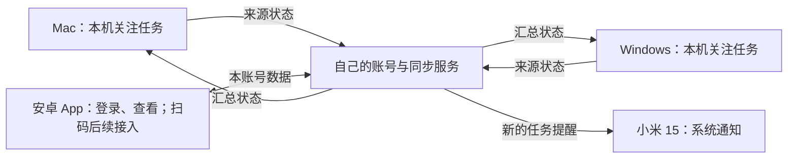

# REQ-002 多设备账号、同步、手机通知与对话

版本：v0.8 实施基线，2026-09-24。用户已授权拉取开源项目并修改；最新范围以本节为准，功能尚未完成验收。下方 v0.5 手机通知阶段保留为历史边界，不能排除新增对话需求。

目录沿用原名称以保留已有链接。用户已明确“直接用服务器吧”，跨设备连接统一为自有服务器同步，取代原先的局域网直连方案；首版不同时实现两套连接。开发环境可用本机隔离服务与 USB 调试，不能把开发连通当作公网交付。

## 0. 当前范围：公网通知与 Codex 对话

### 已确认的变化

2026-09-24 用户确认手机与原生电脑端均使用账号密码直接登录，不扫码；参考其他产品仅限界面方向，日常界面只展示 Codex Top 品牌。已批准的手机六页及电脑账号参考图见 [界面设计](../design/mobile-redesign-2026-09-24/README.md)。主导航收敛为“会话／电脑／我的”，替代此前设置仅放右上角的提议。

用户进一步说明需要给同事使用、可以先做一个账号。因此首批由管理员预建一个独立同事账号，不开放公众注册；同事与已有用户的会话、电脑和凭据按账号隔离，不默认共享，也不删除既有测试账号。账号密码登录必须恢复该账号实际的会话解密能力，不能以假登录界面或仅返回 token 视为完成。忘记密码恢复方式仍待实现设计确认；此前“已登录个人设备绑定”的建议不作为已批准范围。当前未创建真实同事账号。

用户已选择基于 Happier 二次开发，并明确“不要重复造轮子”。复用其 Android 客户端、认证配对、中转、历史、项目与多电脑模型；停止扩建平行的自研 android/bridge/relay 产品。只为实际验证的缺口补实现。桌面 Codex 保持运行且继续管理原会话，手机发送进入同一会话；不能以自动停止、resume 或 takeover 替代。未知投递结果不能自动重发，显式接管是独立操作。

用户要求优先安装最新 APK 查看界面：以本轮真实源码构建，沿用原 Logo，并核对手机包版本和启动；开发预览不等于通知、双向收发或公网验收完成。

2026-09-23 用户进一步明确“历史会话，创建会话功能都实现一下，然后可以看项目，进行选择”。当前范围包括来源电脑已有历史会话、查看并选择该电脑授权项目、在该项目创建真实 Codex 会话；不再将“仅接续已有会话”作为首版范围限制。新建必须取得电脑/Codex 的真实会话标识后才能视为成功，创建请求须幂等；项目名相同也按所属电脑与稳定项目标识区分，手机不传任意本机目录。

用户明确“电脑是可以有多台的”：手机汇总同账号已连接电脑的授权会话，来源电脑和会话组成稳定路由身份，不使用全局“当前电脑”隐式切换已打开会话的发送目标。用户要求优化界面操作、流程和设置页；后续明确“通知点进去直接就是对话”，因此系统通知与应用内通知都直达对应对话，不保留中间通知详情页；明确“还要有对话功能，就是在这个里面发布的对话，直接可以发到 codex 中”，并说明后续部署阿里云、“就不是局域网了”。继续遵守“不要影响我们的 pvtc”“不需要的接口少做”，图标沿用原蓝环橙点。

旧自研手机包与合成服务只作为历史成果保留，不能证明 Happier 新包或真实 Codex 收发。当前构建、测试及设备结果以 docs/STATUS.md 和阶段验收记录为准。

### 产品结构（建议）

- **对话**：紧凑会话列表；进入后显示消息、回复、输入框和发送状态。标题区标明目标电脑与会话，避免发错位置。包含来源端历史，以及选择已授权项目创建真实会话；不得把新建能力悄悄移出范围。
- **通知**：保留紧凑列表，完成、待处理、失败状态可读；点击进入对应对话的相关位置。找不到对话或未获授权时解释原因，不能跳到另一任务。
- **我的**：底部第三个标签，使用统一浅灰背景、白色分组、紧凑行和右侧状态，避免整屏大按钮。首屏保留账号、通知、外观、连接、关于；服务器地址进入二级页，退出账号使用独立次级操作。
- 设置展示“已连接电脑”与数量，进入轻量列表查看每台电脑在线状态，不先做完整设备管理中心。显示服务器连接、目标电脑在线、通知权限三个不同状态，不用一个绿点代表全部正常。
- 首次流程：登录 → 连接自己的电脑 → 开启通知（可稍后）→ 会话列表。尚未连接电脑时给明确空态；已有会话时直接进入列表。失败保留输入草稿并允许重试；退出账号清理本账号本地缓存。

### 端到端目标

Codex Top Android（Happier 底座）⇄ 自建 Happier 中转服务（后续阿里云）⇄ 所属电脑的 Happier 连接组件与必要桌面适配 ⇄ 该电脑的 Codex 会话。

手机和电脑都访问云服务，不要求同一 Wi-Fi，也不要求把电脑端口暴露到公网。云端负责本服务账号鉴权、目标路由、有限保存消息及回执；模型运行和文件操作仍发生在目标电脑，云端不代替 Codex 执行任务。局域网仅作为开发环境，不另维护一套直连产品。

用户首次选择目标电脑和会话，后续发送保留该上下文。每条消息区分“发送中、服务已接收、电脑已接收、Codex 已接收、失败/待确认”；回复返回手机并关联原会话。正在执行时不得默默中断原任务，排队或追加输入以接入能力与用户可见状态为准。

电脑离线时建议保留手机草稿并提示上线后手动重发，首版不自动积压离线执行指令。发送中途断线时先查询同一消息结果，禁止盲目重发导致两次执行。完成状态必须来自真实执行证据；网络确认和任务完成分开显示。

### 必要能力与接口边界

复用已有登录、退出和通知数据读取能力。增量只覆盖目标电脑/已授权会话读取、消息提交、回复与回执同步；具体端点、传输协议和数量留待详细设计，不为了“少接口”把无关权限混在一个接口里。

首版不做好友、群聊、朋友圈、附件/语音、微信登录、远程文件管理、任意命令入口或完整设备管理中心。扫码不是本次对话闭环的前置条件。通知和回复尽量共用事件同步能力，避免分别建设多套连接与重试逻辑。

### 必须先核验的边界

1. **Codex 接入**：先验证目标电脑实际安装版本能够通过何种受支持方式接续已有会话、提交消息、取得回复与接受回执。当前对话中的工具能力不能直接当作可嵌入 Codex Top 的运行接口。若不能可靠接入，必须反馈限制并重新确定范围；不能以复制到剪贴板或弹电脑通知冒充完成。
2. **数据保护**：保持仓库的 Codex 数据只读约束，禁止直接改数据库、配置、认证文件或任务记录；新增发送只能走核验后的受支持交互入口。手机与云端不获取 Codex 登录凭据。云端仅同步用户开放的会话，明确告知正文会经云端传输；正文保存期限与删除规则需在详细设计前确定，不默认上传全量历史。
3. **权限处理**：首版不自动批准 Codex 的敏感操作。遇到需要确认的动作提醒用户回电脑处理；手机审批是否支持另行规划。
4. **部署隔离**：阿里云部署独立目录、容器、网络、数据卷及资源限制，使用独立 HTTPS 入口；不重启或改动 PVTC 容器、数据库和既有端口。若同宿主机资源不足，应另用实例，不宣称容器隔离能消除全部资源竞争。
5. **安卓后台通知**：前台对话实时更新与锁屏通知分别验收；当前一小时轮询不能作为正式全天提醒方案。小米后台/锁屏实际送达方案需验证后选定，不承诺长连接天然能抵抗系统回收。

### 建议推进顺序与验收

先核验已有 Codex 会话收发可行性，同时确定对话、通知、设置的统一视觉稿；再实现一个账号、多台电脑、各自已有会话的完整收发闭环；随后接阿里云 HTTPS，同一 APK 用移动数据、电脑用另一网络验收；最后补后台通知、重连与权限异常。

验收必须包含：至少两台电脑同名会话不串线、单台离线不影响另一台、点击不同来源通知进入正确会话、手机消息只进入指定 Codex 会话、回复能返回手机、重复请求不重复执行、电脑离线不虚报成功、处理中断线可恢复结果、不同账号无法读取或发送对方会话、需要审批时不自动越权、通知可正确定位会话。视觉验收包含设置二级页、返回路径、键盘遮挡、长消息、字体放大和深色模式。公网验收不使用 USB 转发代替真实跨网链路，PVTC 部署前后状态单独核对。

建议本次审核聚焦：已有会话收发作为第一步、两个底部入口、分组设置、电脑离线不自动执行。此处为需求草案，不是接口设计或开发任务清单。

## 1. 目标与首版范围

整体目标是在 Mac、Windows 和手机上登录同一个 Codex Top 账号，查看各台电脑自己已关注的任务，任务完成或需要处理时让小米 15 收到简短系统通知。2026-09-22 用户进一步明确“先实现手机的吧”“暂时不要佳明”，并选择“安卓 App，安装 APK”。本轮优先交付原生 Android 客户端：服务登录、紧凑通知列表与详情、设置中的通知权限与测试、主动开启的临时后台提醒。取消统计、筛选、设备管理和底部导航；应用 Logo 沿用桌面蓝环橙点原图。列表来自现有状态快照，只显示每个任务最近的完成、待确认或失败状态，不冒充持久通知历史或系统送达回执。自有账号服务器与电脑状态上报尚未实现，使用独立本机合成服务联调，不把客户端初版表述为真实多端链路已完成。

本机监控继续免登录工作。登录只启用多设备共享、手机查看与通知；服务器不可用时，本机任务读取和现有窗口继续可用。

本版建议首版先支持个人多设备使用，由部署者创建自己的账号，关闭公开注册；数据和权限按账号归属设计。多人注册、团队共享不作为首版交付目标。手机后续回复、批准或继续任务保留为下一阶段目标，需要单独核验操作接口、权限和执行回执。

### 相比 v0.1 的变化

| 内容 | v0.1 草案 | v0.5 当前范围与后续规划 |
|---|---|---|
| 连接方式 | 局域网内连接，不依赖云服务器或额外云账号 | 本机免登录；跨设备登录自建账号，经自有服务器同步；首版不同时实现局域网直连 |
| 查看终端 | 两台电脑 | 原生 Android App 优先；Mac、Windows 同步后续接入，佳明当前不做 |
| 登录 | 连接自己的另一台电脑 | 手机先登录自己的账号，再扫码确认电脑登录；不依赖微信身份授权 |
| 关注任务 | 来源电脑选择，另一端汇总 | 保留，由来源电脑管理，手机及另一台电脑查看 |
| 提醒 | 电脑上的状态显示 | 先做安卓系统通知；当前客户端提供本机测试与主动开启、最长一小时的轮询提醒，持续推送待服务端阶段完善 |
| 任务操作 | 在所属电脑的 Codex 内处理 | 首版保持；手机操作作为后续独立阶段 |

两台电脑处于同一局域网仍是验收场景；采用服务器同步后，它们均向配置的服务器上报各自已关注任务，并从服务器读取汇总结果。两台电脑不要求彼此直连，但都需能访问服务器。不能把“本机断网可用”表述为“断网仍能互相查看”。本次选择不等于已部署公网入口或已验证跨公网使用。

## 2. 用户已确认的方向

以下记录讨论中的明确选择，不代表本版全部细化条款已审核通过。

| 编号 | 内容 | 用户确认记录 |
|---|---|---|
| D-01 | 在任意一台电脑上快速集中查看两台电脑的任务 | 2026-09-22，在集中查看选项中选择“1，使用这个软件，可以快速查看” |
| D-02 | 原始使用场景是局域网，连接方式现按 D-08 统一使用服务器 | 2026-09-22：“可以的，我们暂时是局域网使用”；后续明确选择服务器同步，局域网仍为首版验收场景 |
| D-03 | 合并各电脑自身已关注任务，选择由来源电脑管理 | 2026-09-22：“合并两台电脑各自已经加入监控的任务，使用最简单” |
| D-04 | 手表目标为振动与简单文字通知，使用安卓手机中转 | 手机为小米 15，手表为佳明 Forerunner 265；“加手机吧，我认为手机后面也可以操作更合适，我们有服务器可以部署” |
| D-05 | 可部署到已有 Ubuntu、Docker 环境，保护 PVTC | 2026-09-22 确认服务器系统与 Docker，明确“不要影响我们的 pvtc” |
| D-06 | 接受自建账号与扫码登录方向，从头整理规划 | 在“手机首次登录自己账号、扫码确认电脑”的提议后答复“可以，开始给我从头设计吧” |
| D-07 | 今后方法及关键步骤需要注释，并写入通用 Skill | “每个方法都写好注释。然后有一些步骤也是写好，这个写到通用skill里面去” |
| D-08 | 两端统一通过自有服务器同步，各自管理并上报本机已关注任务；首版不同时实现局域网直连 | 2026-09-22：“直接用服务器吧”；本次记录在 v0.3，仅确认连接方式，完整需求仍待审核 |
| D-09 | 先实施手机部分，本轮不接佳明 | 2026-09-22：“先实现手机的吧”“暂时不要佳明” |
| D-10 | 手机形态为原生 Android App，交付 APK；连接小米 15 直接调试 | 2026-09-22 选择“安卓 App，安装 APK”，随后“我连接手机了，你待会儿直接tiaoshi” |

2026-09-23 用户在查看 H 紧凑列表设计后要求“开始实施，你自己跑通测试再说吧”，并确认 Logo “还是用这个”，补充“不需要的接口少做”。本次授权对应已展示的手机页面收敛与原图标接入，不扩大为整套账号服务器/跨设备规划获批。仅沿用登录、快照读取、退出三个接口，不新增接口。未来手机发消息经服务器转发到电脑的意向保留；直接注入任务还是电脑提醒尚待明确，本次不实现。

## 3. 各端职责

| 组成 | 用户得到的能力 | 边界 |
|---|---|---|
| Mac / Windows 的 Codex Top | 读取本机已关注任务、显示本机及已授权远端状态、呈现电脑登录二维码 | 仅发布自己的来源数据，不再次发布收到的远端任务；保持 Codex 数据只读 |
| 自有服务器 | 管理自己的账号和设备、接收任务状态、提供同步与通知分发 | 独立于 PVTC；不保存 Codex 登录凭据，不直接控制电脑上的 Codex |
| 原生 Android App | 先实现账号登录、紧凑通知列表与手机通知检查；扫码授权待账号服务与电脑端阶段接入 | 页面正常不代表锁屏后台稳定接收；各环节分别验收 |
| 安卓通知接收组件 | 将服务器通知变成小米 15 的系统通知 | 必须验证后台与锁屏接收；实现选型在详细设计中确定 |
| Garmin Connect 与手表 | 本轮不接入 | 用户已明确“暂时不要佳明” |

用户已选择 APK，原先手机网页建议不再作为当前交付。此前考察的 ntfy 仅保留为后续通知通道参考，不能替代本服务账号。本轮 Android 客户端支持前台刷新与用户主动开启的临时后台轮询，不宣称已经具备全天持续推送。

以下只表达产品信息流，协议和部署拓扑由详细设计确定。

## 4. 使用过程

### 4.1 首次建立自己的账号

1. 部署者在受保护的初始化流程中创建账号和密码，不提供可从公网抢先注册管理员的入口，不使用固定默认密码。
2. 手机安装 APK，在 App 填写自有 HTTPS 服务地址，第一次用账号密码登录。
3. 页面显示当前账号与登录状态；此时手机才具有确认其他设备登录的资格。
4. 允许安卓通知，通过明确标为“测试通知”的消息检查手机通知栏。后台实际任务提醒另外验证，本机测试成功不代表服务器推送成功。

### 4.2 给电脑扫码登录

1. 电脑配置自己的服务地址，选择扫码登录，显示服务地址、设备名称与短时有效的二维码。
2. 手机扫描后进入本服务的确认页；若尚未在该浏览器或客户端登录，先登录自己的账号。
3. 手机明确展示将要登录的电脑与将启用的状态共享范围，用户选择允许或取消。
4. 确认成功后，仅该次请求对应的电脑获得本账号登录状态；扫码打开页面本身不等于批准。
5. 二维码过期、取消、重复使用或网络中断时显示明确结果；电脑不能提前显示“登录成功”。

微信或系统相机可以作为打开页面的扫码入口，但不从扫码工具推断用户身份；不同浏览器的登录状态不保证互通。具体扫描入口和兼容性由小米 15 实测确定。

### 4.3 多设备查看

1. 每台电脑按原有方式选择本机关注任务，并明确启用共享。
2. 同账号设备显示汇总列表；任务可识别来源电脑，主题、比例、位置及窗口模式仍由各端独立保存。
3. 在来源电脑加入、移出或继续任务后，其他终端自动更新。
4. 远端任务的点击行为明确告知所属电脑，不能用本机链接误开同名或错误任务。

### 4.4 通知与退出

1. 关注任务出现新的完成、待处理或明确出错事件时，按账号及通知设置产生简短提醒。
2. 默认提醒使用“任务已完成”“需要你处理”“任务执行出错”等通用文字；用户主动启用后才在通知中展示短任务名。
3. 手机通知可引导进入本服务的任务状态页；首版在所属电脑的 Codex 中处理任务内容。
4. 用户可暂停提醒、退出当前设备或解绑另一台设备。解绑停止该设备后续共享和访问，不删除本机 Codex 任务。

## 5. 功能与验收要求

| 编号 | 要求 | 验收场景 |
|---|---|---|
| R01 | 本机监控不以登录或服务器可用为前提 | 未配置服务、未登录、退出登录及服务器断开时，本机关注、刷新和窗口操作保持可用 |
| R02 | 首版自建账号、关闭公开注册；无固定默认密码，密码不可明文保存或记录 | 未登录者不能创建管理员或读取账号数据；合成账号检查初始化、密码错误和访问拒绝 |
| R03 | 手机登录成功后才能确认电脑扫码请求；确认前明确显示设备、服务及共享范围 | 未登录手机先要求登录；扫描但未确认、取消或过期均不使电脑登录 |
| R04 | 扫码授权与发起电脑绑定，短时有效且只能兑现一次 | 两台电脑同时扫码不会串设备；截取二维码后的未授权请求不能领走电脑凭据；重复兑现失败 |
| R05 | 每台设备拥有独立可撤销登录状态，支持退出、解绑和受保护的账号恢复 | 解绑 B 后其后续读写与连接失效，A 保持登录；丢失手机后有部署者恢复路径；改密或恢复后的旧登录处理规则需在设计中明确 |
| R06 | 服务端按账号检查设备、任务与通知访问；不能只在界面上隐藏数据 | 使用两个合成账号交叉请求，不能读取对方状态、订阅对方通知或代替对方设备上报 |
| R07 | 合并各电脑自己已关注的任务，关注集合仍由来源电脑维护 | A 有 2 个运行任务、B 有 3 个，两端有效数据汇总为 5；A 加入或移出任务不改变 B 的本机关注配置 |
| R08 | 来源设备与任务共同决定归属，远端任务不被重新发布 | 同名或相同任务标识的不同来源不会覆盖；双向连接、重启、重连不会不断增加任务或计数 |
| R09 | 状态、父子聚合和可靠计时沿用来源语义 | 子任务归入来源主任务；未知不变完成；缺开始记录仍为 `--:--`，不用接收时间补造 |
| R10 | 区分设备在线、来源读取可用和数据时效；旧记录不能进入实时运行统计或触发新提醒 | 断网、电脑休眠、暂停读取、解析不兼容及尚未追平分别显示；不能因服务器连接正常就把旧状态变新 |
| R11 | 重连取得来源当前状态，乱序、重试和旧快照不能覆盖新结果 | 离线期间完成、移出或新增任务，恢复后各端一致，旧运行记录不短暂复活 |
| R12 | 网络操作不阻塞本机刷新与窗口；各端显示状态更新时间 | 服务慢、超时、反复重连时仍可展开、拖动及选择本机任务；同步耗时和过期判定需在设计阶段给出量化验收值 |
| R13 | 桌面只显示一份预期监控界面，保持既有布局与当前审核通过的行为 | 汇总数据沿用现有圆环、列表和显示模式；不因接入远端重置主题、位置、比例或新建第二份监控窗口 |
| R14 | 手机可以查看设备、关注任务、来源和状态，离线与过期可辨认 | 小米 15 页面打开、刷新、断网及重新登录后，状态不会被误认为实时；同账号列表与电脑有效数据相符 |
| R15 | 只根据有证据的新状态事件发送完成、待处理、明确出错提醒，可暂停或关闭 | 普通刷新、首次导入已完成任务、数据未知或长时间无更新均不产生伪提醒；明确停止不冒充完成 |
| R16 | 同一来源、同一轮任务事件只产生一份可识别通知，父子聚合及重试不得重复骚扰 | 两台电脑都看到同一个来源事件，重复上报、服务器重启或客户端重连仍不重复弹出；新一轮相同状态允许再次提醒 |
| R17 | 通知有明确有效期和失效规则，旧等待被解决后不继续提示仍需处理 | 先等待后已回复、用户关闭通知、来源数据过期等场景，不补发过时的行动提醒；历史记录与即时提醒分开 |
| R18 | 本轮仅做安卓系统通知，文字简短，尊重通知权限、勿扰和系统后台限制 | 小米 15 锁屏、后台、切换网络分别验收；临时轮询须说明有效时长，权限关闭不冒充成功；佳明不在本轮验收范围 |
| R19 | 分别记录实际可观测的投递结果，不虚构手机回执 | 服务端接受不写成手机已收到；本机测试通知不写成远程通知链路已通过；后台稳定性须实机验证 |
| R20 | 仅共享显示所需的标识、短标题、项目显示名、状态、必要时间及来源；通知默认通用文字 | 合成数据检查请求、存储和日志：无对话正文、工具参数、完整路径、原始数据库或 Codex 认证资料；不修改 Codex 源数据 |
| R21 | 账号、会话与通知通道有独立访问控制，配置和诊断不泄露秘密 | 未授权者不能读写通知；公开仓库及诊断不含密码、登录凭据、二维码可兑现秘密或通知通道凭据 |
| R22 | 自有服务在 Ubuntu/Docker 上独立部署，限制资源与存储增长，保证可单独停止和撤回 | 在测试环境演练启动、升级、备份恢复和撤回；不依赖 PVTC 容器、数据库、备份任务或部署脚本 |
| R23 | PVTC 保护须在部署前后验证，同机资源不足时不部署 | 先在隔离测试环境验证资源限制与异常回退；生产部署前后只读核对 PVTC 端口、健康、CPU/内存/磁盘余量；具体基线、阈值和回退条件经设计确认 |
| R24 | 新增及本次修改的方法都有中文用途说明，关键步骤说明原因；安装与验收步骤可复现 | 审阅最终差异核对方法注释、状态转换、异常/回退与文档；按前提、步骤和预期结果可独立完成操作 |

每条验收都区分合成规则测试与真实设备检查；当前表格是验收要求，不是已通过记录。

## 6. PVTC 与部署边界

已确认服务器为 Ubuntu 并支持 Docker。附图显示 PVTC Web 的宿主机端口为 8088，以及 Web、MySQL、备份容器；截图不是当前服务器健康和资源余量证明。

通知与账号服务使用独立部署目录、Compose 项目、网络、数据存储、凭据和经检查未占用的端口。不连接 PVTC MySQL，不改写 PVTC 配置、部署或备份流程，不重建其容器，不重启 Docker，不执行全局清理。账号服务与通知组件可在本项目内部通信，但不得因此接入 PVTC 内网。

部署前建立只读基线，设置 CPU、内存、日志和消息保留上限；部署后复核 PVTC。压力与故障注入测试在独立测试环境进行，不给共享生产服务器制造额外压力。新服务异常时只停止或撤回本项目新增内容。共享宿主机仍有资源影响，不能仅凭容器隔离声称零影响；资源不足时使用独立服务器。

HTTPS 域名、服务器连接方式、实际余量与现有入口配置尚未提供或核验。部署阶段必须先补齐这些事实，不能据截图直接运行安装命令，也不把现在的需求规划当作修改生产服务的指令。

## 7. 首版之外与后续目标

- 手机发送回复、批准、继续或停止任务：用户明确为后续意向。后续需核验 Codex 可用操作接口、来源电脑在线条件、明确的操作授权、防重复执行及实际结果回执；不能通过直接写 Codex 数据库实现。
- 微信身份登录、佳明接入与原生手表 App、公开注册、团队共享，以及局域网直连和服务器自动切换，不纳入当前手机交付。
- 完整对话同步、共享 Codex 登录凭据、跨设备相加账户额度不在范围内。额度继续使用各端本机账户语义。
- 原生 Android App 已按 D-10 确认；自有账号服务、电脑上报、电脑扫码授权与持续推送仍需后续完整接入和验收。

## 8. 交付层次与当前证据

本段描述交付范围和先后依赖，供需求审核；不是开发任务清单。

| 层次 | 交付结果 | 成立条件 |
|---|---|---|
| 基础账号与设备 | 手机首次登录、电脑扫码授权、设备退出和撤销 | 身份确认、一次性授权及账号隔离通过合成与真实客户端检查 |
| 多设备查看 | Mac 与 Windows 汇总同账号来源任务，手机可以查看 | 先对齐真实 Windows 工程；失效与重连规则通过，两平台真实安装包互通 |
| 安卓客户端优先 | 可安装 APK、登录/查看/通知检查，以及有限时长后台提醒 | 合成接口与原生界面先验收，小米 15 真机单独记录；不接佳明 |
| 部署交付 | 独立服务、运维说明、恢复与撤回验证 | HTTPS 与资源条件明确，PVTC 部署前后核对通过 |
| 后续手机操作 | 在手机上明确发起操作并看到真实结果 | 另行审核需求及控制接口能力，首版完成不代表此能力已具备 |

当前仓库主工程是 macOS Swift，已有本机任务状态读取与聚合；手机代码在独立 `android/` 目录，不改桌面实现。现有 [Windows 交接文档](../handoff/windows-implementation-prompts.md)不证明 Windows 端已完成；用户提供实际 Windows 工程后再对齐，不能用两份 Mac 实例代替 Windows 验收。

macOS 验收仍须覆盖打包后的真实窗口与外接屏，保留用户正在使用的实例及偏好。测试使用独立合成数据，不把真实桌面切为 Demo，不提交原始诊断或私人任务内容。

## 9. 本版审核与后续文档

服务器同步方式已按 D-08 确认，手机实施优先级、原生 APK 和不接佳明已按 D-09/D-10 确认。后续完整服务设计仍需确认：

1. 同意首版先个人多设备使用、关闭公开注册，并采用自己的账号与扫码确认；本机监控继续免登录。
2. 持续后台推送、电脑扫码授权和多平台互通的具体交付方式；手机任务操作与佳明留给后续阶段。
3. 同意上述共享字段、通知默认内容、退出/恢复和 PVTC 保护边界。

本次以用户“先实现手机的吧”和明确 APK 选择作为手机客户端的实施指令，不把它改写为整份多端方案已全部审核通过。手机接口和本地运行步骤随实现记录在 Android 说明；生产账号服务、扫码、持续推送和部署需在后续阶段细化，PVTC 保护约束保持不变。

## 10. 已查阅依据

- [OWASP 会话管理](https://cheatsheetseries.owasp.org/cheatsheets/Session_Management_Cheat_Sheet.html)：登录会话的传输、失效和服务端管理。
- [OWASP 授权检查](https://cheatsheetseries.owasp.org/cheatsheets/Authorization_Cheat_Sheet.html)：服务端按每次请求检查权限。
- [ntfy 安卓接收说明](https://docs.ntfy.sh/subscribe/phone/)：自托管即时接收候选及后台运行方式；尚未在本机小米 15 验收。
- [佳明 265 通知说明](https://www8.garmin.com/manuals/webhelp/GUID-F41EAFB3-6CC9-42DE-9C6C-9E358DBB0671/EN-US/GUID-599D739A-21A7-4EF2-98F4-29258D407B47.html)：手机配对和手表通知设置。
