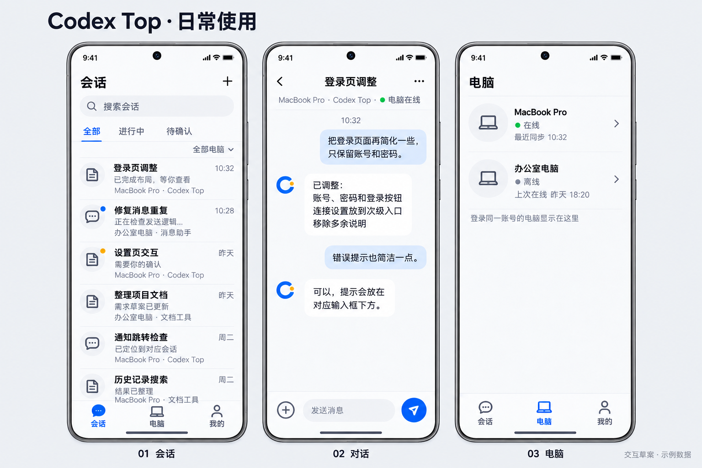
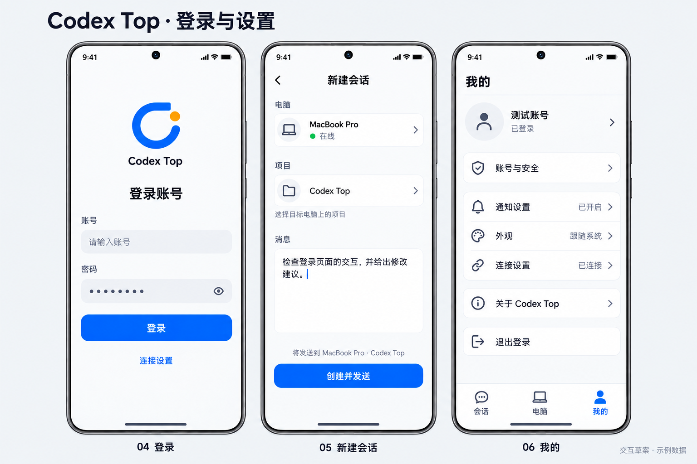

# REQ-002 多电脑 Codex 会话、手机通知与对话

> D-10 最新决定（2026-09-24）：首页只保留一个会话列表，新对话自动排到最前；状态和操作放在每条会话上，不再划分已完成、处理中或常驻等分类。此前 D-09 三类入口及早期三态列表均由本条覆盖。保持标题居中和简洁动画，界面调整仍晚点实现，当前先完成桌面与手机双向消息功能。

> D-09（2026-09-24，用户明确延后）：用户要求顶部“会话”居中，列表入口改为“常驻 / 待处理 / 所有”；所有会话支持长按或左右滑动选择置顶等操作，并明确“这个你放到req里面，晚点在做。我们继续先做功能的实现”。本条仅记录后续界面需求，不授权本批更改已安装界面，不停止当前桌面消息→手机、真实状态、手机→原桌面对话的功能工作。“置顶=加入常驻”、各滑动方向动作及行内状态呈现仍是建议，实施前补设计确认；不能把用户要求的分类当作新的生命周期状态。详细记录见[首页修订讨论稿](homepage-revision-draft.md#后续首页常驻待处理所有d-09)。

> D-08（2026-09-24）：用户指出“界面好像还是之前的类型”，要求“开始处理”。已确认此前紧凑样板尚未接入正式页面；本批须把获准的精简布局与短动画接入实际 App，复用真实账号、会话和操作链路，在模拟器连续验收，不以样板或只改中文替代正式改版。跨电脑汇总范围仍单独确认，其他页面不等待此项。

> D-07（2026-09-24）：用户明确“语言只要中文”。产品仅提供简体中文，移除语言切换入口；首次启动、冷启动恢复及原有英文语言偏好均显示中文。不再为其他语言追加适配工作，内部兼容资源无需为此粗暴删除。用户自己的消息、代码、项目和任务名称保持原文。

> D-06（2026-09-24）：用户确认“可以，就使用你的建议吧”，采用独立 Codex Top 手机 UI，保留 RN／Expo 和现有动画基础，基础控件按需采用 Paper；精简首页、对话和设置内容。先交付可操作样板，已有账号、原任务身份与真实操作要求不变。技术选择不自动确认跨电脑汇总细节。后续用户授权把一部分 UI 工作交给 Cursor，使用 Grok 4.7，主管负责整合验收。

> 最新用户反馈：1.0.14 首页未通过视觉验收；任务状态明确要求“运行中 / 待处理 / 已完成”，不接受最近活跃或空闲。首页电脑／项目选择入口正在按用户要求重新规划，见[首页修订讨论稿](homepage-revision-draft.md)。其中跨电脑汇总等主管建议尚未获批，不擅自替换下方已审核范围。

> 实施状态（2026-09-24 更新）：用户随后明确“开始实现”，当前按本版及任务总表执行。下文“仅文档／尚未开工”描述修订当时的历史状态，不再作为暂停指令；需求范围不变。

版本：v0.10，2026-09-24，需求已通过（在 v0.9 上记录本次已确认的账号简化）。**v0.9 已在完整需求审核后通过；本次用户确认账号简化并要求划分 tasks，形成 v0.10。此次不授权编码或部署。** D-01 至 D-03 和 U-01 的主要布局保持，新增 D-04 简化账号；具体任务拆分已获本轮指令。

用户先要求“停下”“我们重新走req，开始第一步”，随后要求核验桌面 Codex 同时开启的可行性、重新出图。本版整理最新明确需求与获准图片；当前已按账号简化修订设计并进入任务拆分，编码、打包、安装和部署仍暂停。目录保留旧名称以保持链接，产品目标已包含公网使用。

旧 [v0.8 原文](requirement-v0.8-history.md)与[已审核 v0.9](requirement-v0.9-history.md)完整留档；v0.8 中“实施基线”、扫码、仅通知、不支持对话等历史条款不再作为当前依据。旧技术调查和测试记录是参考证据，不能代替本版审核。

## 1. 产品目标

用户在手机 Codex Top 中查看电脑上的 Codex 会话、接收通知，并在同一会话继续对话。电脑上的 Codex 保持开启，继续管理原任务；手机消息与回复进入同一任务，不以停止桌面任务、接管执行或另开一套执行器替代。

支持多台电脑。手机选择来源电脑及其项目、历史会话，也能发起新会话。跨网络通信经过自建服务器，服务器不成为界面中的“云端会话”分类。

## 2. 已明确的需求

以下是本版需求目标；后续详细设计提出的具体方案须另行审核。

| 编号 | 需求 | 用户依据 |
|---|---|---|
| R-01 | 优先交付 Android APK，主要使用设备为小米 15；佳明暂不做。 | “安卓 App，安装 APK”“暂时不要佳明” |
| R-02 | 手机和电脑 Codex Top 使用账号、密码直接登录，记住当前端登录状态并可退出，不采用扫码或首次激活步骤。 | “账号＋密码，两端直接登录”“不要扫码” |
| R-03 | 用户与同事各用独立账号，只能查看和操作自己账号下的电脑、项目与会话；当前范围不做跨账号共享。由管理员预建账号密码，可以先提供一个同事账号；首版不做公众注册、首次激活、自助改密／找回、恢复码或设备管理。 | “我需要给我同事使用的，你可以暂时做一个账号”“账号独立” |
| R-04 | 支持多台电脑，列表与对话可辨认来源；不能把消息发送到另一台电脑或另一条会话。 | “电脑是可以有多台的” |
| R-05 | 展示所选电脑全部可访问的历史会话，不以加入关注为前提；查看并选择项目，创建真实会话。历史范围见 D-01。 | “历史会话，创建会话功能都实现一下，然后可以看项目，进行选择”“所选电脑全部可访问的会话（推荐）” |
| R-06 | 手机可向电脑 Codex 原会话发送内容、查看回复；桌面 Codex 同时开启。 | “在这个里面发布的对话，直接可以发到codex中”“电脑上的codex同步开启的时候” |
| R-07 | 通知点击后直接进入对应对话，省去通知详情中间页。 | “通知点进去直接就是对话” |
| R-08 | 手机、电脑跨网络使用，后续部署阿里云 Ubuntu / Docker 服务；保护现有 PVTC。 | “就不是局域网了”“不要影响我们的pvtc” |
| R-09 | 沿用蓝色 C 与橙点 Logo，统一 Codex Top 界面；参考其他产品仅用于界面，不照搬其产品流程。 | “软件的logo还是用这个”“只需要界面参考”“所有的界面都按照我们的来修改” |
| R-10 | 界面紧凑、设置清楚、页面切换流畅，控制功能与接口数量。 | “类似微信之类的大小”“注意界面中的切换流畅性”“不需要的接口少做” |
| R-11 | 优先复用合适的开源能力，避免重复实现；具体复用边界以后续设计和实测为依据。 | “我们不要重复造轮子” |
| R-12 | 后续编码时，每个新增或修改的方法有清楚注释，重要步骤补充说明。 | “每个方法都写好注释。然后有一些步骤也是写好” |
| R-13 | Codex 遇到待批准操作时，用户可在手机查看并确认或拒绝，结果作用于对应电脑的原任务。 | 针对手机审批问题答复“手机上可以决定” |
| R-14 | 产品界面只提供简体中文，不提供语言切换；旧语言偏好不应使界面恢复英文。消息与代码等用户内容保持原文。 | “语言只要中文” |

## 3. U-01 已确认的界面图

确认日期：2026-09-24。用户在查看下面两张图后回复：**“可以，然后把设计图整理到需求里面，或者提示词”**。

确认范围为这两张图的六个页面、视觉与主要流程方向。图片由内置 imagegen 生成，包含示例数据，**不是当前 App 截图，也不是功能验收证据**。当时的图片确认仅覆盖界面；完整需求另于第 8 节记录审核，技术方案及实施仍须分别推进。可复用生成说明见 [提示词](assets/ui-2026-09-24/prompts.md)。

### 日常使用：会话、对话、电脑

### 登录与设置：登录、新建会话、我的

### 六个页面的职责

| 页面 | 内容与操作 | 导航关系 |
|---|---|---|
| 01 会话 | 紧凑历史列表、搜索、电脑筛选；行内展示标题、来源、最近内容与状态；右上角新建。 | 主入口；点行进入对应对话，点新建进入 05。 |
| 02 对话 | 标明来源电脑和项目，显示同一任务的消息与回复，底部输入并发送。 | 从会话列表或通知直达；返回列表，不保留底部主导航。 |
| 03 电脑 | 展示电脑名称、在线情况与最近连接信息。 | 主入口；电脑详情及其项目选择的二级界面后续细化。 |
| 04 登录 | Codex Top Logo、账号、密码、登录；连接设置作为次级入口。 | 登录成功后进入会话；从通知进入时应保留目标对话。 |
| 05 新建会话 | 选择电脑、选择该电脑的项目、输入首条消息，“创建并发送”。 | 展示明确目标；成功后进入该电脑上的真实新会话。 |
| 06 我的 | 小型账号区，分组展示账号、通知、外观、连接、关于和退出。 | 主入口；具体设置进入二级页，主页面不铺满技术选项。 |

共同约束：

- 主导航固定为“会话 / 电脑 / 我的”；对话和新建等子页使用返回导航。
- 白色与浅灰为主、蓝色强调；小图标、常规按钮、紧凑行高，避免大 Logo 卡片和过大的状态区域。
- 日常页面使用中文，不出现上游产品名、安装 CLI 指引、扫码入口、“云端会话 / 电脑会话”分类或本机地址作为主标题。
- 服务器连接信息放入连接设置，不让用户先理解中转、执行器或连接协议才能聊天。
- 图中“待确认”表示任务状态。用户随后已确认手机可作决定（D-02）；审批详情和确认／拒绝交互需在后续设计中补图，当前图片不证明审批能力已经实现。
- 示例“MacBook Pro”“办公室电脑”“测试账号”不证明对应设备、账号或系统已接入。
- 二级设置、项目选择、空列表、登录失败、断线、键盘及字体放大等状态未在两图中完整展开，后续设计要补齐。提示词中的 dp / sp 数值是生成参考，不是已逐项测量或最终验收的像素规格。

## 4. 主要使用流程

1. **开始使用**：手机和电脑端使用各自账号密码登录，手机展示自己账号下的电脑和会话。所选电脑全部可访问的会话无需先加入关注即可浏览；用户与同事之间不共享电脑、项目或会话。管理员预建账号即可直接登录，首版不提供激活或自助恢复流程。
2. **继续会话**：选择已有会话 → 查看其电脑和项目 → 输入消息 → 原电脑的 Codex 同一任务收到消息 → 回复同步回手机。进入另一台电脑的列表不能改变已打开对话的发送目标。
3. **创建会话**：新建 → 选择电脑 → 选择该电脑真实可用的项目 → 输入首条消息 → 创建并发送 → 打开真实的新会话。不能用本地占位行或另一套执行器的任务冒充成功。
4. **从通知进入**：收到任务通知 → 点击 → 打开对应电脑的对应会话；需要登录时，完成登录后仍应恢复该目标。目标不可访问时说明原因，不能跳到别的任务。
5. **手机审批**：进入需要批准操作的原会话 → 查看待处理操作 → 在手机确认或拒绝 → 对应电脑的原任务处理该决定并回传实际结果。不能把决定应用到其他任务。
6. **状态与异常**：连接中断、电脑离线、任务等待处理等状态如实表达。服务收到消息与 Codex 已执行不能混称“完成”；未知投递结果不得虚报成功。排队、运行中追加消息和断线重试的具体交互仍需后续设计与验证。

## 5. 需求验收要求

| 场景 | 应取得的证据 |
|---|---|
| 两端账号密码 | 真实登录后能访问对应账号的内容；不能只显示登录成功或返回凭据就算完成。 |
| 桌面同时开启 | 手机消息实际进入指定的桌面原任务，回复回到手机；核对任务身份，无隐式接管或另开执行器。 |
| 多电脑 | 至少两台电脑可区分；同名项目、同名会话不串线，一台离线不伪装为全部正常。 |
| 历史和新建 | 所选电脑全部可访问的会话可浏览，未加入关注的会话不被排除；项目来自所选电脑，新任务能在该电脑 Codex 中确认存在并继续对话。 |
| 通知 | 在小米 15 分别检查前台、后台、锁屏送达；点击系统通知进入正确对话。服务接收成功不能代替手机收到通知。 |
| 跨网络 | 手机使用移动网络、电脑使用另一网络仍完成收发；USB 转发和局域网演示不算公网验收。 |
| 连续操作 | 实际安装包连贯完成登录、切换列表、打开对话、新建、设置与返回；检查键盘遮挡、滚动、草稿及切换时的闪屏或卡顿。 |
| 失败和不确定状态 | 登录失败、断网、电脑离线、投递结果未知都能辨认；重复提交不会造成同一指令意外重复执行。细化方案交用户审阅。 |
| 账号隔离 | 使用两个独立测试账号，分别验证电脑与项目列表、历史正文、消息发送、审批和通知只属于各自账号；即使直接使用另一账号的目标标识，也不能读取、发送或批准其操作。切换账号后不显示前一账号内容。 |
| 手机审批 | 对指定测试任务的待批准操作，分别在手机确认和拒绝，核对原电脑任务实际收到并遵从对应决定；无待处理操作或操作已经失效时，不伪报成功。 |
| PVTC 隔离 | 独立部署范围，核对部署前后既有 PVTC 状态；不改动其容器、数据库或占用端口。 |

仓库继续遵守 Codex 数据只读约束：不能直接修改 Codex 数据库、配置、任务记录或认证文件。新增交互入口须验证能力与边界。技术路线、接口和部署配置属于后续详细设计，本页不预设新端点。

## 6. 可行性证据与未完成项

2026-09-24 已做只读接入核查：当前 Mac 上的桌面连接握手成功，能找到原任务所属的桌面实例。此核查未发消息、未运行任务，不等于本轮已完成收发验收。

历史 [1.0.4 手机验收记录](../validation/happier-mobile.md)记载：桌面保持运行时，手机向指定空闲测试任务发送合成消息，原任务完成后手机显示该消息与回复。它证明已有任务的基础收发路径曾跑通，不证明本版全部功能可用。

当前接入依赖桌面私有通信机制，存在版本兼容风险。运行中发送策略、桌面原生新建任务、多电脑完整流程、Windows、公网、小米锁屏通知和手机审批，仍须分别核验；不会因为暂未跑通就从用户要求中删去历史、项目或新建功能。已确认图片也不证明当前 APK 已按图实现。

## 7. 已确认决策

| 编号 | 决策 | 用户确认记录 |
|---|---|---|
| D-01（原 Q-01） | 手机展示所选电脑全部可访问的 Codex 会话，不要求先在电脑加入关注。“全部可访问”受 D-03 账号隔离约束，不能读取其他账号内容。 | 2026-09-24：“所选电脑全部可访问的会话（推荐）” |
| D-02（原 Q-02） | 手机支持查看待批准操作，由用户确认或拒绝；纳入当前功能范围。接入能力、审批页面和真实结果仍需后续设计与验证。 | 2026-09-24，针对手机审批选择：“手机上可以决定” |
| D-03（原 Q-03） | 用户与同事使用独立账号，各自查看和操作自己账号下的电脑、项目与会话。当前范围不做跨账号共享。 | 2026-09-24：“账号独立” |
| D-04 | 账号只做管理员预建、两端直接登录、独立隔离、记住登录与退出；账号页只有当前账号与退出。不做公众注册、首次激活、自助改密／找回、恢复码和设备管理。 | 2026-09-24，用户对上述简化方案回复“是的，没错，改了后划分tasks”。 |

三项范围问题均已答复，账号初版流程随后按 D-04 明确收敛。此次不增加“激活、恢复、设备管理”等隐藏工作；现有加密兼容、权限与凭据保护仍由内部实现承担。各次确认记录见第 8 节。

## 8. 审核记录与文档状态

| 日期 | 记录 | 对应范围 |
|---|---|---|
| 2026-09-24 | “停下”“我们重新走req，开始第一步” | 旧实施停止，回到需求讨论。 |
| 2026-09-24 | “你先确认一下是否可以实现，电脑上的codex同步开启的时候” | 先核验核心可行性，证据见第 6 节。 |
| 2026-09-24 | “可以，然后把设计图整理到需求里面，或者提示词” | 批准 U-01 两板六页界面方向，要求归档图片与提示词。 |
| 2026-09-24 | “所选电脑全部可访问的会话（推荐）”“手机上可以决定”“账号独立” | 确认 D-01、D-02、D-03，分别同步到历史、手机审批及账号隔离需求。 |
| 2026-09-24 | “下一步” | 紧接“请审核这版完整需求；通过后进入详细设计”的邀请，记录为通过 v0.9 并进入详细设计。此解释已在本轮开场告知用户，不扩大为编码或部署授权。 |
| 2026-09-24 | “是的，没错，改了后划分tasks” | 批准已展示的简化账号方案，记录 D-04，修订至 v0.10；允许修改设计后直接划分 tasks，未要求本轮开始编码。 |

当前需求 v0.10 已记录 D-01 至 D-04。用户授权按账号简化修订[详细设计 v0.2](detailed-design.md)并[划分任务](tasks/progress.md)，本轮执行到任务文档阶段，不恢复产品代码工作。

### D-05 本批新建边界（实施中确认）

2026-09-24：主管说明当前桌面已有原任务入口，但尚未找到可供连接组件调用的原生新建接口，并解释桌面自动点击方案会切换前台和受改版影响；用户回复“暂时不做”。本批暂不采用桌面自动操作，新建入口不开放，旧独立执行器 spawn 不得作为替代。已有会话、真实项目查看、收发、审批和通知继续实施。R-05 的原生新建保留为后续待对接，不算本批已实现或已验收；重新推进前单独确认可用路线。
