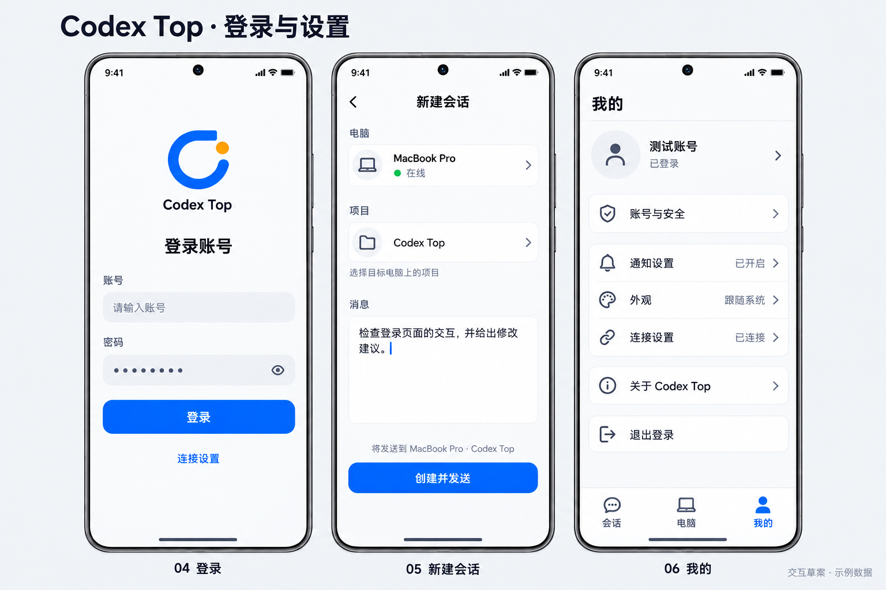

# REQ-002 多电脑 Codex 会话、手机通知与对话

## 当前手机端需求汇总

整理日期：2026-09-30，增量更新至2026-10-02。本批**需求 v0.11、详细设计 v0.3 均已审核，任务已拆分，第一批实施中**。原审核范围为 D-23～D-29 及其涉及的既有聊天要求，后续用户增量反馈逐条记为 D-30～D-36、D-38～D-43；D-37远程升级另列为v0.12增量草案，尚未审核，不扩大原v0.11的批准范围。这不是已实现清单。两次“下一步”分别承接明确的需求审核邀请和设计审核邀请，确认记录见第8节。以[详细设计 v0.3](detailed-design.md)及[任务总表](tasks/progress.md)继续，不再重复同版审核；下方旧 v0.10 记录保留历史依据。

| 范围 | 当前要求 | 依据 |
|---|---|---|
| 整体界面 | 大体沿用 Telegram 原版页面、布局、组件和交互，只做必要删减、文案替换及 Codex 业务适配，不另行重构一套界面。产品文案用简体中文。 | 2026-09-29 原生方向、D-07、D-25 |
| 底部导航 | 会话／电脑／我的。进入具体聊天隐藏主导航，返回时回到原入口并保留位置。 | D-14、D-24 |
| 会话列表 | 一个最近对话列表，不拆运行／完成／常驻等分类。默认50条，可在我的设置；新对话自动加入，新消息或活动使对话靠前。标题下副标题显示原草稿或最新真实消息／附件预览，不用状态补成消息内容；未取得正文不编造摘要。超出最近上限不删除历史。 | D-10、D-12、D-24、D-39；后续纠正D-36 |
| 列表状态 | 文字为主，不画大头像、满屏完成勾或启动时钟。按D-39，状态及有效运行的小蓝环移到右侧时间下面，与左侧真实摘要分别布局；保留行高、未读和原多选。缺失、过期或连接异常如实表达，旧事实仍标“上次”，不画当前运行动画。 | D-25、D-38、D-39；原设计 v0.3 加增量反馈 |
| 电脑和项目 | 查看对应电脑及其在线情况，进入其全部项目，再进入项目内的全部可访问对话；最近50条上限不截断项目历史。项目内打开对话沿所属子页面返回，不切回全局会话。 | R-04／R-05、D-12、D-14 |
| 聊天体验 | 像普通 IM：本地记录先显示，新对话和新消息未点开也同步本地；联网增量补齐，断网保留记录和草稿。点击发送即清空本次输入并把消息放入对话，失败保留，可按实际结果重试或恢复编辑；回传不重复。状态放固定顶栏，底部只留输入区域，手机暂不显示普通工具调用过程。 | D-16／D-17／D-19／D-21／D-22 |
| 聊天页顶部 | 保留原返回与双行标题，去掉 C 头像；在真实“运行中”前显示小蓝色圆环，与列表同步。状态变化不改变顶栏高度。 | D-28／D-34 |
| 消息复制 | 普通消息单击不复制；长按进入沿用的原版菜单，再选择复制。链接、图片和文件保留各自正常点击行为。 | D-26 |
| 回答 Codex 提问 | Codex 提出问题和选项时，手机展示完整问题及选项，用户可直接选择并提交到原桌面任务；原问题允许自定义回答时保留该能力。未答问题可从待回复状态进入处理。 | D-29；与操作审批分别记录 |
| 图片与文件 | 两端均可发送和接收。图片可看缩略图和大图；文件显示名称、大小，可打开或保存。发送立即进入记录，进度轻量，失败保留并可重试，附件必须实际到达原对话。 | D-23 |
| 我的 | 集中账号、服务器连接、最近对话数量、本地缓存、应用版本；额度前置，直接显示所选电脑的真实采集值及来源、时间、实际窗口。按D-40将额度和所选来源保存本地，回访与冷启先显已有值，缺失或过期沿原入口后台更新；临时失败保留旧值与采集时间，不清空为“正在读取”，不持续轮询。 | D-24、D-27、D-35、D-38、D-40 |
| 性能与资源 | 控制网络消耗，按变化增量同步，旧历史按需读取；控制安装包大小，避免无关功能与过度设计。在线手机点击发送到桌面原对话实际收到的目标为3秒内；回复生成时间另计。 | D-18、D-20、D-22及用户网络／简化要求 |

原有基础目标继续有效：手机与电脑以账号密码连接同一账号范围，跨网络在指定电脑的原 Codex 任务双向收发文字；支持多电脑且不串会话，账号之间隔离；任务通知可直达对应对话，真实待批准操作可在手机处理。后台／锁屏通知、真实审批等是否可用须查对应验收记录，本汇总不作完成承诺。手机原生新建按 D-05 继续暂缓，不能借本次整理重新开放。

设计 v0.3 的原头像槽进度／完成／提示组合按 D-38 收敛为文字列表与小运行环；未读独立、待回复与待批准分别说明、双行顶栏和额度实际字段。图片／文件的可用类型、大小沿现有传输能力核实并在发送前提示；原任务提问、非空附件及额度来源接入的技术验证仍需完成。下列 D-23～D-29 保留提出时的原话与阶段，后续批准以上述版本及第8节记录为准。

## 远程升级增量需求 v0.12（草案，待用户审核）

D-37（2026-10-01）：用户要求“做一个远程升级，不然每次都要连接手机，怪麻烦的”。范围为已安装的Telegram原生Android客户端。目标是后续版本可在手机联网时直接升级，保留同一账号、聊天记录、草稿与本地缓存。

建议本次采用以下行为，待用户审核：

- 在“我的”原版本行保留检查更新入口；应用启动或回到前台时，按现有更新检查节奏静默核对真实新版本。
- 有新版时沿Telegram原更新行和原下载进度呈现，由用户点击下载、安装，不另加自动弹窗或新页面。
- 安装包下载在手机完成；下载完成后交给Android原系统确认覆盖安装。无需连接电脑，不要求静默安装。
- 无网络、下载失败或取消时可继续使用已装版本；重新检查和重试沿原更新入口。
- 只交付与当前应用匹配的正式安装包，版本必须能区分新旧；升级后保留账号和本地数据。

验收：手机从上一版完成联网检查、下载、系统确认和覆盖；升级前后账号、会话记录、草稿、缓存保持。没有新版本时不打扰聊天；断网、下载取消和恢复后重试不能阻塞日常使用。电脑端发送恢复补丁及既有手机收发验收按原范围继续，不能用升级成功替代消息验收。

本增量只提交需求草案，尚未写设计、划分任务或编码。当前原代码有更新布局和安装入口，但现有构建关闭了接线；可用正式APK发布源还需在下一设计阶段确定，未将可达的服务版本接口当作安装包分发能力。

## 决策与变更记录

> D-43（2026-10-02，需求已授权）：用户要求把桌面“目标”功能加入手机。先核对官方现有目标契约和既有连接能力，沿原会话详情／顶栏展示真实目标与状态；只接已证实可用的动作，不臆造完成率、接口或另一执行器，不修改Codex数据库、配置、任务记录和认证文件。功能接入和实际验收另记，不把本记录当成已实现。

> D-43追补（2026-10-02）：用户此前反馈目标无法修改和删除，最新版安装后再次指出“目标不可编辑”。要求包含对原Codex实际目标正文的修改及删除，只读展示尚未满足。新截图显示“上次”目标及当前未知状态，不能把旧缓存当作当前可写目标。原版内部支持修改／清除，但当前手机跟随链没有对应写入口；接入须使用已核实的原生能力与真实回执，不以本地缓存编辑或普通聊天消息替代。缺口与安装状态分别记录，不把安装新版写成该功能已修复。

> D-42（2026-10-02，补充已授权）：手机应可看到桌面Codex提出的问题及完整选项，选择、自定义回答及提交保持原题语义，并有可发现的待回复提示。沿原顶栏／菜单入口和原选择表单提示，不自动弹窗。区分同步提问和异步提问的真实契约、运行中同时待回复、已答／失效及迟到响应，不用普通消息或XML正文替代可交互选项。

> D-41（2026-10-02，双主题与现有页优化已授权）：用户在无头像像素预览中选择1与3，分别为清爽像素浅色、深色像素。沿现有Telegram页面统一色彩、层级、留白和少量像素图标，正文保持可读字体；会话列表和聊天顶部不放对话头像。用户允许继续改善每个聊天页面及其他已有页面，逻辑和操作保持简单，不增无必要页面或弹窗。预览消息与额度是合成示例；主题选择、源码实现、构建安装与真实页面验收分别记录。多利用Cursor／Grok分工，由主管核验交回结果。

> D-40（2026-10-02，已授权实施）：用户明确额度存本地，不希望每次打开都看刷新，要求无感。按产品账号、服务器、来源电脑隔离保存真实采集快照及最后选择；本地先显，原按需请求在后台合并更新。瞬时失败保留上次采集值及失效说明；明确采集账号改变时清对应旧来源。写盘失败只保留内存，不冒称冷启可恢复。不新增轮询、额度owner、RPC或通知提示。

> D-39（2026-10-02，已授权纠正）：用户用箭头指出运行状态应放右侧时间下面，并明确副标题应是内容的一部分。此条覆盖D-36／D-38中“状态补空副标题”和“第二行前小环”的位置选择：左侧保留原草稿／最新真实正文或附件预览，右侧时间下面独立放真实状态及小环。复用已有历史投影和原消息列表模型同步最新项，不猜消息、不额外追全部历史；原未读、多选、左右方向、失效语义和同相位动画保持。

> D-38（2026-10-02，已授权界面实施）：用户反馈会话“全是钩”不好看、要求“我的界面也可以修改”，看过静态图后明确“界面优化也开始修改”。本次沿 Telegram 原控件做最小内容布局调整：会话采用无大头像的文字列表，真实运行副标题前保留约14dp蓝环，完成／待回复／缺失／过期由原可读文案表达；标题、副标题和分隔线回收头像留白，原时间、未读、轻点进入和长按多选保留。我的页把真实采集额度移到前面，强调实际比例并减少重复图标，来源、窗口、重置、采集账号／时间、缺失与过期保持。不新增装饰卡片、进度数据、弹窗、页面、状态来源或轮询。生成图只是方向参考，未作为像素级审核或真实额度证据。随后用户指出刚打开时整页“状态未更新”：已校验的旧事实沿原位显示“上次：已完成 · 状态未更新”等说明，失效理由保留；没有可靠旧值仍显示未知／同步中。缓存有效性、有效期、运行动画和待办操作权限不改变，联网恢复另按实际链路验收，不用旧缓存假装当前状态。

> D-33（2026-09-30，实施中增量反馈）：用户指出启动时状态头像成为成排黑色块，不合理。保留原版图标，按素材真实比例绘制；尚未核实、过期和离线状态用柔和中性色，不能用缓存事实伪装当前运行或完成。联网取得真实状态后原行更新，启动也纳入实际验收。

> D-34（2026-10-01，设计图已批准）：用户希望去掉聊天顶栏 C 头像，并用蓝色小图标表示运行。展示静态设计图后用户回复“可以”，据此实施：保留 Telegram 返回、标题与状态／电脑副标题，在真实“运行中”前放小蓝色旋转圆环，与列表同相位；固定顶栏尺寸。仅调整这一处现有顶栏，不采用生成图中的其他装饰，也不把生成图当作实机验收。

> D-35（2026-10-01，实施中增量反馈）：用户明确“额度直接放这个界面查看”，并反馈“图标丑”。“我的”根页沿原版设置行直接展示所选电脑实际采集的 Codex 额度，不再要求进入额度详情才能查看；明确来源电脑、采集账号、采集时间和来源实际提供的额度窗口、剩余比例及重置时间，缺失、失败和过期如实说明，不把产品登录账号当额度账号。首次按需读取，回访优先显示同来源缓存，无持续轮询；图标按各行含义复用原版素材，不另造一套设置界面。

> D-36（2026-10-01，实施中增量反馈）：用户以截图指出会话没有副标题。保留原列表布局与草稿、真实消息摘要的优先级；原摘要为空时，使用现有真实状态说明作为副标题，沿原 STATUS 更新重绘。状态缺失或过期按既有语义表达，不猜运行／完成，也不承诺尚未核实的子任务统计。

> 三屏静态图（2026-10-01，提案待确认）：会话列表／聊天／我的三屏图仅用于讨论，图中示例额度不是真实账号数据。普通 Markdown 重发后用户确认图片可见，仅该 PNG 收图问题闭合；用户尚未批准整套装饰、颜色和布局。D-35／D-36 只覆盖上述明确改动，不以生成图替代原版控件或真实界面验收。

> D-32（2026-09-30，实施中增量反馈）：用户要求“每个运行的动画，应该同步”。所有可见且真实处于运行中的列表圆环使用相同旋转节奏和相位；滚动重新出现也对齐。对话各自的真实状态不被动画同步覆盖，结束、待回复、离线／过期仍按原语义显示，保留减少动态效果及离屏停绘。

> D-31（2026-09-30，实施中增量反馈）：用户截图圈出会话首页右上角“⋮”并要求不需要。Codex主会话页移除该更多入口，现有电脑／我的底栏继续承载对应功能；不影响聊天长按菜单或非Codex原版入口。

> D-30（2026-09-30，实施中增量反馈）：用户要求“加载过的界面也应直接存在本地，而不是每次都需要全部刷新”，并指出会话页周期刷新观感差。电脑、项目及项目对话列表保存成功加载内容，重新进入与重启先显示已有本地数据，网络后台更新不清空、不跳位；首次无缓存才显示加载，成功空列表也应保留空态。最近会话列表无变化不重绘整批，变化只更新对应行或必要排序，复用当前同步频率与原控件，控制请求量。缓存内容不证明实时在线或任务仍运行，失效状态如实表示。

> 副标题讨论（2026-09-30，建议待确认）：用户询问会话标题下的空白能否像桌面显示“正在执行任务 · 子任务数”。建议原副标题一行表达运行／待回复的说明，完成时显示最后回复预览，真实可得时再附子任务数；图标与文字各有作用。尚未确定整套展示规则，未将建议当作用户已确认字段，也未实施。

> D-29（2026-09-30，需求确认，暂不实施）：用户澄清“是codex给你提问，然后选择的那种情况”。手机须展示 Codex 发出的真实问题及选项，允许用户选择并提交回答，作用于对应电脑、对应原会话的同一提问，让桌面原任务继续处理；如原提问允许自定义回答，手机保留该入口，不擅自限制为固定选项。问题未答时属于待回复场景；已在任一端回答或失效后，不继续显示为可重复提交，提交后按桌面真实状态更新。该功能与 R-13 操作批准／拒绝不同，也不是引用回复普通消息；D-19 隐藏工具过程不能隐藏需要用户回答的提问。沿用原版界面与控件适配，具体展现形式后续确定，本批仅记录需求。

> D-28（2026-09-30，需求记录，暂不实施）：用户反馈“对话界面，顶部现在是一个返回，然后旁边就都是名字了，可以稍微修改一下吧”。记录为聊天页顶部的轻量整理需求，整体仍沿用 Telegram 原版；具体标题、来源、状态如何排布尚未确认，不预先决定改成居中标题、增加多行或隐藏来源。此条不取消 D-16 状态位置稳定的要求。

> D-27（2026-09-30，需求记录，暂不实施）：用户要求“我的界面可以看额度”。本轮按查看所连接电脑使用的 Codex 账号额度理解，不能把 Codex Top 登录账号与 Codex 额度来源混同。剩余比例、统计周期、重置时间及更新时间为后续展示建议，尚未逐项确认；只能展示来源实际提供的数据，读取失败或过期须说明，不能将缺失当作剩余0或100%。沿用原版设置页面组织，不扩充付费、充值或套餐管理功能。

> D-26（2026-09-30，需求确认，暂不实施）：用户要求“聊天界面，点按一下对话就是复制，没必要。长按复制即可”。普通消息单击不再复制，也不因此弹出复制操作；长按沿用原版消息菜单，再选择复制。链接、图片预览和文件打开等本身具有意义的点击保留。本条不增加新的自定义消息菜单，不移除必要的失败消息处理。

> D-25（2026-09-30，需求方向确认，暂不实施）：用户要求外部会话列表能看到运行、完成和待回复，提出用头像动图表达状态，并说明“ui大体上还是按照原版程序”“头像没啥必要，对话又多”。原头像位置改作任务状态展示，运行状态可用轻量动画，结束等状态用静态标识；不再每行重复放头像或 Logo，保留 Telegram 原版列表结构、尺寸和间距。转动圆环／勾号／橙色提示为助手建议，具体样式未定稿；“待你回复”及未读分开是当前建议，不以未读消息冒充任务等待，不用动画停止推断任务完成。

> D-24（2026-09-30，需求确认，暂不实施）：用户确认底部固定“会话／电脑／我的”。会话展示最近对话，按最新活动排序，显示摘要、时间、未读标记和真实状态；默认50条，可在“我的”调整。电脑展示已连接电脑及在线情况，按电脑→项目→项目全部对话逐层进入；最近列表的上限不截断项目历史。我的集中账号、服务器连接、最近对话数量、本地缓存和应用版本。进入聊天隐藏底部主导航，状态固定在顶部，底部保留输入框及原版附件入口；返回来源会话列表或电脑／项目子页面并保留位置。沿用 Telegram 原有页面和组件样式，本条确认页面职责与交互需求，不授权本轮重构或实现。列表状态的具体文案和含义仍待本次后续讨论确认。

> D-23（2026-09-30，需求确认，暂不实施）：用户要求图片、文件均支持发送和接收，随后确认所建议的交互：图片显示缩略图并可打开大图；文件显示名称、大小，可打开或保存。发送后立即进入对话记录，轻量显示传输进度，失败保留并可重试；成功须以附件实际进入对应电脑的原对话、接收方可以查看内容为准，不能仅传本机路径或展示占位消息。沿用普通聊天的本地记录、增量同步及不重复投递要求。用户明确本批只提需求，暂不实施；附件类型／大小限制及传输方案未定，不在此预设接口或存储架构。

> 2026-09-30 登录页修正：用户对照原版手机号登录截图后要求“界面，基本上都按照原版的来，只改文字”，并明确“先只改登录界面”。本轮以原版手机号页为外观基准，保留其标题、说明、输入框、按钮及动画；移除国家/区号等与账号登录无关的入口，只替换必要文案及文本输入行为。不得因为复用原邮箱页而带入邮箱插图。后续密码页和既有账号认证继续沿用；其他页面不在本轮修改范围。

> 2026-09-29 原生手机端验证：用户提出直接采用 Telegram UI 并删减，随后确认“开始实现，先跑通”。所有界面（包括登录页）沿用 Telegram 原有页面、布局、组件及动画，只做功能删减，不自建页面、不重构界面；不能以零散使用 Telegram 组件替代保留原版界面。接入现有 Codex 账号和传输链路，完成一个真实原桌面对话的本地历史、文字发送与自动回复闭环；验证通过后再扩展为完整手机端并移除联系人、群组、频道、通话等无关入口。账号密码与 Codex 收发需要必要的业务适配，不代表允许另行设计 UI。不得以官方 Telegram 登录成功、合成消息演示或静态页面代替 Codex 对话接入。此前功能需求继续有效，已有正式账号、Mac连接组件和云端不因界面切换而重建。

> D-22 补充（2026-09-28）：用户明确“有新对话，新消息就加载到本地，而不是点开后才加载”。手机发现新对话时自动加入最近列表并同步消息；已有对话的新消息即使详情未打开，也自动增量保存到本地。打开详情直接显示本地已有记录，网络同步不得将它清空或阻塞其显示。断网期间保留记录，恢复连接或重新启动后自动补齐缺口，不以点开详情或手动刷新作为同步触发条件。沿用原账号分区、缓存容量与最近会话上限，按变化增量同步，较早历史继续按需分页；不每轮全量读取所有项目历史。系统允许后台执行时继续同步，被系统挂起／回收后的补齐与锁屏推送分别验收，不能冒称已支持持续后台运行。

> D-22（2026-09-27）：用户补充“想实现类似微信，或者我们IM项目的那种普通对话的效果”，并要求“写到需求内”。这是对既有手机对话目标的澄清：日常使用围绕看消息、发消息和接收回复，进入与返回连贯，联网同步在后台完成，不让用户反复刷新或处理连接细节才能聊天。具体行为与验收见下方“普通聊天体验”；本条记录目标，不表示当前版本已经实现或验收通过。

> D-21（2026-09-27）：用户要求手机点击发送后，文字立即从编辑框移到对话正文，可用轻量“发送中”标识。先在现有本地消息中保存本次文本，再清空这一次草稿；电脑确认后移除标识。明确失败保留消息并提供恢复编辑；结果未确认保留正文与待确认提示，不自动重发。不能清掉用户随后输入的新草稿，也不能在桌面回传同一条消息时重复显示。此项是交互响应，D-20 的真实桌面送达计时仍单独验收。

> D-20（2026-09-27）：用户明确“我希望我手机发送消息后，电脑上3s内可以在codex对话中发送出去”。计时从手机点击发送开始，到同一电脑 Codex 对话实际接收到该条用户消息结束，不包含模型生成回复时间；不得只以请求发出或手机乐观气泡作为成功证据。连续发送、运行中追加和合盖恢复后的发送分别验证。当前长任务单次控制读取约5.4秒，尚未达到该目标。

> D-19（2026-09-27）：用户明确“工具调用其实我手机上暂时不用”。手机对话隐藏普通工具调用过程及分组，保留用户消息、助手正文、真实运行状态，以及需要用户处理的审批和输入请求；不删除历史数据，不扩大为桌面端或其他会话类型的移除。

> D-18（2026-09-25）：用户指出安装包约175 MB、当前功能少，要求缩小包体。先按正式APK分析代码、原生库与资源占用，再裁剪当前产品未使用的内容；不得以删除已有收发、历史、账号、项目或必要动画功能换取体积数字。交付记录实际APK大小与升级验收，不预先承诺目标大小。

> D-17（2026-09-25）：用户要求手机对话保存在本地，进入时先显示已缓存内容，联网后再刷新，避免每次进入都重新加载。沿用已批准的按账号分区、有容量上限的正文缓存设计；刷新补充变化并保留阅读位置。缓存正文不作为最新运行状态或发送授权，离线草稿保留，恢复网络不自动重发指令。

> D-16（2026-09-25）：用户查看对话页两版图后选择“方案 B：状态放顶部，底部只留输入框”。状态、异常与待处理入口整合到固定顶栏，详细说明按需打开；不因状态文字变化推动正文和输入框，保留轻动画、真实审批及未知状态。图及规格见[顶栏方案 B](../design/mobile-ui-2026-09-25/chat-status-header.md)。

> D-15（2026-09-25）：用户明确将管理员预建账号最低密码长度由12位改为8位，并使用其提供的密码创建独立账号；不覆盖旧账号或迁移其内容。密码不写入文档、源码或公开诊断。

> D-14（2026-09-25）：用户明确“电脑”详情里的查看会话与项目入口应进入所属电脑的子页面，不切回全局“会话”页。导航为电脑详情→电脑全部会话或所选项目会话→具体对话，返回逐层回原电脑／项目并保留阅读位置；首页最近列表与其筛选不被这些操作改变。复用现有会话、来源与分页，保留原生转场动画，不增加平行数据源。已进入Android1.0.27，两个项目的实际导航、返回及标题验证见[本批验收](../validation/mobile-state-recovery.md)。

> D-13（2026-09-25）：用户明确允许手机点开尚未在原生桌面加载的已有会话时，自动让电脑Codex切到同一会话。沿用官方既有任务入口，不新建、不接管执行；正常已加载会话不跳转，后台发现／控制刷新／续租不得反复切换桌面。当前原生接口未提供不切页的后台加载能力，页面切换是已告知并获准的行为。已实现并装入Mac build47，真实冷会话打开、收发验收见本批状态记录。

> D-13 实施边界补充（2026-10-01，源码已推送并装入Mac75）：macOS 原 native-auto-v1 无附件普通文本发送，仅首次冷 owner 发现超时或返回 owner_unavailable、且本次尚未提交时，复用已授权的官方已有任务入口，最多恢复一次。恢复前后复核同一认证来源、Codex home、原任务 remoteId、本次 localId 及原 lease，消息本身只提交一次；已派发而结果未知时不触发此恢复、不重投。此补充不适用于提问或审批动作，不新建任务／runner，不增加后台导航、轮询或弹窗。实际手机发送失败根因仍在核查，Mac75正式安装与账号保持回核通过，实际手机收发仍未验；现场及动作预算边界见[本批记录](../validation/native-v03-20260930.md#额度副标题与发送冷发现记录2026-10-01)。

> D-12（2026-09-25）：用户要求“电脑”入口可查看对应电脑的全部项目，再查看项目内的对话；“会话”入口作为有数量上限的最近对话列表，新对话自动加入并置前。用户确认“默认50，可在我的设置”：默认最多50条，可在“我的”中调整数量。超出上限仅移出最近列表，完整历史仍可从电脑／项目进入。沿用D-10单列表，不恢复分类或另建消息／状态来源。此条已实现并通过源码与专项验证，最终APK实际验收见本批状态记录。

> D-11（2026-09-25）：用户要求 Mac 设置采用“左边为选择，右边是详细信息”，避免所有设置挤在同一长页。沿用当前原生窗口，左侧固定中文分类，右侧显示并独立滚动当前内容，保留轻量切换动画；账号与本机监控状态继续复用原有入口。此项已明确要求实施，不需要重新选图。

> 2026-09-25 设计交接已接收：用户要求“完成功能后，需要开始实现界面 UI 的修改”，并在设计任务中明确授权代理完成取舍后交主管实施。唯一实施设计为[手机 UI 简化设计与实施交接 v1](../design/mobile-ui-2026-09-25/README.md)：B 简化浅色、C 深色、A 开放正文；D-10 单列表保持，重点验证消息刷新、阅读锚点、键盘与轻量动画。设计选择由代理在授权内作出，不冒称用户逐项点选。原“手机 UI 与交互”任务已接只读实施准备；功能收口后进入展示层实施，无需重复等待用户确认。旧三分类及“等待设计确认”的文字仅保留历史依据。

> 阶段顺序确认（2026-09-24）：用户要求“功能实现完成后，告诉我，然后我们开始整理界面”。先完成已确认功能及实际联调，主管明确汇报已通过项与剩余限制后，再与用户进入界面整理。当前不启动 D-10 视觉改版，也不以构建、安装或模拟器局部通过宣称全部功能完成。

> D-10 最新决定（2026-09-24）：首页只保留一个会话列表，新对话自动排到最前；状态和操作放在每条会话上，不再划分已完成、处理中或常驻等分类。此前 D-09 三类入口及早期三态列表均由本条覆盖。保持标题居中和简洁动画，界面调整仍晚点实现，当前先完成桌面与手机双向消息功能。

> D-09（2026-09-24，用户明确延后）：用户要求顶部“会话”居中，列表入口改为“常驻 / 待处理 / 所有”；所有会话支持长按或左右滑动选择置顶等操作，并明确“这个你放到req里面，晚点在做。我们继续先做功能的实现”。本条仅记录后续界面需求，不授权本批更改已安装界面，不停止当前桌面消息→手机、真实状态、手机→原桌面对话的功能工作。“置顶=加入常驻”、各滑动方向动作及行内状态呈现仍是建议，实施前补设计确认；不能把用户要求的分类当作新的生命周期状态。详细记录见[首页修订讨论稿](homepage-revision-draft.md#后续首页常驻待处理所有d-09)。

> D-08（2026-09-24）：用户指出“界面好像还是之前的类型”，要求“开始处理”。已确认此前紧凑样板尚未接入正式页面；本批须把获准的精简布局与短动画接入实际 App，复用真实账号、会话和操作链路，在模拟器连续验收，不以样板或只改中文替代正式改版。跨电脑汇总范围仍单独确认，其他页面不等待此项。

> D-07（2026-09-24）：用户明确“语言只要中文”。产品仅提供简体中文，移除语言切换入口；首次启动、冷启动恢复及原有英文语言偏好均显示中文。不再为其他语言追加适配工作，内部兼容资源无需为此粗暴删除。用户自己的消息、代码、项目和任务名称保持原文。

> D-06（2026-09-24）：用户确认“可以，就使用你的建议吧”，采用独立 Codex Top 手机 UI，保留 RN／Expo 和现有动画基础，基础控件按需采用 Paper；精简首页、对话和设置内容。先交付可操作样板，已有账号、原任务身份与真实操作要求不变。技术选择不自动确认跨电脑汇总细节。后续用户授权把一部分 UI 工作交给 Cursor，使用 Grok 4.7，主管负责整合验收。

> 最新用户反馈：1.0.14 首页未通过视觉验收；任务状态明确要求“运行中 / 待处理 / 已完成”，不接受最近活跃或空闲。首页电脑／项目选择入口正在按用户要求重新规划，见[首页修订讨论稿](homepage-revision-draft.md)。其中跨电脑汇总等主管建议尚未获批，不擅自替换下方已审核范围。

> 实施状态（2026-09-24 更新）：用户随后明确“开始实现”，当前按本版及任务总表执行。下文“仅文档／尚未开工”描述修订当时的历史状态，不再作为暂停指令；需求范围不变。

版本：v0.10，2026-09-24，需求已通过（在 v0.9 上记录本次已确认的账号简化）。**v0.9 已在完整需求审核后通过；本次用户确认账号简化并要求划分 tasks，形成 v0.10。此次不授权编码或部署。** D-01 至 D-03 和 U-01 的主要布局保持，新增 D-04 简化账号；具体任务拆分已获本轮指令。

用户先要求“停下”“我们重新走req，开始第一步”，随后要求核验桌面 Codex 同时开启的可行性、重新出图。本版整理最新明确需求与获准图片；当前已按账号简化修订设计并进入任务拆分，编码、打包、安装和部署仍暂停。目录保留旧名称以保持链接，产品目标已包含公网使用。

旧 [v0.8 原文](requirement-v0.8-history.md)与[已审核 v0.9](requirement-v0.9-history.md)完整留档；v0.8 中“实施基线”、扫码、仅通知、不支持对话等历史条款不再作为当前依据。旧技术调查和测试记录是参考证据，不能代替本版审核。

## 1. 产品目标

用户在手机 Codex Top 中查看电脑上的 Codex 会话、接收通知，并在同一会话继续对话。电脑上的 Codex 保持开启，继续管理原任务；手机消息与回复进入同一任务，不以停止桌面任务、接管执行或另开一套执行器替代。

支持多台电脑。手机选择来源电脑及其项目、历史会话，也能发起新会话。跨网络通信经过自建服务器，服务器不成为界面中的“云端会话”分类。

## 2. 已明确的需求

以下是本版需求目标；后续详细设计提出的具体方案须另行审核。

| 编号 | 需求 | 用户依据 |
|---|---|---|
| R-01 | 优先交付 Android APK，主要使用设备为小米 15；佳明暂不做。 | “安卓 App，安装 APK”“暂时不要佳明” |
| R-02 | 手机和电脑 Codex Top 使用账号、密码直接登录，记住当前端登录状态并可退出，不采用扫码或首次激活步骤。 | “账号＋密码，两端直接登录”“不要扫码” |
| R-03 | 用户与同事各用独立账号，只能查看和操作自己账号下的电脑、项目与会话；当前范围不做跨账号共享。由管理员预建账号密码，可以先提供一个同事账号；首版不做公众注册、首次激活、自助改密／找回、恢复码或设备管理。 | “我需要给我同事使用的，你可以暂时做一个账号”“账号独立” |
| R-04 | 支持多台电脑，列表与对话可辨认来源；不能把消息发送到另一台电脑或另一条会话。 | “电脑是可以有多台的” |
| R-05 | 展示所选电脑全部可访问的历史会话，不以加入关注为前提；查看并选择项目，创建真实会话。历史范围见 D-01。 | “历史会话，创建会话功能都实现一下，然后可以看项目，进行选择”“所选电脑全部可访问的会话（推荐）” |
| R-06 | 手机可向电脑 Codex 原会话发送内容、查看回复；桌面 Codex 同时开启。 | “在这个里面发布的对话，直接可以发到codex中”“电脑上的codex同步开启的时候” |
| R-07 | 通知点击后直接进入对应对话，省去通知详情中间页。 | “通知点进去直接就是对话” |
| R-08 | 手机、电脑跨网络使用，后续部署阿里云 Ubuntu / Docker 服务；保护现有 PVTC。 | “就不是局域网了”“不要影响我们的pvtc” |
| R-09 | 沿用蓝色 C 与橙点 Logo，统一 Codex Top 界面；参考其他产品仅用于界面，不照搬其产品流程。 | “软件的logo还是用这个”“只需要界面参考”“所有的界面都按照我们的来修改” |
| R-10 | 界面紧凑、设置清楚、页面切换流畅，控制功能与接口数量。 | “类似微信之类的大小”“注意界面中的切换流畅性”“不需要的接口少做” |
| R-11 | 优先复用合适的开源能力，避免重复实现；具体复用边界以后续设计和实测为依据。 | “我们不要重复造轮子” |
| R-12 | 后续编码时，每个新增或修改的方法有清楚注释，重要步骤补充说明。 | “每个方法都写好注释。然后有一些步骤也是写好” |
| R-13 | Codex 遇到待批准操作时，用户可在手机查看并确认或拒绝，结果作用于对应电脑的原任务。 | 针对手机审批问题答复“手机上可以决定” |
| R-14 | 产品界面只提供简体中文，不提供语言切换；旧语言偏好不应使界面恢复英文。消息与代码等用户内容保持原文。 | “语言只要中文” |
| R-15 | 手机对话具有普通聊天体验：发出即入对话、本地记录先显示、回复自动更新、失败原位处理，连续聊天不被状态读取或后台同步打断。 | D-22：“类似微信，或者我们IM项目的那种普通对话的效果” |
| R-16 | 图片与文件双向收发，支持图片预览、文件打开或保存、轻量进度及失败重试；附件属于对应电脑的原对话。 | D-23：“支持发送图片，以及文件”“接收也是同理”；仅记录需求，暂不实施。 |
| R-17 | 底部采用会话、电脑、我的三个主入口，聊天页隐藏主导航；最近列表、项目历史和个人设置职责明确，返回保留来源与位置。 | D-24：用户对建议回复“可以的”；仅记录需求，暂不实施。 |
| R-18 | 会话列表用原头像位置表达任务状态，运行可用轻量动画，保留原版列表结构。 | D-25：“直接头像变为动图”“头像没啥必要，对话又多”；具体样式未定稿。 |
| R-19 | 普通消息单击不触发复制；通过长按原版消息菜单完成复制。 | D-26：“长按复制即可”。 |
| R-20 | 手机“我的”可以查看 Codex 使用额度。 | D-27：“我的界面可以看额度”；具体展示字段未定稿。 |
| R-21 | 在原版基础上轻量整理聊天页顶部的名称展示，具体布局另行讨论。 | D-28：“顶部现在是一个返回，然后旁边就都是名字了，可以稍微修改一下吧”。 |
| R-22 | 手机可回答 Codex 的提问：展示问题与选项，选择提交给桌面原任务，保留原问题允许的自定义回答。 | D-29：“是codex给你提问，然后选择的那种情况”。 |

## 3. U-01 已确认的界面图

以下保留2026-09-24的历史界面确认依据。当前外观以2026-09-29的 Telegram 原版适配方向及本页最新决定为准，不按旧图重新搭建页面；图中新建入口继续受 D-05 暂缓约束。

确认日期：2026-09-24。用户在查看下面两张图后回复：**“可以，然后把设计图整理到需求里面，或者提示词”**。

确认范围为这两张图的六个页面、视觉与主要流程方向。图片由内置 imagegen 生成，包含示例数据，**不是当前 App 截图，也不是功能验收证据**。当时的图片确认仅覆盖界面；完整需求另于第 8 节记录审核，技术方案及实施仍须分别推进。可复用生成说明见 [提示词](assets/ui-2026-09-24/prompts.md)。

### 日常使用：会话、对话、电脑

### 登录与设置：登录、新建会话、我的

### 六个页面的职责

| 页面 | 内容与操作 | 导航关系 |
|---|---|---|
| 01 会话 | 紧凑历史列表、搜索、电脑筛选；行内展示标题、来源、最近内容与状态；右上角新建。 | 主入口；点行进入对应对话，点新建进入 05。 |
| 02 对话 | 标明来源电脑和项目，显示同一任务的消息与回复，底部输入并发送。 | 从会话列表或通知直达；返回列表，不保留底部主导航。 |
| 03 电脑 | 展示电脑名称、在线情况与最近连接信息。 | 主入口；电脑详情及其项目选择的二级界面后续细化。 |
| 04 登录 | Codex Top Logo、账号、密码、登录；连接设置作为次级入口。 | 登录成功后进入会话；从通知进入时应保留目标对话。 |
| 05 新建会话 | 选择电脑、选择该电脑的项目、输入首条消息，“创建并发送”。 | 展示明确目标；成功后进入该电脑上的真实新会话。 |
| 06 我的 | 小型账号区，分组展示账号、通知、外观、连接、关于和退出。 | 主入口；具体设置进入二级页，主页面不铺满技术选项。 |

共同约束：

- 主导航固定为“会话 / 电脑 / 我的”；对话和新建等子页使用返回导航。
- 白色与浅灰为主、蓝色强调；小图标、常规按钮、紧凑行高，避免大 Logo 卡片和过大的状态区域。
- 日常页面使用中文，不出现上游产品名、安装 CLI 指引、扫码入口、“云端会话 / 电脑会话”分类或本机地址作为主标题。
- 服务器连接信息放入连接设置，不让用户先理解中转、执行器或连接协议才能聊天。
- 图中“待确认”表示任务状态。用户随后已确认手机可作决定（D-02）；审批详情和确认／拒绝交互需在后续设计中补图，当前图片不证明审批能力已经实现。
- 示例“MacBook Pro”“办公室电脑”“测试账号”不证明对应设备、账号或系统已接入。
- 二级设置、项目选择、空列表、登录失败、断线、键盘及字体放大等状态未在两图中完整展开，后续设计要补齐。提示词中的 dp / sp 数值是生成参考，不是已逐项测量或最终验收的像素规格。

## 4. 主要使用流程

1. **开始使用**：手机和电脑端使用各自账号密码登录，手机展示自己账号下的电脑和会话。所选电脑全部可访问的会话无需先加入关注即可浏览；用户与同事之间不共享电脑、项目或会话。管理员预建账号即可直接登录，首版不提供激活或自助恢复流程。
2. **继续会话**：选择已有会话 → 查看其电脑和项目 → 输入消息 → 原电脑的 Codex 同一任务收到消息 → 回复同步回手机。进入另一台电脑的列表不能改变已打开对话的发送目标。
3. **创建会话**：新建 → 选择电脑 → 选择该电脑真实可用的项目 → 输入首条消息 → 创建并发送 → 打开真实的新会话。不能用本地占位行或另一套执行器的任务冒充成功。
4. **从通知进入**：收到任务通知 → 点击 → 打开对应电脑的对应会话；需要登录时，完成登录后仍应恢复该目标。目标不可访问时说明原因，不能跳到别的任务。
5. **手机审批**：进入需要批准操作的原会话 → 查看待处理操作 → 在手机确认或拒绝 → 对应电脑的原任务处理该决定并回传实际结果。不能把决定应用到其他任务。
6. **状态与异常**：连接中断、电脑离线、任务等待处理等状态如实表达。服务收到消息与 Codex 已执行不能混称“完成”；未知投递结果不得虚报成功。排队、运行中追加消息和断线重试的具体交互仍需后续设计与验证。

## 5. 需求验收要求

### 图片、文件与主导航（D-23／D-24，待实施）

- 手机向指定桌面原对话发送图片、文件，桌面能读取实际附件；桌面原对话中的图片、文件回到手机后可预览或打开、保存。仅气泡出现、路径文本或上传成功不等于双向收发通过。
- 附件发送立即进入记录，传输进度不阻塞继续输入；失败保留并可重试，结果不明时不盲目重复发送。切换页面、恢复网络和桌面回传不产生重复附件消息。
- 三个主入口保留各自导航和阅读位置；从电脑／项目进入对话后逐层返回，不跳到全局会话列表。默认50条最近对话，新活动置前；修改上限不删除项目历史。
- 进入聊天隐藏主导航，状态区域高度稳定，图片和文件复用原版附件交互。以上为后续验收目标，当前仅完成需求记录，未开始实现或验收。

### 普通聊天体验（D-22，统合 D-16／D-17／D-19／D-20／D-21）

这次对标的是微信及现有 IM 项目里“打开就能看、输入就能发、回复接着出现”的使用感受。具体视觉沿用已确认的 Codex Top 简洁界面和轻动画；不因此扩充好友、群聊或新的聊天服务。

| 使用场景 | 期望体验与验收标准 |
|---|---|
| 消息复制 | 单击普通消息不写入剪贴板或弹出复制操作；长按后可通过原版菜单复制对应文本。链接、图片、文件的正常点击与列表滚动不受影响。本项为 D-26 新要求，尚未实施验收。 |
| 发出消息 | 点击后本次文字立即移出编辑框并成为对话中的一条消息，可以继续输入下一条。手机发送后保持输入焦点和已打开的键盘，连续输入无需每条重新点入；用户仍可手动收起。发送中只需轻量提示；桌面回传同一条消息时合并，不出现两个气泡，不清掉下一条草稿。 |
| 接收回复 | 桌面原对话的新消息自动更新到手机；在底部阅读时自然跟随新回复，查看较早消息时保持位置，并能便捷回到最新消息。无需每轮手动刷新。 |
| 未打开的对话 | 手机停留在列表、电脑或我的页面时，新对话及既有对话的新消息也自动同步并存入本地；新对话自动进入最近列表。先等待该次后台同步完成，再断网打开，须能直接读到刚同步的消息，不能直到点开才开始拉取。记录增量请求与传输量，未变化的对话不重复全量加载。 |
| 再次打开 | 先显示本地已有记录，联网后补充变化；不能每次进入都清空正文、整屏等待或跳回错误位置。离线仍可阅读已有记录和编辑草稿。 |
| 历史翻阅 | 2026-09-29 用户指出两个“更早的消息”重复。正常向上翻阅沿用自动分页；需要手动继续时只保留一处轻量入口，已有列表内入口时不再叠加顶部黑色浮层。短列表、断档和加载失败仍能继续读取历史，不用重复按钮掩盖空白正文。 |
| 断网和恢复 | 原消息、草稿和阅读位置保留；网络恢复后自动恢复读取与状态同步，不要求退出重进。未送达消息在原消息旁简洁提示并可恢复编辑，是否送达不明时不得盲目重复执行原指令；具体投递仍沿用既有 D-17／D-21 约束。 |
| 状态和异常 | 顶部轻量表达真实运行／待处理／完成及连接状态，区域高度稳定。首次状态读取仍在进行且没有明确错误时显示“同步中”，不将正常等待误报为故障，也不猜测运行或完成；已知状态、离线、读取失败及投递结果不明继续如实表达。普通工具过程隐藏；技术详情按需查看，不用大块错误信息或反复弹窗挤压正文。需用户决定的真实审批／输入仍保留。 |
| 响应和切换 | 消息、输入、键盘和页面切换连贯并保留轻动画。已联网可通信时，发送到同一桌面 Codex 对话的目标仍为3秒内，模型回复耗时单独计算；气泡先出现不能代替实际送达。 |

通过标准是实际安装包连续聊天、离开重进、退后台返回和断网恢复均符合上表。分别保留模拟器与实机证据，记录失败样本；不能只凭截图、构建成功或一次成功发送宣称达到普通聊天体验。

| 场景 | 应取得的证据 |
|---|---|
| 两端账号密码 | 真实登录后能访问对应账号的内容；不能只显示登录成功或返回凭据就算完成。 |
| 桌面同时开启 | 手机消息实际进入指定的桌面原任务，回复回到手机；核对任务身份，无隐式接管或另开执行器。 |
| 多电脑 | 至少两台电脑可区分；同名项目、同名会话不串线，一台离线不伪装为全部正常。 |
| 历史和新建 | 所选电脑全部可访问的会话可浏览，未加入关注的会话不被排除；项目来自所选电脑，新任务能在该电脑 Codex 中确认存在并继续对话。 |
| 通知 | 在小米 15 分别检查前台、后台、锁屏送达；点击系统通知进入正确对话。服务接收成功不能代替手机收到通知。 |
| 跨网络 | 手机使用移动网络、电脑使用另一网络仍完成收发；USB 转发和局域网演示不算公网验收。 |
| 连续操作 | 实际安装包连贯完成登录、切换列表、打开对话、新建、设置与返回；检查键盘遮挡、滚动、草稿及切换时的闪屏或卡顿。 |
| 失败和不确定状态 | 登录失败、断网、电脑离线、投递结果未知都能辨认；重复提交不会造成同一指令意外重复执行。细化方案交用户审阅。 |
| 账号隔离 | 使用两个独立测试账号，分别验证电脑与项目列表、历史正文、消息发送、审批和通知只属于各自账号；即使直接使用另一账号的目标标识，也不能读取、发送或批准其操作。切换账号后不显示前一账号内容。 |
| 手机审批 | 对指定测试任务的待批准操作，分别在手机确认和拒绝，核对原电脑任务实际收到并遵从对应决定；无待处理操作或操作已经失效时，不伪报成功。 |
| 回答 Codex 提问 | 桌面原任务产生选择题后，手机显示一致的问题和选项；手机选择提交后，核对原提问收到对应回答，原任务继续处理。仅发送普通文本或本地隐藏问题不算成功；桌面已答／问题失效时手机同步更新，不能重复作答。原提问支持自定义回答时另行验证。此为 D-29 待实施验收目标。 |
| PVTC 隔离 | 独立部署范围，核对部署前后既有 PVTC 状态；不改动其容器、数据库或占用端口。 |

仓库继续遵守 Codex 数据只读约束：不能直接修改 Codex 数据库、配置、任务记录或认证文件。新增交互入口须验证能力与边界。技术路线、接口和部署配置属于后续详细设计，本页不预设新端点。

## 6. 可行性证据与未完成项

2026-09-24 已做只读接入核查：当前 Mac 上的桌面连接握手成功，能找到原任务所属的桌面实例。此核查未发消息、未运行任务，不等于本轮已完成收发验收。

历史 [1.0.4 手机验收记录](../validation/happier-mobile.md)记载：桌面保持运行时，手机向指定空闲测试任务发送合成消息，原任务完成后手机显示该消息与回复。它证明已有任务的基础收发路径曾跑通，不证明本版全部功能可用。

当前接入依赖桌面私有通信机制，存在版本兼容风险。运行中发送策略、桌面原生新建任务、多电脑完整流程、Windows、公网、小米锁屏通知和手机审批，仍须分别核验；不会因为暂未跑通就从用户要求中删去历史、项目或新建功能。已确认图片也不证明当前 APK 已按图实现。

## 7. 已确认决策

| 编号 | 决策 | 用户确认记录 |
|---|---|---|
| D-01（原 Q-01） | 手机展示所选电脑全部可访问的 Codex 会话，不要求先在电脑加入关注。“全部可访问”受 D-03 账号隔离约束，不能读取其他账号内容。 | 2026-09-24：“所选电脑全部可访问的会话（推荐）” |
| D-02（原 Q-02） | 手机支持查看待批准操作，由用户确认或拒绝；纳入当前功能范围。接入能力、审批页面和真实结果仍需后续设计与验证。 | 2026-09-24，针对手机审批选择：“手机上可以决定” |
| D-03（原 Q-03） | 用户与同事使用独立账号，各自查看和操作自己账号下的电脑、项目与会话。当前范围不做跨账号共享。 | 2026-09-24：“账号独立” |
| D-04 | 账号只做管理员预建、两端直接登录、独立隔离、记住登录与退出；账号页只有当前账号与退出。不做公众注册、首次激活、自助改密／找回、恢复码和设备管理。 | 2026-09-24，用户对上述简化方案回复“是的，没错，改了后划分tasks”。 |

三项范围问题均已答复，账号初版流程随后按 D-04 明确收敛。此次不增加“激活、恢复、设备管理”等隐藏工作；现有加密兼容、权限与凭据保护仍由内部实现承担。各次确认记录见第 8 节。

## 8. 审核记录与文档状态

| 日期 | 记录 | 对应范围 |
|---|---|---|
| 2026-10-01 | 用户要求“额度直接放这个界面查看”，反馈“图标丑”，并以截图指出会话没有副标题。 | 记录 D-35／D-36：我的根页直接显示真实采集额度并复用原版语义图标；空摘要用现有真实状态说明补足。三屏静态图仍为提案，示例数值不是真实额度，不将此反馈扩大为整套装饰获批或功能验收通过。 |
| 2026-09-30 | 用户明确“开始执行”。 | 按已审核需求 v0.11、设计 v0.3 与任务总表开始产品实施；第一批为 M3-U1/U2 与 M2-S，后续依赖项按任务顺序推进。 |
| 2026-09-30 | 在展示设计 v0.3 并明确“请确认这版设计，确认后进入任务拆分”后，用户回复“下一步”。 | 设计 v0.3 审核通过，完成本批任务拆分；需求 v0.11 保持已通过，不重复审核。本次尚无本批产品编码指令。 |
| 2026-09-30 | 在“现在先审核本批需求汇总，你确认需求完整后再继续设计”的明确邀请后，用户回复“下一步”。 | 本批需求 v0.11（D-23～D-29及所涉既有要求）审核通过，正式进入详细设计 v0.3；不再重复需求审批，也不扩大为设计通过、任务拆分或编码授权。 |
| 2026-09-30 | 用户提醒“不走req吗”。 | 明确当前为本批需求汇总待整版审核；已有 v0.3 设计暂存，不将“开始下一步”或逐项讨论当成本批全部设计的批准。按需求确认→详细设计审核→任务拆分→实施推进。 |
| 2026-09-30 | 在需求汇总、选择题澄清和“我们都是按照ter来做哦”之后，用户要求“开始下一步吧”。 | 按已展示的需求范围进入详细设计 v0.3 草案；具体样式与技术方案不据此视为已审，未进入任务拆分或实现。 |
| 2026-09-30 | “是codex给你提问，然后选择的那种情况”。 | 确认 D-29／R-22 是回答 Codex 的问题和选项，与操作审批及引用回复区分；仅记录需求，暂不实施。 |
| 2026-09-30 | 用户希望稍微调整聊天页返回按钮旁的名称区域。 | D-28仅确认需要整理顶部，具体排布尚未确定；不据此自行重构界面。 |
| 2026-09-30 | 用户补充原头像位显示状态、整体沿用原版、消息仅长按复制、我的查看额度，并要求“整理一下我所有的需求”。 | 记录 D-25／D-26／D-27，汇总新增与仍有效的手机端需求。具体动效、待回复定义、额度字段未定稿；本轮只整理需求，不启动实现。 |
| 2026-09-30 | 用户提出图片、文件双向收发，明确这批仅提需求；对“会话／电脑／我的”及附件交互建议回复“可以的”。 | 确认 D-23／D-24，记录功能和导航目标。暂不启动详细设计、任务拆分、编码或安装；列表状态细则继续讨论。 |
| 2026-09-27 | “类似微信，或者我们IM项目的那种普通对话的效果”“写到需求内”“我之前可能表述的不是很清楚” | 记录 D-22 普通聊天体验，统一既有交互和验收目标；不据此宣称通过，也不扩充 IM 业务或变更原桌面对话归属。 |
| 2026-09-24 | “停下”“我们重新走req，开始第一步” | 旧实施停止，回到需求讨论。 |
| 2026-09-24 | “你先确认一下是否可以实现，电脑上的codex同步开启的时候” | 先核验核心可行性，证据见第 6 节。 |
| 2026-09-24 | “可以，然后把设计图整理到需求里面，或者提示词” | 批准 U-01 两板六页界面方向，要求归档图片与提示词。 |
| 2026-09-24 | “所选电脑全部可访问的会话（推荐）”“手机上可以决定”“账号独立” | 确认 D-01、D-02、D-03，分别同步到历史、手机审批及账号隔离需求。 |
| 2026-09-24 | “下一步” | 紧接“请审核这版完整需求；通过后进入详细设计”的邀请，记录为通过 v0.9 并进入详细设计。此解释已在本轮开场告知用户，不扩大为编码或部署授权。 |
| 2026-09-24 | “是的，没错，改了后划分tasks” | 批准已展示的简化账号方案，记录 D-04，修订至 v0.10；允许修改设计后直接划分 tasks，未要求本轮开始编码。 |

当前需求 v0.10 已记录 D-01 至 D-04。用户授权按账号简化修订[详细设计 v0.2](detailed-design.md)并[划分任务](tasks/progress.md)，本轮执行到任务文档阶段，不恢复产品代码工作。

### D-05 本批新建边界（实施中确认）

2026-09-24：主管说明当前桌面已有原任务入口，但尚未找到可供连接组件调用的原生新建接口，并解释桌面自动点击方案会切换前台和受改版影响；用户回复“暂时不做”。本批暂不采用桌面自动操作，新建入口不开放，旧独立执行器 spawn 不得作为替代。已有会话、真实项目查看、收发、审批和通知继续实施。R-05 的原生新建保留为后续待对接，不算本批已实现或已验收；重新推进前单独确认可用路线。
