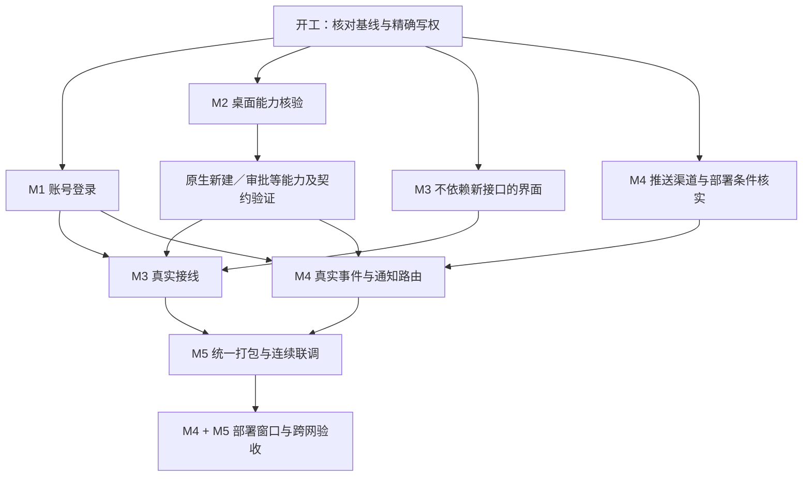

# REQ-002 任务总表

2026-09-25 D-11已实施：Mac双栏build43安装，正式账号与手机身份一致，五分类／方向键／明暗布局实测；LIST修复已装入组件但真实全量列表未验收，CONTROL长会话仍超时。当前缺项及用户接管UI记录见[本批验收](../../validation/settings-sidebar.md)。

2026-09-25 最新阶段：正式1.0.24已安装模拟器，D-10单列表与紧凑对话／输入落地，长输入白屏和手势区透底修复已实测；手机同原Desktop公网连续收发、运行到完成及后台恢复通过指定路径。极速输入尾部缺失和既有未验收项继续保留。任务“手机 UI 与交互续接”及内部辅助已交回实现写权，主管统一验收；详见[唯一手机验收记录](../../validation/happier-mobile.md)，不宣称REQ整体完成。

2026-09-25 接续：1.0.22/code23与最终CLI已完成公网连续收发、静止重新打开、后台完成恢复及恢复后再发送的指定原Desktop路径复验；dev `0fed02010`、自有快照 `2b5945d74` 已保存推送。真实审批、锁屏推送、小米、多电脑和冷历史owner兼容仍保留缺项。原“手机 UI 与交互”现已获[新版设计](../../design/mobile-ui-2026-09-25/README.md)的D-10页面、刷新和动效写权并开始实施；基础方案无需再次审批，实际打包和设备验收由主管执行。

2026-09-24。依据[需求 v0.10](../requirement.md)、[详细设计 v0.2](../detailed-design.md)。
用户已确认“是的，没错，改了后划分tasks”，本轮已完成账号设计简化和任务文档。随后用户明确“开始实现”，现按已确认范围执行；源码、专项测试、安装和真实验收分别记录。

2026-09-24 云端接续：业务镜像独立 Linux 构建、真实登录/持久化通过，6文件提交 `de4731a77`、自有快照 `da2bb7ca9` 已推送。业务/Caddy镜像均已上传校验并导入；部署配置安装到固定独立目录，主机预检和维护资源限额回读通过，两个容器已健康启动且重启数0，公网HTTPS ready返回200、链信任/IP SAN验证通过。38项维护检查和P1独立原复现通过，真实age加密/文件恢复通过（Docker边界合成）；云端账号登录/WebSocket、证书续期、实际服务恢复和手机跨网仍未通过。11个既有容器导入前后状态不变，PVTC未修改或重启。功能完成先汇报，再整理界面，不把镜像或预检成功当M4/M5完成。

2026-09-24 最新阶段：Android 1.0.20已安装模拟器；自动列表实测发现设备比电脑慢约35秒导致候选被判未来、状态未知及排序异常；校准设备后最近排序和深页恢复通过。原手机任务随后完成跨端时间、墙钟回拨及Android深睡边界修复，最终77项专项、UI noEmit与独立复核通过，8文件冻结，1.0.21/code22已构建并安装模拟器，±35秒运行/完成分类及最近排序实测通过，正确任务回复一条。深页本版复验因预期外页面切换停止点击，实际长时深睡仍未验证。**电脑端会话与项目接入**仅只读核对真实生命周期，不改源码或运行进程。此前1.0.19冷开首发、同轮追加、断线保留草稿及恢复重发、过期提示清除已实测；不是公网／小米／通知／真实审批整体通过。本批手机8文件已保存到dev提交`3a6393eae`，自有快照`3b0393663`已推送并回读；服务端目标3文件未提交，独立镜像构建中。不增加API，D-10布局延后，原生新建按D-05暂缓；无域名和自有推送项目已记入M4，PVTC未改。

## 1. 固定范围

- 手机／Mac 账号密码直接登录，管理员预建独立账号，记住登录并可退出当前端。
- 不做公众注册、首次激活、自助改密／找回、恢复码、设备管理或远程退出其他端。
- 同账号多电脑、全部可访问历史、真实项目及新建、原 Desktop 同任务收发、手机审批、通知直达。
- 已选紧凑 UI、原 Logo、会话／电脑／我的三个入口；PVTC 保护不变。
- 开源能力优先复用，数据与实际操作边界不能靠假接口、假数据、独立执行器或隐藏错误绕过。

## 2. 五组任务

M3 本轮委派补充（2026-09-24）：用户已采纳独立手机 UI 与按需 Paper 的建议，并授权 Cursor／Grok 4.7 协作。已在 Cursor 实际启动 **Codex Top mobile UI design**，按[样板任务书](cursor-ui-sample.md)制作隔离合成数据样板，主管处理依赖、审查和实机验证。既有 M1/M2/M4 业务写权不转交；样板不作为正式客户端功能通过。

本批收口：中文与样板源码已交回；中文167项、样板/配置46项和最终配置35项通过，完整UI noEmit通过；Web手机视口完成合成交互检查。正式APK仍是旧版，样板接线、原生动画/键盘及真实操作未验收。M2来源/标题已通过独立返工复核，完整三态与项目归属仍未完成。参见[验收记录](../../validation/codextop-mobile-ui-2026-09-24.md)。

M4部署包也已交回：停止阶段异常恢复与归档配额校验两项审查问题已修复，主管复跑24项本地检查、独立原复现复核通过；[部署包审查](../../validation/codextop-deploy-package-2026-09-24.md)明确真实Linux/加密恢复、公网及PVTC前后对照尚未验收，没有构建或部署。

| 任务 | 内容 | 主要交付 | 当前状态 |
|---|---|---|---|
| [M1 账号与登录](M1-账号与登录.md) | 后台预建、手机与 Mac 登录、记住登录、退出及隔离 | 唯一认证逻辑与可复用登录状态 | 进行中 |
| [M2 电脑会话接入](M2-电脑会话接入.md) | 全部历史、真实项目／新建、原任务收发、忙时及审批 | 经验证的电脑能力、RPC 与真实回执 | 进行中 |
| [M3 手机界面与交互](M3-手机界面与交互.md) | 主／子页、账号简化、对话／新建／审批接线与流畅性 | 符合设计且使用真实能力的 App 界面 | 进行中 |
| [M4 通知与云端部署](M4-通知与云端部署.md) | 推送、通知路由、Docker／HTTPS、备份与 PVTC 隔离 | 可验证通知及独立云端配置 | 已独立部署；公网登录/收发部分通过，恢复与推送待验 |
| [M5 联调与验收](M5-联调与验收.md) | 统一构建、安装、小米／多电脑／跨网实测和交付 | 实际版本、闭环证据与已知限制 | 本机集成中 |

任务按职责长期归组，不按每个页面开新任务。2026-09-24 本批已复用侧栏 **手机 UI 与交互**（品牌/文案）、**电脑端会话与项目接入**（来源/标题/状态）、**云端中转与部署**（隔离部署包），以及 Cursor 的 **Codex Top mobile UI design**（隔离样板）；本批均已交回写权。主管负责依赖、整合、设备与验收，精确边界见[主管记录](../supervision.md)。

## 3. 并行与依赖

这是依赖关系，不指定固定并发数；依工具容量、文件冲突、构建与设备窗口安排。M1、M2、M3 静态界面和 M4 条件核实可独立推进；共享接口、真实接线与设备验收必须等对应交付。

M2 优先核验原 Desktop 新建与审批入口，M4 尽早核验小米推送渠道。必要能力失败时，先记录具体证据及可选路线，停止对应依赖接线；不做完整假界面后才说明底层不支持，也不擅自缩减要求。

## 4. 唯一写权与交接

下表为规划分工；实际开工先确认精确文件列表和当前未提交改动。

| 文件领域 | 唯一负责方 | 交接约束 |
|---|---|---|
| 账号模型／密码协议／认证存储／CLI 登录 | M1 | M3 不重写认证；M4 只消费身份与登录代次。 |
| 登录表单、Mac 账号入口 | M1 先接功能，M3 后收外观 | 同文件顺序交回；`Views.swift` 不并写。 |
| Direct Session 协议／RPC／CLI provider／Desktop 适配 | M2 | 公共导出、协议生成和包配置由主管分批指定，不与 M1 并写。 |
| 列表／对话／新建／设置／导航布局 | M3 | 接收 M1、M2 契约；保留底层身份，不改事件 owner。 |
| 通知事件／推送注册／通知响应／待跳转目标 | M4 | M1 提供登录完成和退出边界，M3 提供页面导航；同一目标只由一个 owner 保存和消费。 |
| locale、锁文件、生成产物 | 主管按具体批次指定 | 不按模块推断能同时修改；先交回再交接。 |
| 需求、设计、任务总表、STATUS、统一验收 | 主管 | 其他任务只更新自己的文档与范围内证据。 |
| Computer Use、手机、模拟器、桌面、统一构建、生产窗口 | 主管 | 不并行控制，不在真实任务里测试；不让两个监控实例同时可见。 |

M1 接通登录结果回调；M4 决定通知目标的作用域、持久化及消费；M3 完成最终页面。三者不能分别创建自己的 pending 导航实现。

## 5. 进入和完成条件

- 产品开工前核对用户实施指令；旧中断前的授权不自动恢复。
- 先核对两个仓库现有改动，复用已做代码，保留无关工作。旧通过记录只作证据索引，不直接勾选本批清单。
- 新增或修改的方法写中文说明，关键状态转换、重试、取消和失败回退有就近注释。
- 行为变化做对应有效验证；界面连续操作、正式窗口、小米通知、公网和 PVTC 对照必须取得实际证据。
- 任务交付须包含精确文件、测试与退出码、未完成项、依赖和写权交回；未完成必要项不能标整体完成。
- UI 原生新建、手机审批和跨网通知等能力未打通前，不能以“APK 安装成功”或“设计图一致”宣布交付。

## 6. 需求覆盖

| 需求 | 主要任务 |
|---|---|
| R-01 安卓 APK、R-09 Logo 与统一界面、R-10 紧凑流畅 | M3、M5 |
| R-02 两端登录、R-03 独立账号、D-04 简化账号 | M1，M3 展示，M4 通知隔离，M5 验收 |
| R-04 多电脑、R-05 全部历史／项目／新建、R-06 原任务对话 | M2，M3 接线，M5 验收 |
| R-07 通知直达、R-08 云端与 PVTC 保护 | M4，M5 验收 |
| R-11 复用、R-12 注释 | 所有任务，由主管收口 |
| R-13 手机审批 | M2、M3、M4 提醒、M5 验收 |

## 7. 本轮文档完成记录

2026-09-24：简化账号设计已记录，v0.1 和需求 v0.9 原文另存历史；更新设置图，生成五组任务及依赖、写权和验收清单。此记录仅代表文档完成，所有产品任务状态保持未开始。未恢复任何实施子任务、账号创建、设备、构建或生产服务。

文档核对：68 个相对链接有效；五组任务所有产品项均未勾选；新设置图与生成原件一致，空白检查通过。独立复核已收口通知恢复写权和换号草稿清理，不代表产品测试通过。

## 8. 实施状态

2026-09-24 用户“开始实现”后开工。主仓 native/UI 与相邻 Happier 工作区保留现有改动；三个实施责任分别为 M1 认证与 CLI、M2 原 Desktop 协议、M3 手机导航与设置。主管负责 Mac UI、通知/部署条件及统一验收。M1、M2 公共导出和包文件变更先交主管协调；尚无必要产品项验收完成。

2026-09-24 D-05：用户“暂时不做”后，本批暂不采用桌面自动操作来新建会话，新建入口不开放；原生新建相关验收标“后续待对接”，不冒称完成。其余任务继续；原项目列表已找到 Desktop 的真实配置来源，正在只读接入。

### 2026-09-24 本机集成记录

- M1：两个独立合成账号经本机隔离服务验证；打包后的连接组件在仅有系统基础 PATH 的环境下通过查询、退出、确认未登录、再登录、再查询。源码审查修复了手机 token 身份未核对、取消登录残留凭据和 CLI 退出伪成功；不是正式同事开户或公网验收。
- M2：共享协议构建、CLI 类型检查与 Direct RPC 54 项通过；真实项目采用 Desktop 配置读取。普通命令／文件审批仍需原任务实际结果核验，复杂权限／网络审批只提示电脑处理。
- M3：账号、会话、电脑与项目界面已整合；等待输入时的追加消息分派、明确拒绝后的按钮恢复、动作发出前失败与发出后未知结果的区分已修复。最终相关 4 文件 127 项与完整 UI 类型检查通过；不以静态测试替代手机实际操作。
- M4：通知与推送专项 43 项、注册退出换号竞争 3 项、SQLite 推送 token 归属事务 3 项通过。Compose 使用合成参数做 config --quiet 验证通过；没有启动 Docker、修改 PVTC 或发布云端。
- M5：Mac 201 项 swift test、release 构建、带独立连接组件的 build 41 打包与签名校验通过；已安装并保持单实例，真实窗口检查账号区域。服务器 TypeScript 检查通过。安卓 1.0.13/code14 构建、原签名校验及模拟器覆盖安装通过，独立用户 10 保留原用户数据；小米当前未连接。
- 实测卡点：手机登录参数请求 200 后超过 6 分钟仍没有登录请求，测试 App CPU 超过一个核心。已定位到 Hermes 执行 JS PBKDF2；M1 正复用已有 Android 原生计算模块，保持 PBKDF2-SHA512 的 220000 次、32 字节盐和 64 字节主密钥及后续协议不变。修复必须重新打包验证，现不称手机登录通过。
- 遗留：修复后手机登录与持续交互、双电脑、原审批实际执行、外网和锁屏通知；HTTPS 域名与自有 Expo/FCM 配置尚未确认。上述未通过项不勾选为完成，不部署到 PVTC。

### 2026-09-24 用户实测反馈：通知邀请品牌残留

用户在 1.0.14 登录后的“开启通知？”弹窗看到 Happier，明确要求“不要出现 h 这些”；随后要求“记录下来，你先继续做你的别的测试吧”。记录为 M3 待修问题，本轮先继续功能测试，暂不为文案重新打包。

- 已确认入口：`settingsNotifications.pushPriming.body`，由既有通知权限邀请流程显示。
- 后续一并复核错误页、服务器错误、会话控制失败及欢迎页等可见品牌词，统一产品名为 Codex Top；内部包名、协议标识与合法许可证归属不盲目替换。
- 当前登录已实际通过，但不因成功登录忽略该用户可见问题；最终交付前需修复并重新验证该弹窗。

用户随后纠正三态和首页布局，现以[首页修订讨论稿](../homepage-revision-draft.md)收集新方向，不把 1.0.14 记为设计验收通过，也不在建议获批前直接改出第三套布局。M2 只读诊断发现内部子代理混入、标题污染和项目 worktree 漏项；真实三态尚需接入可靠状态源，不能改名掩盖。Mac build42 的201项测试、打包签名、安装、原监控窗口及隔离 daemon 实际升级通过。
