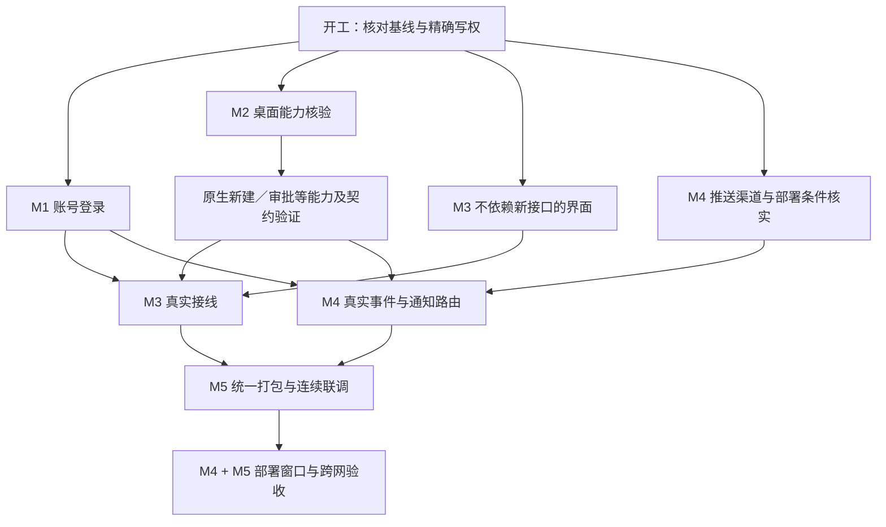

# REQ-002 任务总表

2026-10-05 历史批读逐项让出：旧两入口真实RED→新6组GREEN，账号／连接／预算／去重及迟回包边界保持；失败菜单补恢复输入与手机移除，并修复删除间隙重试复活。主管专项与独立Codex复核、Swift265／release及完整ARM64签名候选c4c9d2ce通过，22份生产源保持。无设备、未安装，三秒、手机菜单／草稿、图片后文字及目标编辑仍未验；单项DOM和常驻历史模型仍待优化。保留2ce及必要设备／回退包，Android源待实机验收，本片主仓仅记阶段结果。见[实现与待验](../../validation/open-latest-20261003.md#2026-10-05历史批读让出队列与失败消息菜单)。

2026-10-05 D-44缓存资源片：两生产源流式保存及缓冲读取，由Codex限定实施、两路独立复核，主管复跑新9组、分段模型及Runtime20／锚点14／尾页31通过。7组同输入JVM对照降低保存临时峰值，64MiB预算、原子替换和失败保旧保持；不是手机RSS或三秒证明。Swift265／release及完整ARM64签名候选2ce2e4ed通过，无设备、未安装；Android源待实际UI验收再提交。阅读完整DOM、全量写遍历、实际同步速度及目标编辑继续待处理，见[本片证据](../../validation/open-latest-20261003.md#2026-10-05历史缓存流式读写)。

2026-10-05 D-44最新页优先片：三路Codex分别实施模型／界面／真实方法专项，主管集成Runtime并独立复跑，另一路Codex复核与实际Cursor/Grok协议复核。v2本地连续段、页面身份、稳定来源书签与延迟通知补回已编码；两处UI移交与保存并发真实RED→GREEN，Runtime20／锚点14／尾页31及模型／界面回归通过。最终完整ARM64构建和原签名通过，候选61b75df0未安装，Android源待实拍后提交；设备未连接，默认最新三秒、图片后文字、实体恢复和目标编辑均不记完成。见[实现与验收边界](../../validation/open-latest-20261003.md#2026-10-05最新页优先与本地连续段)。

2026-10-05 易用性三项修复：两路Codex限定实现、另一Codex只读复核，Cursor/Grok实际核对尾游标拒绝协议，主管复跑真实方法。纯提问含目标直接开题、type3包含锚点、拒绝尾游标保存失效进入原恢复；普通分页、正文和发送语义保持。完整ARM64构建／原签名通过，ba5e300c尚未安装；设备当前未连接，Android源待实际界面验收再提交。D-44分段仍未实现，旧页缺口与三秒、图片后文字和目标编辑不记完成。见[本片验收边界](../../validation/open-latest-20261003.md#2026-10-05提问直达历史锚点和失效尾游标)。

2026-10-03 D-43独立实验交付：Codex实施任务完成一次性目标协调器和21项专项，另一Codex任务独立构建／复跑21项通过；Cursor/Grok实际交回只读复核，无阻断项。主管完成独立AppKit窗口与打包CUA验收，主仓原206项／release通过。所有写权已收回，样例测试后退出。仅独立样例完成；真实Codex执行器、手机编辑／删除接线仍未完成，不把测试适配器当生产能力。详见[阶段证据](../../validation/goal-read-20261003.md#界面操作独立验证版)。

2026-10-02 下一轮已实际派发：Cursor聊天设计任务独占DialogCell、新显示层CodexDialogPreview及两份专项四文件，仅整理列表普通文字的Markdown，不改原正文、草稿、媒体或主题；提问六文件返修仍执行中，目标任务只读追兼容传输。主管统一核验后再构建、提交；本段不把接收记作交付。

2026-10-02 D-39／D-40／D-41阶段：Android额度持久化f72deb3、真实摘要与右侧状态51af150、电脑／项目原语义图标0bbf5cd、明暗像素强调4f01a46已分别提交并推到自有分支，远端同SHA。最终2e71f86e已覆盖模拟器并回核完整SHA／账号；明暗列表、电脑／项目／聊天、多选原路径及额度离线冷恢复已实拍。一次在线合成首发T0→原记录T2观测1531.2ms，原用户／助手各1，回复与下一条输入保留。当前Mac75／模拟器2e71f86e／断连实体15e8f2da；不扩大为手机或恢复验收。Cursor／Grok四项已实际交付，主题保存失败返修已核验；异步题仍缺真实卡片回复闭合，原六文件跟随链返修已实际接收。目标五文件只读基础独立通过但尚未接入或发布。摘要格式和浅色系统导航对比度继续核对，完整目标未完成。

2026-10-02 实体手机已重连，D-38最终包15e8f2da正常覆盖成功；设备完整SHA与已验签产物一致，加密会话指纹保持。当前Mac75／模拟器15e8f2da／实体15e8f2da。复用已冻结Android38ccabd及上一阶段构建／模拟器证据，无新代码或重复包；未启动或操作手机UI，不将安装记作手机收发或完整功能验收。 详见[本次实机安装](../../validation/native-v03-20260930.md#实体手机安装界面优化版本2026-10-02)。

2026-10-02 D-38已实施：会话去掉大头像与完成勾，真实运行副标题前保留小蓝环；我的页真实额度前置、强调比例并减少重复图标。Android三片24c0b50／3244376／38ccabd分别提交推送；首开已有旧事实明确标注“上次”及失效原因，未续有效期或待办权限。最终15e8f2da已覆盖模拟器并回核SHA／账号，实体手机再次断连仍为81288a2a，安装待重连。明暗、原多选返回、完整聊天、真实额度及离线旧值已实拍；最终包同页联网恢复已验证，字号切换期间黑屏仍有待诊断，完整手机功能未闭合。Mac75保持，App内升级仍未接通。 详见[本阶段验收](../../validation/native-v03-20260930.md#会话我的页优化与首开旧状态说明2026-10-02)。

2026-10-01 实体手机已重连，最新Telegram原生包5ecac5bd（64,441,632字节）已正常覆盖，设备完整SHA与已验签安装包一致，加密账号指纹保持。当前Mac75／模拟器5ecac5bd／实体5ecac5bd；原0e保留上一版回退，5446／274既有QA保留，四个APK均回核哈希，无新增重复包。未启动或操作手机UI，不将安装记作发送、额度或副标题实际验收；原失败消息重试仍待确认。D-37远程升级需求仍待审核，未加入本次包。详见[本次安装](../../validation/native-v03-20260930.md#实体手机安装额度与副标题版本2026-10-01)。

2026-10-01 D-35额度根页／原语义图标、D-36空摘要状态副标题通过真实方法专项与独立复核；D-35／D-36分别推送8d014fb／069cbb1，远端均同SHA。新包5ecac5bd已正常覆盖模拟器并回核SHA／账号，未启动或操作Android新包UI；实体16:11断连仍0efd9c66，Mac75已正式安装。两次实体发送在owner发现阶段超时且未派发，根因未确认；沿D-13的一次冷发现恢复源码已推送，Mac75构建、签名、正式安装与身份保持回核通过，CUA已实拍运行圆环，不标收发通过。三屏静态PNG收图已闭合，整套装饰仍未批准。详见[集中记录](../../validation/native-v03-20260930.md#额度副标题与发送冷发现记录2026-10-01)。

2026-10-01 附件入口、回答正文与下载调度三处最小修正已分别推送自有 Android 分支 ac21cb8／77691ef／da113d5，远端同 SHA；独立复核、主管八组32 MiB回归、Swift206项重跑及release通过。原纸夹空输入恢复，完整回答封套仅作可读投影，下载使用已有网络队列避免等待旧页；无新界面或提示。最终64,439,246字节 e0f80acc 已覆盖模拟器与实体手机，两端完整包 SHA 和账号保持。当前 Mac74／模拟器e0／实机e0；旧通知、草稿分歧、手机实际提问与图片文件收发、当前包恢复及外接屏未闭合，整批未完成。详见[本批修正与待验](../../validation/native-v03-20260930.md#附件入口回答正文与下载调度2026-10-01)。

2026-10-01 L1同来源并发两文件已推送自有71062c69，原入口重复RPC、首连失败吞新连接及建连发布至返回间隙重复读取三项真实RED→GREEN，独立及主管32MiB专项／相邻回归通过。仅合并在途读取，原快照与队列保持，无新owner、轮询、RPC或提示；构建、签名与正常覆盖回核通过，账号保持。当前Mac74／模拟器378a955b，未启动应用，手机额度及Q／F／收发恢复仍未验，整批未完成。详见[本批验收](../../validation/native-v03-20260930.md#额度同来源并发合并2026-10-01)。

2026-10-01 提问动态同步与未知大小显示已独立复核、专项／构建／签名通过；cell8719ae0f与Q295d5b46分别推自有Android分支、远端一致。新包27bd37d3已正常覆盖模拟器并核对包SHA／账号保持，原状态通知／弹窗／cell复用，无新owner或轮询。当前Mac74／模拟器27bd37d3，实机断连274a；未启动应用，手机Q／F／L及收发恢复未验，整批未完成。详见[本批验收](../../validation/native-v03-20260930.md#提问动态同步与未知大小显示2026-10-01)。

2026-10-01 云附件混合漏项已单独推送f8a938988，57专项与正式构建通过，Mac74已正式安装并核对账号／单实例／真实窗口。仅保留明确不可用项，不新增下载桥或提示；模拟器abffbab5和断连实机版本保持。Q表单动态同步及未知大小小修正已分配；手机实际界面、收发恢复和云字节下载未验，整批未完成。详见[本批验收](../../validation/native-v03-20260930.md#云附件混合漏项与mac74部署2026-10-01)。

## 当前批次：原生手机端 v0.3（2026-09-30）

2026-10-01 手机实际限额七文件768101fc已提交并推送、远端同SHA；原候选能力、Outbox及文件选择错误框复用，无新增RPC／轮询／提示控件。首次connect丢首份列表的真实RED已修正GREEN，独立复核、解析、主管32MiB三组真实方法／分支、构建和正常覆盖回核通过。当前Mac73／模拟器abffbab5，账号保持，实体机断连274a；清理534并回核保留ab当前／314回退／5446启动QA／274实机。实际启动、手机限额提示、Q／F／L及当前包收发恢复仍未验，整批不标完成。云附件混合漏项已另分配两文件最小修正，只保留明确不可用，云字节下载仍有缺口。详见[手机限额验收](../../validation/native-v03-20260930.md#手机附件实际限额接线与安装2026-10-01)。

以下四段保留先前各阶段发生时版本与待办，当前状态以上文和本表为准。

2026-10-01 实际限额后端九文件已提交0fda05f1c，自有发布67de1985已推送并回读一致。原候选能力字段复用实际传输注册上限，不增RPC／owner／轮询／弹窗；实际RED→GREEN、独立复核、主管CLI100项／协议28项、noEmit和protocol／CLI正式构建通过，Swift206项本批通过。Mac73已正式构建、签名与覆盖，账号／machine保持及唯一实例回核通过；内置屏CUA实拍圆环运行1／待办0，原机器RPC限额读取与limit+1元数据拒绝通过，无正文或任务消息。Android发送前校验仍在实施且未冻结／构建／安装；模拟器保持314ca286、实体机断连，手机UI、收发恢复与外接屏仍未验，整批未完成。详见[本批验收](../../validation/native-v03-20260930.md#附件实际限额后端接线2026-10-01)。

2026-10-01 附件失败说明4eaebed已单独推送；实际方法RED→GREEN、独立复核、32MiB七组、构建及覆盖回核通过，当前314ca286，账号保持。仅原Outbox与原长按菜单footer，不增加弹窗。Happier实际限额接线专项准备已完成，尚未构建部署或接Android；手机界面／收发恢复仍待验。详见[本批验收](../../validation/native-v03-20260930.md#附件失败原因与原菜单说明2026-10-01)。

2026-10-01 bulk拒绝后续阶段：9343775已单独推自有Android分支并回读同SHA；真实方法RED→GREEN、独立复核、32MiB回归及实际机器元数据拒绝通过。53459fb4已覆盖模拟器、回读一致且账号保持；未改Runtime或UI，没有新增弹窗。当前真实启动／手机Q／F／L／网络收发仍未验；上传前限额和手机具体原因说明保留缺口。详见[本批拒绝记录](../../validation/native-v03-20260930.md#附件bulk拒绝结果保留2026-10-01)。

2026-10-01后续缓存恢复增量：四个Android文件已冻结，真实预取方法32MiB及6组模型通过；已离线构建、验签及覆盖模拟器，最终01f1254d回读一致、账号保持。源码bd733595已单独推自有分支并回读同SHA。先前5446a1f3有启动未完成ANR记录，采样栈位于LauncherIcon静态初始化，尚无受控复现，不归因于缓存修正；当前包真实启动／手机UI／网络仍待验。详情见[缓存恢复与启动记录](../../validation/native-v03-20260930.md#缓存恢复增量与启动失败补记2026-10-01)。

**2026-10-02更新：当前Mac75／模拟器2e71f86e／断连实体15e8f2da。D-39～D-41四片已推送，构建签名、模拟器实际界面、额度离线冷恢复及一次在线首发通过；手机安装／功能、异步提问回复、目标接入与其余恢复验收仍待补，整批不标完成。** [需求 v0.11](../requirement.md)与[设计 v0.3](../detailed-design.md)已审核，D-38～D-43属于用户明确授权增量，不重复同版审核。

本批源码基线已核对：Codex Top `main / f2d7a8c`、Telegram Android `dc28c18`、Happier `2a84c29a5`。主仓既有文档及用户 `AGENTS.md` 改动、Happier 的 `AGENTS.md` 与两份旧 UI 同步文件均保留；开工时Android工作区无改动。10月1日Mac72正式覆盖安装完成，签名、单实例及产品账号／机器身份保持；真实窗口圆环显示1个运行、0个待处理。此前附件批次Android整合包5446a1f3已覆盖模拟器user10，包回读一致、账号保持；断连实体手机最后已验证仍为274a48c2。当前构建／安装证据见[M5本轮交付状态](M5-联调与验收.md#本轮交付状态2026-10-01)，此前逐项证据保留于[本批记录](../../validation/native-v03-20260930.md)，不沿用下方旧包编号或旧包功能结论。

### 实施批次和依赖

| 顺序 | 批次与需求 | 交付及开始条件 | 状态 |
|---|---|---|---|
| 1，可并行 | [M3-U1／U2](M3-手机界面与交互.md)：三栏、列表状态、顶部与复制；D-24～D-26、D-28 | 沿现有真实数据先完成原版页面适配；列表真实状态等 M2-S 交回，选择题专用待办等 Q1 交回后接入。 | S／U已交回并安装；Q页面代码已交回并装模拟器，实际提问界面待验 |
| 1，可并行 | [M2-S／Q0／F0／L0](M2-电脑会话接入.md)：列表状态接入及提问、附件、额度的接入验证 | 复用已有源码定位，交付可执行输入／输出、能力与错误语义；独立只读检查可并行，真实控制验证由主管安排。 | S已交回；Q04原任务回显，Q05电脑已答，Q06机器RPC提交及原任务回显通过；F03原执行端及下载通过；L实际机器RPC可读 |
| 2，按项交付 | M2-Q1→M3-Q：回答 Codex 提问；D-29 | Q0 闭合后实现原请求提交及手机原选择弹窗；不必等待附件与额度全部完成。 | Q动态同步295d5b46已推送，专项／构建及模拟器27bd37d3覆盖通过；Q06原机器证据保留，手机表单及生命周期仍待验收 |
| 3，按项交付 | M2-F1→M3-F：图片、文件双向；D-23 | F0 闭合后接原传输、消息投影和附件控件，实际内容到达同一任务。 | F03原执行端及下载已有证据；F1及手机实际限额已接入、复核并构建安装；未知大小显示8719ae0f已推送并入27bd37d3；手机限额交互与实际收发未验，云引用下载缺口保留 |
| 4，按项交付 | M2-L1→M3-L：我的额度；D-27／D-35 | 我的根页沿原设置行直接显示同来源实际采集值，缓存先显、按需读取与原语义图标保持。 | L0机器RPC及L1并发证据保留；D-35源码8d014fb已推送，真实方法与独立复核通过并入模拟器5ecac5bd；手机额度UI未验 |
| 本批反馈优先 | M2／M3：D-30～D-33，本地浏览缓存、列表差异更新、更多移除、运行环与状态图标 | 沿原缓存／列表／原版控件最小修正，保持未知、过期和来源语义。 | 先前批次保留有限模拟器证据；后续bd733595已推送，真实方法合成、6组模型、构建与模拟器覆盖通过；缓存批次01f1254d，当前模拟器5ecac5bd，真实启动／手机UI／网络验收待补 |
| 本批反馈优先 | M3-U2：D-34聊天顶栏 | 沿原双行标题隐藏C头像，真实运行前用共享帧时间的小蓝色圆环。 | a070fe6已推送；状态回归、源码复核、构建签名及两端0efd9c66覆盖回核通过，实际顶栏对齐／动画／状态切换待验 |
| 本批反馈优先 | M3-U2：D-36空摘要副标题 | 原草稿及真实摘要优先；为空才显示既有真实状态说明，STATUS沿原行更新。 | 真实方法与独立复核通过，069cbb1已推送且远端同SHA，已入模拟器5ecac5bd；实际显示未验，不加入未核实子任务数 |
| 发送失败收口 | 原native-auto-v1无附件普通文本冷发现恢复，沿D-13 | 仅首次冷发现timeout／owner_unavailable且本次尚未提交，在macOS官方已有任务入口launch-only最多一次，原身份及lease复核、只提交一次。 | 三文件专项167／167、直接noEmit与独立复核通过；源码fbf95874及自有发布addde190已推送回核。Mac75已正式安装并回核身份／窗口，已派发unknown不恢复／重投；手机重试及收发待验，详见[本批记录](../../validation/native-v03-20260930.md#额度副标题与发送冷发现记录2026-10-01) |
| 每批收口 | [M5-V1～V4](M5-联调与验收.md)：整合、正式包、实际闭环 | 对应实现交回后验证，不将源码通过当作安装或真实功能通过。最后做受影响普通聊天回归。 | Mac75已正式安装并回核身份／窗口，模拟器5ecac5bd正常覆盖并保持账号；实体已重连并正常覆盖5ecac5bd，包SHA与账号保持。未启动Android新包或验实际手机UI，手机重试、Q／F／L及恢复仍待验 |

顺序表示优先级，不要求空等：M3-U 与 M2 契约核对可以同时进行；Q／F／L 一项交付即可接一项。共享协议、Android 接入层和 `ChatActivity` 必须串行写入；M3-U2 中不依赖新字段的点击与顶栏整理可先做，未打开详情的列表状态等 S 交付、真实待回复入口等 Q 交付再验收。

M1 本批不重做登录或账号，M4 本批不重建云服务或扩大推送实现；既有未验收项保留在原记录，遇到本批回归再按实际原因交回。D-05 原生新建继续暂缓，旧任务中涉及新建的清单不作为本批开工依据。

用户实机新增反馈已落地：电脑／项目／已加载会话本地优先、空缓存区分、首页无变化不发布与稳定实体差异更新；移除首页更多、运行环同相位，按原素材比例修正状态黑块。模拟器已证实离线冷启缓存、联网恢复状态及上述显示项。缓存批次最终发送脚本在输入前因wrong_chat保护中止，未发消息且无计时；期间未预期切页原因仍未知，不继承旧包发送结论。实体手机待重连，副标题仍讨论。Q／L在Mac71已取得真实加密机器RPC证据：Q06返回recorded且原轮次匹配，原任务实际回显乙／慢；额度available、来源匹配且返回实际窗口和采集时间。Q05用户已确认在电脑作答甲／快，后续脚本在读题阶段因题目已不可用退出，未执行action，不计产品提交失败。Q／F／L此前已进入5446a1f3整合包，但实际手机界面与收发仍待验证；CUA无法绑定模拟器属于验收环境限制，不记为产品缺陷。

缓存批次写权已交回，源码保留在 `42644408`。当前F1沿同一Outbox保存原选择、已暂存前缀、已上传前缀及投递结果未知状态，第二件暂存失败丢批次的实际代码回归已由RED转GREEN；Runtime及6个原UI文件已冻结，独立复核未发现其余阻止构建的缺陷。Happier附件索引顺序与名称两项RED修正后14项及typecheck通过，源码 `0c32c5ea2`、自有component分支对应提交 `b1d1f7a5` 已推送；Android模型阶段 `8c69a33` 已推自有fork的 `codex/native-mobile`。Android整合源码4da430c已单独提交并推送同一自有分支；不推第三方上游。

此前（2026-09-30）Q专项245项、协议9项及返工138项分别通过，CLI noEmit通过；不同批次不合计为去重总数。L专项24项及Android额度JVM模型通过，Android提问模型通过。独立Q复核发现混合待办误将计划题列为审批，已修正；原提问仍阻止不适用的新轮次发送。Swift完整206项首次因既有取消测试的PID文件等待超时失败，未修改该测试逻辑；随后针对9项及完整206项通过。新增官方CLI嵌套路径测试先失败后修复通过。以上是源码与构建证据，不替代手机表单、额度来源展示或附件实际验收。

10月1日Android完整构建1分19秒通过，重打包前后7,639条目内容一致、签名有效；最终包64,429,024字节，完整SHA见M5。Mac72的Swift206项重跑及release通过，首次既有额度测试PID等待超时仍保留，不称已修复其原因。整合源码已分阶段保存并推送；下一步在设备可操作后依次补手机Q／F／L实际闭环及受影响普通聊天回归，现有通知、审批、多电脑等验收缺口继续独立保留。

### 写权与交付约定

后续缓存恢复增量的源码写权已交回主管：修正已加载但缺少尾游标时的恢复、空投影最多4页续读、写盘失败误标预取完成，以及已访问且已连接的非首页电脑预取；坏候选行跳过，不占正常条数。沿同一队列，不汇总所有电脑主页、不自动连接全账号；缺少最新锚点时保留缓存并拒绝伪造尾游标。RuntimePrefetchTest在32MiB堆上验证提取的真实方法，网络／账号／队列仍为合成边界，不是整App或真实网络验收。构建、覆盖回读及单独推送已补记于同一验收节；5446包启动ANR与9月29日旧NPE分开记录，不据旧异常判定当前包失败原因。

| 范围 | 本批唯一负责方 | 约束 |
|---|---|---|
| Happier 协议、机器 RPC、原桌面控制／历史投影、传输及额度来源 | M2 接入负责人 | S→Q→F→L 的共享文件逐项交接；只读检查可并行，新增字段先交契约。 |
| Android `com/butang/codextop` 的连接、状态、消息、待发与缓存适配 | M2 的手机接入负责人 | 一人串行整合 S／Q／F／L；M3 消费接口，不另起数据 owner。开始前主管核对并列出精确文件，不授整个目录无边界写权。 |
| 原版底栏、列表、聊天、设置及必要资源 | M3 原生界面负责人 | `ChatActivity` 按 U2→Q→F 顺序；`SettingsActivity` 按 U1→L 顺序，同文件不并写。 |
| Swift 额度 owner（仅确需修改时） | M2 提出最小范围，主管分配 | 保持已有读取与账号来源归属，不复制一套解析或轮询。 |
| 文档、资源共用文件交接、版本／构建配置、构建安装与设备 | 主管／M5 | 单一设备操作窗口；不在用户当前工作任务发送测试，不同时展示演示与真实实例。 |

实施任务交回最小契约、实际差异、专项结果、未闭合项及文件写权。首批U1/U2及S之后，Q／L已按契约交回，F1 Runtime及原UI也已冻结交回；共享协议、Android接入层及页面文件仍由主管逐项交接。技术核验发现无法满足已审设计时，只暂停对应依赖、报具体证据；不得静默降级为文字路径、另一执行器或假成功。

### 完成边界

- [x] 需求、设计审核记录与任务依赖已同步；三路只读复核完成。
- [x] 用户下达“开始执行”，已核对当前基线，向原手机UI续接、电脑接入任务分派第一批精确写权并回读运行中。
- [ ] M2、M3 各批完成行为检查并交回；主管复核需求覆盖及是否存在重复 owner／多余轮询。
- [ ] M5 记录对应实际安装与逐项验收；功能缺口不由截图或构建结果代替。
- [ ] 收回写权并完成项目要求的检查后阶段提交；仅向本项目已授权远程推送，不推 Telegram／Happier 上游，不提交包或私有诊断。

历史通知、真实批准／拒绝、多电脑等缺口不因本批局部通过而关闭；本批完成也不自动等于 REQ-002 全部完成。

## 历史任务与版本记录

以下保留旧 RN 和早期原生批次的原文、勾选与证据；“当前版本”“进行中”、旧写权及旧新建计划仅指当时，不覆盖上面的 v0.3 批次。

当前版本为Mac68/Android3a31a04f。审批版本校验已安装并验证空待办读取；上一包c134897c通过在线335.1ms送达、下一条草稿保留、最近上限修改与重启保存，以及首页时间刷新。当前包两轮暖重连首发520.6/277.2ms通过，真实批准/拒绝、多账号/多电脑、通知、实体机与合盖仍待验收；下方旧版本记录保留作历史证据。

2026-09-30 当前Mac68/Android2942bbd2：在线337.8ms、两轮暖恢复首发342.8/272.9ms到原记录，自动回复和后续草稿保留。R-13空待办入口已实测，合成IPC104项与typecheck通过，真实批准/拒绝仍未验收。审批连接换代结束通知、首页时间差异刷新修复在源码待装；多账号/多电脑、通知、实体机和合盖仍未完成。详见STATUS与本批验收，不采用下方旧阶段版本作为当前版本。

2026-09-30 R-13继续：原顶栏/AlertDialog已接读取与单次决定，账号/页面/连接归属守卫、提交身份先保存及回读已实现，Java编译38秒通过。未安装、未验证真实批准/拒绝/重复点击或进程恢复，不计R-13完成；设备b23d2f94保持。

2026-09-30 R-13原生审批适配进行中：现有control.read/action接口及session.write授权已核对，Android数据模型/调用封装已实现，合成测试与Java编译通过。Runtime队列、现有弹窗接线、结果回读、防重复及真实验收未完成；设备仍b23d2f94，不把状态显示或接口封装算审批完成。

2026-09-30：Android fe778621已安装，正文缓存总预算64MiB、旧文件淘汰及账号目录隔离的合成测试通过。实际模拟器离线可读，两轮恢复首发954.5/276.9ms，原记录用户/助手各1、回复自动显示且下一草稿保留。Mac68保持。实际满额、账号切换、实体机和合盖仍待验收；本轮未提交推送。

2026-09-30：Mac68 已安装，Android仍bca2383d。状态观察复用现有只读生命周期，明确单文件状态不再请求桌面完整历史；CLI164项、typecheck、Swift205项及打包签名通过。模拟器在线293.2ms、长会话打开返回339.5ms、两轮断网恢复首发281.0/280.7ms到达原对话记录，回复各1且草稿保留。完整历史请求和大帧日志均0；旧格式路径、实体机、合盖及账号/多电脑仍未验收，整体未完成。已恢复测试环境并保留Mac67回退，无提交推送。完整时序与限制见[本批验收](../../validation/mobile-cache-size.md)。下一步继续剩余账号及缓存验收，不将本轮结果推广成全产品通过。

2026-09-30 已撤回上一页订阅保留实验：当前原生app.asar协议只读核对，following-status-requested用于跟随者登记，不是独立运行状态查询；完整历史请求会强制水合并广播快照，不能直接删除后用旧终态冒充当前状态。尝试手机最多保留当前及上一页租约20秒，编译8秒、构建1m4s、覆盖与设备SHA3b7666c1一致，冷启3824ms。实测快速返回确有observation_lease=reuse，但长会话旧请求仍传两份164668274/164668275字节快照（parse282/245ms），完整历史9256ms；发送steer等待5002ms结束，45秒内原对话未出现测试消息，随后只读复查该用户消息0条，未盲目重发。此方案增加大帧传输、未解决原生端等待，已仅撤回本轮PreviousObservation/switchObservation修改，保留既有发送计时，恢复此前bca2383d APK，安装Success、冷启2824ms、设备SHA完整回读一致。失败3b包已按哈希确认后删除，仍保留bca当前与c3c回退；Mac67保持。手写设置恢复缺省，网络/AC未改变；未清账号、历史或未确定投递结果的待发身份。实验失败完整保留，不将复用日志或构建通过当成收发通过。下一步重新检查状态事实来源，避免打开对话就强制完整历史水合；任何替代必须保持未知/过期明确，不修改Codex数据或伪造状态。整体未完成，无提交推送。

2026-09-30 Mac67诊断包定位到原生IPC等待：在desktopIpc现有请求记录起止，超过1MiB帧记录体积/解析/归约耗时，不记录参数、正文或会话身份。首轮日志依赖触发测试环境配置缺失，已仅隔离外部日志文件边界；正确CLI目录下126项测试通过、正式typecheck通过。根目录首次命令未发现用例，不计通过。连接组件1.0.0+codextop.67构建、Swift release构建、签名验证和覆盖安装完成，真实安装build67，二进制SHA b0f64df65dadb0b6a5a02ea24ba94ca425b146706ac407f37f98ae0fa1a0ba71。首次启动继承代理导致证书目标错配，未关闭TLS；清除进程代理环境后重新启动，03:44:39服务连接成功。当前仅一个真实应用与连接进程。Android bca2383d保持。交错发送T0 UTC2026-09-29 19:47:02.004766、原记录19:47:05.706、T2观测3731.0ms，仍失败；手机已见单条消息/自动回复且输入框为空。IPC：发送initialize519ms、owner发现1ms、steer往返2874ms、随后原生明确拒绝后的start往返349ms；重叠完整历史请求3867/2830ms。收到的约2.13MB帧parse4ms/handle0ms，不能将本轮延迟归因于连接组件JSON解析；未捕获主长会话完整大帧，亦不声称已排除原生端序列化/调度。需继续减少状态基线对完整历史水合的依赖，先核对原生状态协议和连续性证据，不能用缓存终态伪造当前状态。原进程sample缺符号，未作为根因证据。回退Mac66已核验SHA17499ab0并保留，清理更早65；Android回退c3c保持。模拟器本轮未改网络/AC，手写已恢复缺省、键盘切回中文后返回列表；未改账号。无Swift源码改动，本轮未跑swift test、未提交推送；安装诊断不等于延迟修复或全产品通过。

2026-09-30 分段计时包再次复现长历史交错超时：Android assembleAfatDebug 1m7s通过，用户10覆盖安装Success，设备与产物SHA一致 bca2383db61860e0e931803afc781a0d8f080472d32d4697834de8519c6700f7；Mac安装回读build66。启动命令WaitTime3013ms时设备处于休眠，不能视作界面启动耗时；临时接通模拟器AC唤醒后进入原账号列表。长对话“同步中”期间切回专用测试对话发送，T0 UTC2026-09-29 19:30:12.188006，原记录19:30:16.578，T2观测4411.7ms，三秒失败再次复现。Android同单调时钟阶段：queue1ms、persisted2ms、linked2ms、ack4428ms；本地排队/落盘/关联不是本轮主要等待，延迟在调用发送接口后，仍需区分Socket事件队列、传输与桌面处理，不能直接认定JSON解析为根因。随后稳定基线T0 UTC19:31:17.935022、原记录19:31:18.257、T2观测335.2ms；queue0/persisted1/linked1/ack631ms。T2为同主机50ms落盘采样含ADB注入；ack是接口返回代理观测，不能替代T1接收，跨设备时间不能直接相减。两条原用户/助手各1，截图phase-overlap-reply与phase-base-reply各1气泡/回复，基线nextdraft保留且键盘保持；本轮未完成当前包两轮断网。已清合成草稿、中文拼音回读、手写恢复缺省、AC恢复off并回列表；网络未改。回退包c3c33257哈希回读，清理已被替代的da1f7b65；没有构建安装活动句柄，无提交推送。下一步定位发送接口内部等待，再修复并重跑超时场景；整体未完成。

2026-09-30 长历史交错发送发现未通过项：在当前 c3c33257 验证包上，长对话加载完成后回测试对话发送，T0 UTC 2026-09-29 19:14:16.883596，原记录 19:14:17.282，T2 观测 434.0ms；长对话仍显示“同步中”时切回发送，T0 UTC 19:17:46.429399，原记录 19:17:50.151，T2 观测 3748.9ms，超过三秒门槛，保留失败。两条原用户消息和助手回复分别各 1，本次重新只读核对；真实手机截图均有对应回复且输入框为空。T2 同主机50ms采样含ADB注入；T1未观测，手机日志时钟与主机有偏差，不能直接相减。同步中截图证明界面仍在等待，尚无服务端跨度证明当时哪一请求占用了发送链路。代码检查确认发送为独立队列、native-auto使用独立IPC连接；大帧JSON解析仍同步，但尚不能认定为本次根因。已在Android调试构建路径补queue/persisted/linked/ack阶段耗时，只记随机身份哈希和单调时钟，不记正文；compileDebugJavaWithJavac通过8秒，尚未打包安装或用新计时复现，不宣称修复。手写临时设置已恢复缺省；下一步装计时包重现并划分等待阶段，再做最小修复。整体未完成，未提交推送。

2026-09-30 已有Socket重连唤醒及两轮首发通过：原connect事件区分首次/重连，重连沿同一onDesktopConnected唤醒；账号代次、连接对象身份、当前电脑守卫后在statusQueue取消原定时项再执行，无新轮询器。Android构建1m13s、覆盖Success、冷启3434ms，设备/产物SHA一致c3c3325733f322bdd4991f2c4bc6d8bdda765045a298e6d1508e74bd601ed9a8，Mac66保持。在线基线T0 UTC19:07:19.481113、原记录19:07:19.784、T2观测331.4ms。两轮均先确认无默认网络，历史/草稿保留；恢复A：4312ms reconnected并立即status，4481.2ms真实completed；T0 UTC19:08:27.149650、原记录19:08:27.411、T2 276.5ms。恢复B：4460ms reconnected、4462ms status、4617.5ms completed；T0 UTC19:10:16.431562、原记录19:10:16.718、T2 330.6ms。网络启用命令为恢复起点；重连事件至状态分别约169/158ms，不再等5秒。脚本改原始管道分行读取，避免文本缓冲推迟日志交付；T2同主机50ms采样含ADB注入，T1/精确T3未观测。三条原用户/助手各1、手机各1气泡和自动回复，后续nextdraft保留，键盘保持；稳定12秒采样2次状态、间隔5112ms，无此窗口重复轮询。短对话局部验收，不替代长历史并发、跨账号、实体机/合盖或全场景时延保证。截图transport-base-reply/reca-reply/recb-ready/recb-reply。合成草稿清理、中文拼音回读、手写设置恢复缺省、网络1/1并返回列表；账号未改。保留da1f7b65回退并核验SHA，清理更早897952e4；无活动构建安装句柄、无提交推送。下一步转长历史和账号切换剩余功能验收，整体未完成。

2026-09-30 网络广播恢复接线及当前包两轮首发：复用ApplicationLoader原网络广播，在前台已登录且desktop缺失时沿refreshDialogs/loading门禁触发，不新增监听或定时器；已有连接路径仍沿原Socket重连。Android构建1m22s、覆盖Success、离线冷启2582ms，产物/设备SHA一致da1f7b65357fe4bce5e03e70cd01386b8b34c66751b5744ab8e936914972207c，Mac66保持。冷恢复A：启网4143ms原广播network_available，4146ms机器查询、4248ms完成、4689msSocket、4690ms状态查询、5166ms同步中、6242.9ms首次已完成；恢复后首次发送T0 UTC19:00:47.359847、原记录19:00:47.670、T2观测318.7ms。暖恢复B：系统确认无默认网络后启网，观测状态恢复9253.5ms，T0 UTC19:01:58.234195、原记录19:01:58.488、T2观测264.1ms；已有Socket恢复仍受状态定时等待，未闭环。相对计时为主机收到日志的观测值，存在日志缓冲；T2同主机50ms采样含ADB注入，T1/精确T3未观测。两条原用户/助手各1、手机消息/自动回复各1、nextdraft保留；一冷一暖两轮首发满足三秒，不覆盖长历史交错或实体机/合盖。截图network-reca-reply/network-recb-ready/network-recb-reply。已清合成草稿、中文拼音回读、手写设置恢复缺省，网络1/1并回列表；未改账号。保留897952e4回退并回读SHA，清理更早c0772fca，无活动构建/安装句柄，无提交推送。下一步补已有连接重连唤醒及账户隔离剩余验收，整体未完成。

2026-09-30 新连接唤醒状态查询装包验证：Android构建1m9s通过，覆盖Success、冷启2674ms，产物／设备SHA一致897952e457e475bfa616fdb0333d360ce1a743788593bf4a8f50ae614b531b6a，Mac66保持。离线冷入后启网：4947ms开始机器查询、5145ms完成、5275msSocket就绪，5276ms即查询状态；5871msattach、5934ms同步中，7038ms已完成，随后12149/17253/22370/27434ms已完成，稳定约5秒无叠加轮询。对照上一计时包连接就绪5574ms却到9942ms才状态查询，消除了该段约4.4秒空等；总恢复仍有约5秒首次重建等待，不声称全链路瞬时恢复。真实截图wake-897-recovered历史与状态正常，返回列表12秒内状态日志0条，代次取消实测一次；跨账号/长请求交错未验收。本轮未发消息，当前包收发和两轮恢复仍待测。网络回读1/1，未改草稿或账号，已回列表。保留c0772fca回退并核验SHA，清理更早3cf6107d包；无构建安装句柄，无提交推送。下一步处理首次重建触发、补当前包收发回归与账号隔离，整体未完成。

2026-09-30 有界初始状态追踪装包首测：Android assembleAfatDebug通过1m3s，用户10覆盖Success，冷启2727ms；设备与产物SHA一致c0772fca62ae5b8e44d1194d161e19ce0f7ffcc36c62e37eeda5c99d952788e8，Mac66保持。SessionStatus独立合成用例通过，不替代轮询运行验收。确认无默认网络后从缓存列表进入测试对话，启网不刷新：10328ms attach，10389ms同步中/not_observed，11443ms已完成/present；此后16542/21657/26743ms仍已完成。证明初始等待约1秒、稳定后约5秒，未证明预算耗尽场景；前段约10秒仍未解决，总恢复不能声称已达标。真实截图status-c077-recovered确认历史与已完成；本轮未发送，不能继承上一包收发及两轮恢复通过。网络恢复1/1并回列表，无账号草稿变更。保留3cf6107d回退并回读SHA，核验后清理更早ed653b36，未删除实体机使用包。无活动构建安装句柄、无提交推送。下一步定位连接初始化等待及完成当前包收发回归，整体未完成。

2026-09-30 冷恢复分段复现及有界状态追踪（源码未部署）：3cf6107d离线冷启2655ms、系统确认无默认网络，进入指定短测试对话后启网，无手动刷新。白名单日志相对启网：2179ms connect阶段ConnectException，10302ms observation attach，10404ms同步中/not_observed，15512ms已完成/present；之后稳定约5秒一次。确认基线未到达后额外固定等待5秒，前段连接恢复耗时仍未闭环。原watchStatus增加仅not_observed时最多三次1秒追踪；每个观察代次不重置预算，稳定状态、错误和预算耗尽仍5秒，未增加常驻高频轮询。Android compileDebugJavaWithJavac通过7秒，未打包安装，不宣称恢复时延已改善。模拟器网络恢复1/1并返回列表，无新消息、账号或草稿变更；无提交推送。下一步打包验证此有界追踪并继续定位首次连接等待，整体未完成。

2026-09-30 原生3cf6107d离线冷启草稿与两轮恢复：沿同一Mac66组合，断网后强停再冷启2678ms，系统确认无默认网络，原历史与合成未发送草稿恢复。冷启后的恢复轮A，从开启网络命令至首次真实completed为17355.5ms；T0 UTC18:34:57.154500，原记录18:34:57.463，T2观测334.6ms。暖恢复轮B为6188.9ms；T0 UTC18:36:18.395032，原记录18:36:18.655，T2观测290.7ms。两轮均未手动刷新或重进，50ms采样含ADB注入，原用户／助手各1条、手机各1气泡，后续草稿保留；T1和精确T3未观测。两轮恢复首发满足三秒，但冷恢复状态17秒仍为待解决问题，不用发送速度替代状态验收。短对话证据不能覆盖长历史并发、跨账号、实体手机或合盖。本轮续接核对源码状态查询每次结束后等待5秒；连接建立及RPC另有等待，尚不能将17秒全部归因于轮询。已清合成nextdraft、回读中文拼音、恢复手写设置缺省及AC off，Wi-Fi/data均1，返回列表。未修改生产代码、未构建或提交推送；下一步分段定位冷恢复及账号隔离验收，整体未完成。

2026-09-30 原生3cf6107d：退出原菜单、中文确认、同账号重登及历史状态恢复首测通过；重登后合成发送T2 398.2ms，原记录和手机各一条消息／回复。跨账号、草稿重启、新包两轮恢复、实体机及合盖仍未验收，不声明整个模块完成。详见STATUS及本批验收。

2026-09-30 原生草稿隔离：源码已接账号文件选择、现有账号旧草稿兼容及登录前恢复；尚未部署／切换账号验收。完整退出的旧请求隔离继续，见STATUS。

2026-09-30 原生账号退出：凭据文件恢复／清理基础方法已修，并在Android真实AtomicFile合成用例验证。完整退出入口、旧异步请求及草稿隔离仍待完成，无APK部署。详见STATUS最新记录。

2026-09-30 原生实施当前入口：Mac66／Telegram原生测试包ed653b36。未打开详情增量落盘、长会话观测时点追平、离线打开及原回底读取已实测；此前Mac65组合完成短对话三秒送达和两轮恢复。不同安装组合结果不互相替代。后续仍须账号切换／设置入口收口、当前组合收发回归、多电脑、实体手机、合盖恢复和完整中文删减验收；原生新建继续按用户决定暂缓。详见[本批验收](../../validation/mobile-cache-size.md)与[状态](../../STATUS.md)。下方旧RN版本记录保留为历史证据，不当作原生包验收。

2026-09-29 code64：修复隐藏预取失败占住原消息重试、阻塞后续本地缓存的问题；RED→GREEN、136项、UI noEmit及独立审查通过。普通1.0.63/code64签名回读一致；手机停留“我的”产生新回复，断网强停冷开后唯一正文仍可读，证明打开前落盘。905ms仍占位／1217ms正文，即时首屏未通过；在线446ms到原记录、单消息单回复。普通63两轮恢复首发1203／1383ms，连续输入失败保留，私有取证已恢复清理。源码4fc2d94cf／自有快照9013e0e01已推送；原草稿、中文键盘、网络与运行中恢复，保留APK64／63／12，Mac63／服务保持。隐藏历史来源断档、真实新建、系统后台、首屏、连续输入、实体手机与合盖仍未关闭。[证据](../../validation/mobile-cache-size.md#隐藏会话预取故障隔离2026-09-29)。

2026-09-29 code63：修正测量及目标稳定后的布局就绪交接，原定位保护保持；真实运行时RED→GREEN、Android／iOS／web邻接、UI noEmit及独立复核通过。普通1.0.62/code63签名回读一致，在线627ms到原记录；离线冷入正文采样由1.7秒到1.4秒，暖返仍1.1秒，即时首屏未通过。稳定历史返回62为−2px、63为+1px，首轮372px及首拖跳位仍保留未关闭。源码16a16f71a／自有快照47afc1eb8已推送；原草稿、中文键盘、网络和运行中恢复，保留APK63／62／12，Mac63／云端保持。前台主动缓存已有，系统后台、真实新建、连续输入、实机与合盖仍未完成。[证据](../../validation/mobile-cache-size.md#code63-布局就绪交接修正2026-09-29)。

2026-09-29 code62渲染量测：完全离线冷入／暖返，Loaded累计render358／249ms、其中消息行67／60ms，没有历史全量挂载证据。首屏仍先占位；下一步只量原布局与首次定位解除透明的等待及提交成本。普通62、原草稿／网络／运行中恢复，私有源码恢复与APK清理完成；没有新生产版本，前台主动缓存保持，D-22仍未完成。[证据](../../validation/mobile-cache-size.md#code62-首屏-react-渲染量测2026-09-29)。

2026-09-29 code62首屏量测：原尺寸回调冷入43.89ms／暖返120.63ms，onLoad实例区间约864／719ms；不足以解释整体空白，不添加签名缓存或低收益扫描补丁。截图结果未改善，下一步量React渲染和提交。私有源码恢复、普通62回读与原草稿／网络／运行中恢复，临时APK清理；D-22仍未完成。[证据](../../validation/mobile-cache-size.md#code62-首屏尺寸回调量测2026-09-29)。

2026-09-29 code62：跳过普通文本缺失来源／媒体元数据的无用错误格式化；协议7项、UI39项及两端类型检查、独立审查通过。普通1.0.61/code62签名回读一致，在线572ms到原桌面且单消息单回复，离线正文保留。冷入1.4秒骨架／1.7秒正文、暖返0.8秒空白／1.1秒正文未改善，首屏继续未通过；下一步量原尺寸签名重复工作。原草稿、中文键盘、网络与运行中恢复，保留APK62／61／12，Mac63和云端保持。前台主动缓存保持，系统后台、真实新建、连续输入、实机与合盖未完成。[证据](../../validation/mobile-cache-size.md#code62-普通文本元数据与缓存首屏复核2026-09-29)。

2026-09-29 code61主动缓存与显示分开验收：前台未点开即落盘保持，离线冷入1.7秒／暖返1.1秒采样有正文，但此前仍空白，首屏未通过。私有量测排除Loaded自身几十毫秒作为全部延迟来源，下一步沿原列表测量调用定位，不叠加缓存。普通61连续输入611ms到原桌面但下一字丢失；已恢复普通包、原草稿、中文键盘、网络和运行中。Swift205及release通过，未发布新版，实体手机缺席，D-22保持未完成。[证据](../../validation/mobile-cache-size.md#code61-缓存显示与连续输入复核2026-09-29)。

2026-09-29 code61：修复恢复网络时新点击复用失效代次STATUS的问题，旧回执继续拒绝，未增加重试／队列。4项RED、104项回归、UI类型检查、Swift205及release通过；普通1.0.60/code61签名回读一致。在线486ms；两轮实际离线约72秒，开网络51～55ms即点击，分别1409／1477ms首次观察到原用户记录，各单消息单回复。源码282a73112／自有快照23fc470d7已推送；中文键盘、网络、原草稿与运行中恢复，保留APK61／60／12。前台主动缓存保持；首屏空白、长消息裁切、连续输入、真实新建缓存、系统后台、实机与合盖仍未完成。[证据](../../validation/mobile-cache-size.md#code61-网络恢复即发修复2026-09-29)。

2026-09-29 Mac63：短发送连接复用有效reader的桌面目标，仍保留原租约、断连及修订检查；187项、CLI noEmit、Swift205项及release通过。正式63签名安装与身份回读一致，原生Codex未重启；普通Android60在线／两轮恢复首发535／475／507ms首次观察到原用户记录，各单消息单回复。两轮实际断网约72秒，原位自动明确状态约5.3秒采样恢复。指定路径通过，不覆盖所有unknown／冷连接；即时首屏、连续输入、真实新建主动缓存、系统后台、实机与合盖仍未完成。源码5eb2d7073／自有快照a30c35c60已保存推送；保留Mac63／62及APK60／59／12，云端不变。[证据](../../validation/mobile-cache-size.md#code60-恢复首发与发送目标复核2026-09-29)。

2026-09-29 code60：修正初始末尾footer重复计数和布局完成后的二次增长目标失配；Android13项、iOS11项、邻接5项、UI noEmit及独立审查通过。普通1.0.59/code60签名回读一致；完全离线冷入1.4秒仍占位、1.7秒正文，暖返0.8秒空白、1.1秒正文，即时首屏仍未通过。在线A585ms到原桌面且单消息单回复。源码28f01865c／自有快照50bc459b7已推送，Mac62／服务未动；网络、中文键盘、原草稿和运行中回读恢复，保留APK60／59／12。未打开新回复主动缓存保持；真实新建、系统后台、连续输入、稳定三秒、实机与合盖继续未完成。[证据](../../validation/mobile-cache-size.md#冷入期间-footer-二次增长2026-09-29)。

2026-09-29 code59：已修正首次末尾定位重复计入footer，原生回归与普通1.0.58/code59签名回读通过；断网暖返1.1秒采样已有完整正文（58为1.4秒），冷入1.7秒仍占位、2秒正文，首屏整体未通过。在线A750ms进入原桌面且单消息单回复。冷入第二次footer增长仍沿旧目标重试已复现，继续最小修正；前台未打开新消息主动落盘保持，系统后台接收尚未实现，Mac62／服务未动、实体手机未连接。[证据](../../validation/mobile-cache-size.md#首次末尾定位重复计入-footer2026-09-29修复验证中)。

2026-09-29 code58：缓存入口批量路由派生与手机底栏首帧跳变已修正，40项／74项、UI类型检查及交叉审查通过；普通1.0.57/code58签名覆盖回读，离线记录可读、在线613ms进入原桌面且单消息单回复。源码c89c93eb3／快照5d3445c36已推送。整体首屏仍未通过；现场已确认初始定位重复计入footer，最小修复及原生边界回归继续，Mac62／服务保持，实体手机未连接。[证据](../../validation/mobile-cache-size.md#手机缓存首屏计算与布局修正2026-09-29)。

2026-09-29 Mac62状态恢复：原lease连续两次暂时失败后永久缺基线已有RED→GREEN修正，沿原轮询暂停后恢复，无新增状态owner；54项／174项及真实暂停2项、类型检查和独立审查通过。正式62与原手机57两轮断网恢复后首发865／786ms进入原桌面，各单消息单回复；源码84052d1b0／快照f27a24831已推送。主动缓存保持，D-22首屏、即时续写、稳定三秒、实体手机与合盖继续未完成。[证据](../../validation/mobile-cache-size.md#mac62-状态基线恢复2026-09-29)。

2026-09-29 code57主动缓存复核：未打开新回复自动落盘已验证；前台最近集合默认50可调，系统挂起、真实新建和实体手机仍待验。F／G／H送达762／679／831ms，但连续输入、G回传延迟及末行遮挡未通过。两种已有列表的离线冷开仍先占位、约1.9秒采样出正文，私有对照未带来改善，不推进换库或新版；D-22继续未完成。[证据](../../validation/mobile-cache-size.md#code57-连续收发与主动缓存复核2026-09-29)。

2026-09-29 code57续验：未打开消息主动落盘已验证；离线冷开1.808秒采样仍占位、2.204秒已有最新回复，即时首屏仍未通过。异步测量候选被当前Fabric同步实现反证，已全部撤回，无code58。在线单次806ms不覆盖连续输入丢字、未知状态及稳定三秒的未完成项；当前阶段只保存验证结论。[证据](../../validation/mobile-cache-size.md#code57-续验与测量候选撤回2026-09-28)。

2026-09-28 code57续验：主动缓存继续保留，离线冷入和返回重进均可读已有回复；首绘数字已区分原列表容器布局、初始滚动与外层门禁，尚无已证实的修复，不削减原验收要求。测试网络已恢复，普通57及原草稿／中文键盘回读确认，主管页运行中但独立会话发现仍超时。D-22即时首屏、连续输入和稳定三秒继续未完成；[本轮证据](../../validation/mobile-cache-size.md#code57-首屏布局与测试网络区分2026-09-28)。

2026-09-28 code57阶段：主动缓存补验（空对话首消息→离线恢复）117项通过并保存；本地撤回能力后的准备修正经50项、UI noEmit及独立复核通过，普通1.0.56/code57已签名覆盖回读。在线1572ms，自动明确状态恢复后的两轮首发702／738ms，各单消息单回复；开网络69ms就发送的B仍未送出，单独保留。源码8f1d4041c／自有快照518d38ef9已推送。首屏占位与连续输入仍失败，稳定三秒、实体手机及合盖不关闭；Mac61／云端保持，保留57／56／实体机12。 原中文键盘、网络、27字草稿及运行中已新采样确认恢复。

2026-09-28 code56阶段保存：列表与Sync重复正文解析已合并，116＋62项、UI noEmit及独立复核通过；普通1.0.55/code56覆盖回读SHA一致。全断网冷开新回复保留，但1.5秒采样骨架／2.1秒正文与55相当，无占位首屏仍失败。源码51d38c424／自有快照230edea6a已推送；网络、原27字草稿与运行中回读恢复，旧54归档清理，保留56／55／实体机12。Mac61／云端不变，实体机缺席；下一步分段量测恢复与首绘，D-22及稳定三秒保持未完成。

2026-09-28 code55实测：普通1.0.54/code55签名与设备SHA一致；未打开新回复自动缓存再次通过，两轮离线冷开2.1秒采样已有正文且后续保持，1.5秒仍有骨架，首屏门槛未通过。原96条尾部首绘后再补旧历史，10＋6项专项、UI类型检查与独立复核通过；源码0bdd5899d／自有快照469eaf623已推送。正在合并列表与Sync重复正文解析，不另建缓存；Mac61／服务保持，网络恢复，实体手机缺席，D-22与三秒仍未关闭。

2026-09-28 code54实测：在“我的”和“电脑”分别产生新回复，两轮均未打开目标就自动缓存；断网强停冷开后唯一新回复可见、离线最近排序正确。第二轮逐帧仍见完整详情加载占位后才出本地正文（2.1秒采样仍占位、2.7秒已有内容），因此首屏体验未通过，继续沿原首帧定位与绘制门禁取证。网络恢复，Mac61保持，实体手机缺席；源码8ad36cd8a／自有快照47f66943d已保存，D-22与稳定三秒不关闭。

2026-09-28 code54：离线最近列表改存原桌面活动时间，不再采用关联创建时间；同正文标记不因时钟校正抖动重写正文。Sync110项、缓存及发现73项、UI noEmit和独立复核通过；源码8ad36cd8a／自有快照47f66943d已推送。普通Android1.0.53/code54已签名安装并回读SHA一致，Mac61保持。设备系统查询与截图连续超时，重连调试无效后保留数据重启同一模拟器；主动缓存实际验收仍在继续，旧失败及三秒、即时续写、实体手机和合盖边界保留。

2026-09-28 主动本地同步：Mac61／Android1.0.52/code53已安装并核对签名与SHA，账号保留；源码220项分轮及两端类型检查、独立复核通过，源码ec1c0ee6c／自有快照8ed823af8已推送。手机停留“我的”产生新测试回复，断网冷开暴露离线排序采用关联更新时间，旧对话挤占最近列表，未完成正文落盘验收；网络已恢复，正修原缓存来源时间。安装确认超时后独立SHA回读成功，未盲目重装。稳定三秒、即时续写、实体手机与真实合盖仍未完成。

2026-09-28 D-22主动本地同步：新对话、新消息未点开也须自动入本地，需求、M3与M5已同步。原Sync的同步恢复已通过RED→GREEN（95项及邻接36项），尚未装包；正在将原发现入口提升至手机全局前台，并沿原分页／增量／缓存预取最近集合。CLI明确提供不打开桌面的关联能力与正文变化标记，手机仅同步新入选或变化内容，避免无变化时逐条拉正文。两路按文件分工实施，主管统一验证；主动同步、稳定三秒和即时续写均未验收通过。

2026-09-28 code52在测：原本地消息承接后立即派发原生输入清空，198项正式专项、7项原生边界、UI noEmit及独立审查通过；普通1.0.51/code52签名安装回读SHA一致。首轮1799ms进入原用户记录且单回复可见，但点击150～352ms后的软键x未保留，连续输入仍失败。第二轮预填尚未发送即触发5117ms键事件ANR，已保存系统诊断；现有栈不能归因到输入清空或正文布局。先定位输入事件与实际清空，暂缓断网首发扩测；恢复可操作后第二条独立消息6218ms，软x仍丢失，三秒门槛也失败；Mac60／服务未动，实体手机未连接，D-22不关闭。

2026-09-28 code51：普通1.0.50/code51已安装回读SHA，原草稿token修复与列表hook memo专项／官方UI noEmit通过；真实135～172ms软键盘续写仍混入已发文字。856ms原用户记录、单回复可见及键盘保持分别记成功，连续输入仍失败。M阶段和D-22不关闭，下一步沿消息本地承接后的原输入边界修复；实体手机、稳定三秒及合盖待验。[证据](../../validation/mobile-cache-size.md#code51-草稿确认丢失修复与即时续写复验2026-09-28)。

2026-09-28 D-22 code50：焦点与采集取消修正经215项、noEmit、独立审查及签名安装；真实软键盘连续输入仍失败。私有原生观察确认过期清空被拒、已发文和新字回填，已恢复普通包，正在量化原发送同步阶段。另有精确token清稿最小修复经78项通过、尚未装包；不能把独立反例当现场原因。稳定三秒与普通聊天未通过，详情见[证据](../../validation/mobile-cache-size.md#code50-软键盘连续输入复验2026-09-28)。

2026-09-28 code49阶段保存：清空草稿后的迟到读取、普通commit丢历史采集及退出后晚保存已按原owner修正，304项相关测试、官方UI noEmit、独立审查及本阶段Swift205项／release通过；正式1.0.48/code49已覆盖并回读SHA。正常续写602ms，两轮断网首发579／3100ms，后者仍超三秒；冷开空输入和原草稿保留经新快照核对。历史返回+416px仍失败，快速续写与后台稳定性未关闭。源码`baf06d68b`／自有快照`e4f3eae8d`已推送；原草稿、运行中、网络、Mac60单实例已恢复，服务保持、实体手机未连接。清理旧两APK约275.4MiB，保留49／48／实体机12。下一步修手机发后失焦并核对历史采集被取消后的重排，D-22继续未完成。[证据](../../validation/mobile-cache-size.md#code49-草稿迟到读取与历史采集修正2026-09-28)。

2026-09-28 D-22增量：正式code48连续输入与返回三轮151字通过、草稿保留；源码59项、官方UI noEmit及独立审查通过，源码`ea68ff724`／自有快照`45f1cb1de`已推送。四次送达1830／569／4006／1759ms，其中一次超三秒，后台返回仍短暂回退后恢复；不勾选完成。两轮断网冷开缓存／草稿及恢复首发收发通过，Mac60／服务保持、实体手机待验。[证据](../../validation/mobile-cache-size.md#code48-连续输入白屏修复2026-09-28)。

2026-09-28 code46阶段保存：已取消native-auto普通文本的重复STATUS等待，保留当前操作、写权限和原external目标；198项、官方UI noEmit、独立审查、Swift205项及release通过。正式1.0.45/code46已安装回读SHA；三次送达3830／664／3189ms，单消息单回复、末尾完整，但稳定3秒仍失败。长稿输入又两次出现更新循环白屏、尚未发送；优先补首次错误栈，不能用重启当修复。历史锚点另有普通commit丢失最后采集的私有RED，未入生产，不直接归因旧+872px。源码`84ee77382`／自有快照`fda2db1c8`已推送；Mac60及服务未变，实体手机仍未连接。详见[本批证据](../../validation/mobile-cache-size.md#code46-发送重复等待与输入白屏复验2026-09-28)。

2026-09-28 D-22增量：末尾尺寸变化的重复负补偿已最小修复并装正式code45，源码`f645151aa`／自有快照`1702f0dd6`已推送。四轮收发及末行显示通过，但其中8299ms未达3秒；阅读历史返回一次+872px仍失败。私有阶段取证未重现这两个慢／偏移窗口，恢复普通包后原草稿和运行状态保持；不勾选整体完成。验证及剩余边界见[本批证据](../../validation/mobile-cache-size.md#code45-末尾尺寸补偿与连续聊天复验2026-09-28)。

2026-09-28 D-22原生取证：私有code44五次真实收发856／662／3008／1578／1024ms，各单消息单回复、末尾完整；3008ms超过目标，持续裁切未复现也未关闭。已证实到底与原生补偿可先后改写位置，继续沿原维护核对尺寸变化回执。诊断源码恢复，正式code44覆盖与安装SHA回读通过；Mac60及服务不变，实体手机仍未连接。详见[取证记录](../../validation/mobile-cache-size.md#code44-原生滚动取证2026-09-28)。

2026-09-28 D-22接续：原IPC恢复间隙重复历史已修复并随Mac60装机，159项、CLI类型检查、独立审查和Swift205项通过；正式Mac60／code44两次恢复首发950／693ms，各单消息单回复。源码`c8d47abfe`／自有快照`9f4ee44c1`已推送回读。此前正式及私有诊断包均复现持续末尾裁切，已抓到最后到底命令后仍差46.6dp的时序，继续原生取证；长对话首次等待、实体手机及真实合盖仍未关闭，不勾选整体完成。详见[本轮证据](../../validation/mobile-cache-size.md#code44-电脑连接恢复与持续裁切2026-09-28)。

2026-09-28 D-22滚动增量：Android1.0.43/code44已覆盖模拟器，撤销迟到的旧页面测量，97项相关测试、UI noEmit及独立审查通过。三轮长回复752／700／653ms进入原Desktop，后台返回及历史重进后发送均自动显示完整末尾，历史锚点差1px。源码`4ce5b204e`／自有快照`dfa184f5d`已推送回读；Mac59和服务器不变。长对话首次状态、旧偶发裁切整体、实体手机及真实合盖仍未关闭，不勾选整体完成；[本批证据](../../validation/mobile-cache-size.md#code44-页面返回与长回复2026-09-28)。

2026-09-28 D-20／D-22发送：正式Mac59与code43已安装，普通文本通过电脑原适配器投递，不等完整控制历史。408项专项、两端最终noEmit、Swift205项及独立审查通过；五条实测699／857／490／689／641ms，包含同轮追加与两次断网冷开。源码`e349aeb10`／自有快照`eed13e946`已推送回读。指定模拟器路径重复通过；长对话初入状态、旧裁切、实体手机与合盖仍未验收，不勾选整体完成；[本批证据](../../validation/mobile-cache-size.md#普通文本不等待完整历史2026-09-28)。

2026-09-28 D-22等待反馈：Android1.0.41/code42已覆盖模拟器，首读“同步中”自动恢复真实状态，原草稿、顶栏高度保留；正常收发788ms、单消息单回复。151项相关测试、UI noEmit和独立审查通过；源码`ed33bdf1c`／自有快照`e40bf9532`已推送回读。只修等待反馈，原生冷读延迟与整体验收继续未完成；[本批证据](../../validation/mobile-cache-size.md#code42-首次状态读取反馈2026-09-28)。

2026-09-28 D-20／D-22候选撤回：冷入状态播种经独立审查复现完成通知漏发／误发，已恢复全部9文件至`7b315b937`并保留失败证据。没有发布Mac59，正式58／code41继续使用；不以186项绿色测试替代事件顺序正确性。下一步限复用原投影器和原游标验证最小承接点，整体仍未完成；[撤回记录](../../validation/mobile-cache-size.md#冷入状态候选撤回2026-09-28)。

2026-09-28 D-20／D-22诊断：长对话主要等待原生完整历史返回，四轮私有几何包收发最终回复完整但旧持续裁切尚未复现，不以暂时偏差猜测修复。临时代码已恢复、正式Mac58/code41已还原并核对；继续核实同一reader事实／EOF接续的最小状态路径，不标整体通过。实体手机仍未连接；[完整证据](../../validation/mobile-cache-size.md)。

2026-09-28 D-20／D-22增量：Mac58／code41正式安装，旧任务误判已加载及冷入重复连接已修正；三次原Desktop送达572／685／697ms，包含两轮断网冷开与发送后退后台，均单消息单回复。源码`7b315b937`、自有快照`e3576d539`已推送回读。长对话初入等待、偶发回复裁切、实体手机与真实合盖仍未验收，不勾选整体完成；专项、独立正反审查和实际边界见[完整证据](../../validation/mobile-cache-size.md)。

2026-09-27 D-20／D-22增量：code40两次断网100秒冷开恢复后首发512／566ms进入原Desktop，各单消息／单回复，缓存、草稿与自动状态恢复通过；215项及最终UI noEmit通过。源码`996872777`、自有快照`511ebaf21`已推送回读。模拟器本路径重复通过，实体手机／真实合盖和连续聊天体验仍待验，不勾选整体完成；[完整证据](../../validation/mobile-cache-size.md)。

2026-09-27 D-22续查：code39已同签名安装，原控制快照消费及冷开mutation准备顺序修复经235项、最终UI noEmit与独立审查通过。暖态M手动重发487ms、单回复；断网冷开N仍未提交，联网后状态稍后自行恢复，D-20／D-22继续未通过。源码`f9c47a694`、自有快照`1b265bda2`已推送回读。下一步沿原连接等待链记录实际阶段，不新增聊天服务或重复队列；[完整证据](../../validation/mobile-cache-size.md)。

2026-09-27 D-20/D-21增量：发送前失活误报unknown已按真实投递边界修正，243项、最终UI noEmit与独立审查通过。code38同签名安装后，模拟器离线发送失败可编辑、后续草稿保留、恢复手动发送及发送后退后台验证通过，原Desktop记录计时611／789ms，各一次回复。源码`717b41d2b`、自有快照`7dcd5d71a`已保存推送。旧超时和未提交样本未被覆盖，D-20稳定三秒、实体手机与真实合盖继续未通过；[完整证据](../../validation/mobile-cache-size.md)。

2026-09-27 D-20续查：失效HTTP/2空闲连接复用已通过独立对照与因果干预定位。最小原生修复已进入正式1.0.36/code37，模拟器两次断网75秒后均自行恢复状态、正常单条收发，但2998／5631ms未满足稳定三秒；D-20继续未通过。正常网络与主管对话已恢复，实体手机未连接。构建、专项、完整类型检查、Swift205项及独立审查见[续查记录](../../validation/mobile-cache-size.md)。

2026-09-27 D-21阶段完成：Mac55／Androidcode36已装；即时正文气泡、后续草稿保护、失败编辑与快速连点经源码和模拟器验证。长任务LIST预算推进与截行边界修复已内置并实际恢复指定首页状态。相关用例、版本与计时统一见[本批记录](../../validation/mobile-cache-size.md)。恢复网络后一次手动发送59206ms，未满足D-20；实体新包／真实合盖与旧空页补页独立实测仍未完成，不勾选M2/M3/M5整体完成。

2026-09-27 M2/M3/M5 接续：Mac54与模拟器code34已装。状态热连接修复后，三次原Desktop送达436／433／409ms、回执和单回复通过，包含断网冷开后恢复；此前53失败样本保留。工具隐藏和本地正文可读；冷长任务首页unknown、旧工具空页补页独立实测、真实合盖及小米新包尚未收口。源码36e1b8518、自有快照ee0853ff5已保存推送。详见[续查与审查结论](../../validation/mobile-cache-size.md)，不勾选整体完成。

2026-09-25 D-12/D-13/D-14本批收口：Android1.0.27与Mac47已安装，最近数量设置、电脑／项目子页、逐层返回及标题实测通过。手机同任务收发与运行到完成通过；notLoaded旧任务自动打开通过，首次基线失败恢复补丁经33项／独立复核及最终包旧任务回读通过。独立CONTROL瞬态无观察变化仍手动刷新，完整历史／审批／真机／推送等缺项保留。详见[本批验收](../../validation/mobile-state-recovery.md)。

2026-09-25 D-11已实施：Mac双栏build43安装，正式账号与手机身份一致，五分类／方向键／明暗布局实测；LIST修复已装入组件但真实全量列表未验收，CONTROL长会话仍超时。当前缺项及用户接管UI记录见[本批验收](../../validation/settings-sidebar.md)。

2026-09-25 最新阶段：正式1.0.24已安装模拟器，D-10单列表与紧凑对话／输入落地，长输入白屏和手势区透底修复已实测；手机同原Desktop公网连续收发、运行到完成及后台恢复通过指定路径。极速输入尾部缺失和既有未验收项继续保留。任务“手机 UI 与交互续接”及内部辅助已交回实现写权，主管统一验收；详见[唯一手机验收记录](../../validation/happier-mobile.md)，不宣称REQ整体完成。

2026-09-25 接续：1.0.22/code23与最终CLI已完成公网连续收发、静止重新打开、后台完成恢复及恢复后再发送的指定原Desktop路径复验；dev `0fed02010`、自有快照 `2b5945d74` 已保存推送。真实审批、锁屏推送、小米、多电脑和冷历史owner兼容仍保留缺项。原“手机 UI 与交互”现已获[新版设计](../../design/mobile-ui-2026-09-25/README.md)的D-10页面、刷新和动效写权并开始实施；基础方案无需再次审批，实际打包和设备验收由主管执行。

2026-09-24。依据[需求 v0.10](../requirement.md)、[详细设计 v0.2](../detailed-design.md)。
用户已确认“是的，没错，改了后划分tasks”，本轮已完成账号设计简化和任务文档。随后用户明确“开始实现”，现按已确认范围执行；源码、专项测试、安装和真实验收分别记录。

2026-09-24 云端接续：业务镜像独立 Linux 构建、真实登录/持久化通过，6文件提交 `de4731a77`、自有快照 `da2bb7ca9` 已推送。业务/Caddy镜像均已上传校验并导入；部署配置安装到固定独立目录，主机预检和维护资源限额回读通过，两个容器已健康启动且重启数0，公网HTTPS ready返回200、链信任/IP SAN验证通过。38项维护检查和P1独立原复现通过，真实age加密/文件恢复通过（Docker边界合成）；云端账号登录/WebSocket、证书续期、实际服务恢复和手机跨网仍未通过。11个既有容器导入前后状态不变，PVTC未修改或重启。功能完成先汇报，再整理界面，不把镜像或预检成功当M4/M5完成。

2026-09-24 最新阶段：Android 1.0.20已安装模拟器；自动列表实测发现设备比电脑慢约35秒导致候选被判未来、状态未知及排序异常；校准设备后最近排序和深页恢复通过。原手机任务随后完成跨端时间、墙钟回拨及Android深睡边界修复，最终77项专项、UI noEmit与独立复核通过，8文件冻结，1.0.21/code22已构建并安装模拟器，±35秒运行/完成分类及最近排序实测通过，正确任务回复一条。深页本版复验因预期外页面切换停止点击，实际长时深睡仍未验证。**电脑端会话与项目接入**仅只读核对真实生命周期，不改源码或运行进程。此前1.0.19冷开首发、同轮追加、断线保留草稿及恢复重发、过期提示清除已实测；不是公网／小米／通知／真实审批整体通过。本批手机8文件已保存到dev提交`3a6393eae`，自有快照`3b0393663`已推送并回读；服务端目标3文件未提交，独立镜像构建中。不增加API，D-10布局延后，原生新建按D-05暂缓；无域名和自有推送项目已记入M4，PVTC未改。

## 1. 固定范围

- 手机／Mac 账号密码直接登录，管理员预建独立账号，记住登录并可退出当前端。
- 不做公众注册、首次激活、自助改密／找回、恢复码、设备管理或远程退出其他端。
- 同账号多电脑、全部可访问历史、真实项目及新建、原 Desktop 同任务收发、手机审批、通知直达。
- 已选紧凑 UI、原 Logo、会话／电脑／我的三个入口；PVTC 保护不变。
- 开源能力优先复用，数据与实际操作边界不能靠假接口、假数据、独立执行器或隐藏错误绕过。

## 2. 五组任务

M3 本轮委派补充（2026-09-24）：用户已采纳独立手机 UI 与按需 Paper 的建议，并授权 Cursor／Grok 4.7 协作。已在 Cursor 实际启动 **Codex Top mobile UI design**，按[样板任务书](cursor-ui-sample.md)制作隔离合成数据样板，主管处理依赖、审查和实机验证。既有 M1/M2/M4 业务写权不转交；样板不作为正式客户端功能通过。

本批收口：中文与样板源码已交回；中文167项、样板/配置46项和最终配置35项通过，完整UI noEmit通过；Web手机视口完成合成交互检查。正式APK仍是旧版，样板接线、原生动画/键盘及真实操作未验收。M2来源/标题已通过独立返工复核，完整三态与项目归属仍未完成。参见[验收记录](../../validation/codextop-mobile-ui-2026-09-24.md)。

M4部署包也已交回：停止阶段异常恢复与归档配额校验两项审查问题已修复，主管复跑24项本地检查、独立原复现复核通过；[部署包审查](../../validation/codextop-deploy-package-2026-09-24.md)明确真实Linux/加密恢复、公网及PVTC前后对照尚未验收，没有构建或部署。

| 任务 | 内容 | 主要交付 | 当前状态 |
|---|---|---|---|
| [M1 账号与登录](M1-账号与登录.md) | 后台预建、手机与 Mac 登录、记住登录、退出及隔离 | 唯一认证逻辑与可复用登录状态 | 进行中 |
| [M2 电脑会话接入](M2-电脑会话接入.md) | 全部历史、真实项目／新建、原任务收发、忙时及审批 | 经验证的电脑能力、RPC 与真实回执 | 进行中 |
| [M3 手机界面与交互](M3-手机界面与交互.md) | 主／子页、账号简化、对话／新建／审批接线与流畅性 | 符合设计且使用真实能力的 App 界面 | 进行中 |
| [M4 通知与云端部署](M4-通知与云端部署.md) | 推送、通知路由、Docker／HTTPS、备份与 PVTC 隔离 | 可验证通知及独立云端配置 | 已独立部署；公网登录/收发部分通过，恢复与推送待验 |
| [M5 联调与验收](M5-联调与验收.md) | 统一构建、安装、小米／多电脑／跨网实测和交付 | 实际版本、闭环证据与已知限制 | 本机集成中 |

任务按职责长期归组，不按每个页面开新任务。2026-09-24 本批已复用侧栏 **手机 UI 与交互**（品牌/文案）、**电脑端会话与项目接入**（来源/标题/状态）、**云端中转与部署**（隔离部署包），以及 Cursor 的 **Codex Top mobile UI design**（隔离样板）；本批均已交回写权。主管负责依赖、整合、设备与验收，精确边界见[主管记录](../supervision.md)。

## 3. 并行与依赖

```mermaid
flowchart TD
    Start["开工：核对基线与精确写权"] --> A["M1 账号登录"]
    Start --> B["M2 桌面能力核验"]
    Start --> C["M3 不依赖新接口的界面"]
    Start --> D["M4 推送渠道与部署条件核实"]
    B --> Gate["原生新建／审批等能力及契约验证"]
    A --> Bind["M3 真实接线"]
    Gate --> Bind
    Gate --> Events["M4 真实事件与通知路由"]
    A --> Events
    D --> Events
    C --> Bind
    Bind --> QA["M5 统一打包与连续联调"]
    Events --> QA
    QA --> Release["M4 + M5 部署窗口与跨网验收"]
```

这是依赖关系，不指定固定并发数；依工具容量、文件冲突、构建与设备窗口安排。M1、M2、M3 静态界面和 M4 条件核实可独立推进；共享接口、真实接线与设备验收必须等对应交付。

M2 优先核验原 Desktop 新建与审批入口，M4 尽早核验小米推送渠道。必要能力失败时，先记录具体证据及可选路线，停止对应依赖接线；不做完整假界面后才说明底层不支持，也不擅自缩减要求。

## 4. 唯一写权与交接

下表为规划分工；实际开工先确认精确文件列表和当前未提交改动。

| 文件领域 | 唯一负责方 | 交接约束 |
|---|---|---|
| 账号模型／密码协议／认证存储／CLI 登录 | M1 | M3 不重写认证；M4 只消费身份与登录代次。 |
| 登录表单、Mac 账号入口 | M1 先接功能，M3 后收外观 | 同文件顺序交回；`Views.swift` 不并写。 |
| Direct Session 协议／RPC／CLI provider／Desktop 适配 | M2 | 公共导出、协议生成和包配置由主管分批指定，不与 M1 并写。 |
| 列表／对话／新建／设置／导航布局 | M3 | 接收 M1、M2 契约；保留底层身份，不改事件 owner。 |
| 通知事件／推送注册／通知响应／待跳转目标 | M4 | M1 提供登录完成和退出边界，M3 提供页面导航；同一目标只由一个 owner 保存和消费。 |
| locale、锁文件、生成产物 | 主管按具体批次指定 | 不按模块推断能同时修改；先交回再交接。 |
| 需求、设计、任务总表、STATUS、统一验收 | 主管 | 其他任务只更新自己的文档与范围内证据。 |
| Computer Use、手机、模拟器、桌面、统一构建、生产窗口 | 主管 | 不并行控制，不在真实任务里测试；不让两个监控实例同时可见。 |

M1 接通登录结果回调；M4 决定通知目标的作用域、持久化及消费；M3 完成最终页面。三者不能分别创建自己的 pending 导航实现。

## 5. 进入和完成条件

- 产品开工前核对用户实施指令；旧中断前的授权不自动恢复。
- 先核对两个仓库现有改动，复用已做代码，保留无关工作。旧通过记录只作证据索引，不直接勾选本批清单。
- 新增或修改的方法写中文说明，关键状态转换、重试、取消和失败回退有就近注释。
- 行为变化做对应有效验证；界面连续操作、正式窗口、小米通知、公网和 PVTC 对照必须取得实际证据。
- 任务交付须包含精确文件、测试与退出码、未完成项、依赖和写权交回；未完成必要项不能标整体完成。
- UI 原生新建、手机审批和跨网通知等能力未打通前，不能以“APK 安装成功”或“设计图一致”宣布交付。

## 6. 需求覆盖

| 需求 | 主要任务 |
|---|---|
| R-01 安卓 APK、R-09 Logo 与统一界面、R-10 紧凑流畅 | M3、M5 |
| R-02 两端登录、R-03 独立账号、D-04 简化账号 | M1，M3 展示，M4 通知隔离，M5 验收 |
| R-04 多电脑、R-05 全部历史／项目／新建、R-06 原任务对话 | M2，M3 接线，M5 验收 |
| R-07 通知直达、R-08 云端与 PVTC 保护 | M4，M5 验收 |
| R-11 复用、R-12 注释 | 所有任务，由主管收口 |
| R-13 手机审批 | M2、M3、M4 提醒、M5 验收 |

## 7. 本轮文档完成记录

2026-09-24：简化账号设计已记录，v0.1 和需求 v0.9 原文另存历史；更新设置图，生成五组任务及依赖、写权和验收清单。此记录仅代表文档完成，所有产品任务状态保持未开始。未恢复任何实施子任务、账号创建、设备、构建或生产服务。

文档核对：68 个相对链接有效；五组任务所有产品项均未勾选；新设置图与生成原件一致，空白检查通过。独立复核已收口通知恢复写权和换号草稿清理，不代表产品测试通过。

## 8. 实施状态

2026-09-24 用户“开始实现”后开工。主仓 native/UI 与相邻 Happier 工作区保留现有改动；三个实施责任分别为 M1 认证与 CLI、M2 原 Desktop 协议、M3 手机导航与设置。主管负责 Mac UI、通知/部署条件及统一验收。M1、M2 公共导出和包文件变更先交主管协调；尚无必要产品项验收完成。

2026-09-24 D-05：用户“暂时不做”后，本批暂不采用桌面自动操作来新建会话，新建入口不开放；原生新建相关验收标“后续待对接”，不冒称完成。其余任务继续；原项目列表已找到 Desktop 的真实配置来源，正在只读接入。

### 2026-09-24 本机集成记录

- M1：两个独立合成账号经本机隔离服务验证；打包后的连接组件在仅有系统基础 PATH 的环境下通过查询、退出、确认未登录、再登录、再查询。源码审查修复了手机 token 身份未核对、取消登录残留凭据和 CLI 退出伪成功；不是正式同事开户或公网验收。
- M2：共享协议构建、CLI 类型检查与 Direct RPC 54 项通过；真实项目采用 Desktop 配置读取。普通命令／文件审批仍需原任务实际结果核验，复杂权限／网络审批只提示电脑处理。
- M3：账号、会话、电脑与项目界面已整合；等待输入时的追加消息分派、明确拒绝后的按钮恢复、动作发出前失败与发出后未知结果的区分已修复。最终相关 4 文件 127 项与完整 UI 类型检查通过；不以静态测试替代手机实际操作。
- M4：通知与推送专项 43 项、注册退出换号竞争 3 项、SQLite 推送 token 归属事务 3 项通过。Compose 使用合成参数做 config --quiet 验证通过；没有启动 Docker、修改 PVTC 或发布云端。
- M5：Mac 201 项 swift test、release 构建、带独立连接组件的 build 41 打包与签名校验通过；已安装并保持单实例，真实窗口检查账号区域。服务器 TypeScript 检查通过。安卓 1.0.13/code14 构建、原签名校验及模拟器覆盖安装通过，独立用户 10 保留原用户数据；小米当前未连接。
- 实测卡点：手机登录参数请求 200 后超过 6 分钟仍没有登录请求，测试 App CPU 超过一个核心。已定位到 Hermes 执行 JS PBKDF2；M1 正复用已有 Android 原生计算模块，保持 PBKDF2-SHA512 的 220000 次、32 字节盐和 64 字节主密钥及后续协议不变。修复必须重新打包验证，现不称手机登录通过。
- 遗留：修复后手机登录与持续交互、双电脑、原审批实际执行、外网和锁屏通知；HTTPS 域名与自有 Expo/FCM 配置尚未确认。上述未通过项不勾选为完成，不部署到 PVTC。

### 2026-09-24 用户实测反馈：通知邀请品牌残留

用户在 1.0.14 登录后的“开启通知？”弹窗看到 Happier，明确要求“不要出现 h 这些”；随后要求“记录下来，你先继续做你的别的测试吧”。记录为 M3 待修问题，本轮先继续功能测试，暂不为文案重新打包。

- 已确认入口：`settingsNotifications.pushPriming.body`，由既有通知权限邀请流程显示。
- 后续一并复核错误页、服务器错误、会话控制失败及欢迎页等可见品牌词，统一产品名为 Codex Top；内部包名、协议标识与合法许可证归属不盲目替换。
- 当前登录已实际通过，但不因成功登录忽略该用户可见问题；最终交付前需修复并重新验证该弹窗。

用户随后纠正三态和首页布局，现以[首页修订讨论稿](../homepage-revision-draft.md)收集新方向，不把 1.0.14 记为设计验收通过，也不在建议获批前直接改出第三套布局。M2 只读诊断发现内部子代理混入、标题污染和项目 worktree 漏项；真实三态尚需接入可靠状态源，不能改名掩盖。Mac build42 的201项测试、打包签名、安装、原监控窗口及隔离 daemon 实际升级通过。
