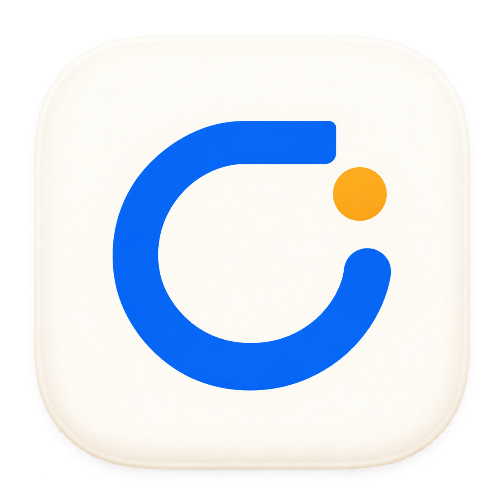

# Codex Top Logo

日期：2026-09-11。用户已确认采用此设计，并要求接入、安装。



蓝色 C 形运行圆环代表 Codex 任务监控，顶部横笔呼应 Top，橙色圆点代表待处理提醒；浅色圆角底板用于 macOS 应用图标。原图由内置 imagegen 生成，1254 × 1254 PNG，保留透明通道。

源资产为 `Resources/AppIcon.png`。打包脚本用 macOS `sips` 等比缩放生成标准 16–1024 px 图标表示，再由 `iconutil` 生成 `AppIcon.icns`，通过 `CFBundleIconFile` 接入应用。生成的 iconset 和 ICNS 属于构建产物。菜单栏与任务状态继续使用现有界面符号。

应用版本维持 `0.1.0`，构建号从 1 增至 2，区分本次图标安装包与已发布包；历史 Release 附件不覆盖。本次只调整应用资源与打包，验证结果见 [Logo 安装验收](../validation/app-icon.md)。

## 原始生成提示词

```text
Use case: logo-brand
Asset type: one original macOS application icon for Codex Top, a native desktop app that monitors coding tasks in a top-of-screen notch, floating panel, and compact running ring.
Primary request: Design a polished, memorable minimalist logo. Make the core mark an original bold circular C-shaped monitoring loop with a deliberate flat horizontal upper terminal, subtly suggesting both a C and the top edge of a screen. A small warm amber circular status dot sits in the open upper-right gap, clearly separated. This is one coherent graphic symbol with very few elements.
Style/medium: precision geometric brand design, crisp vector-like edges, flat symbol, restrained premium macOS icon treatment. Calm, confident, highly legible at 32 pixels.
Composition/framing: a single front-facing app icon, centered on a square 1024 x 1024 canvas; a soft ivory rounded-square macOS icon tile occupies about 88 percent of canvas, ample internal negative space; the thick blue symbol occupies about 60 percent of the tile. Transparent pixels outside the rounded-square tile. No perspective.
Color palette: warm off-white tile, rich cobalt blue monitoring loop, one small muted amber dot. Extremely subtle edge light and very soft shadow for the tile only, mark remains clean and flat.
Constraints: original independent app identity; no OpenAI knot logo, no ChatGPT logo, no existing company logos; no letters rendered as typography, no app name, no text, no mockup scene, no device, no UI widgets, no watermark, no extra symbols. Avoid a generic power-button icon or clock face. Deliver exactly one finished icon, no presentation sheet or alternate options.
```
