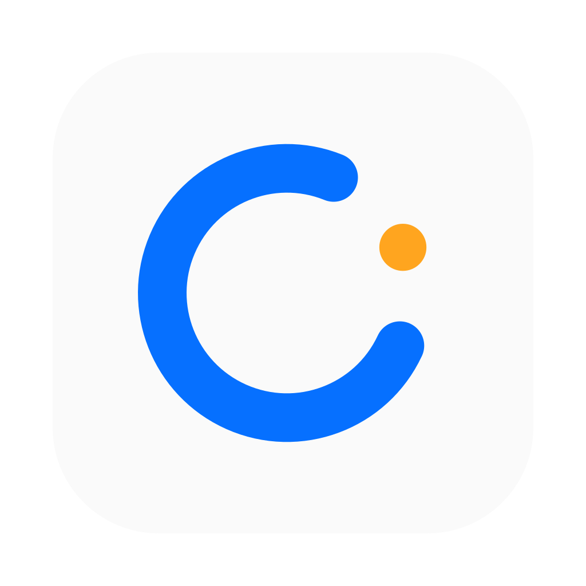

# Codex Top Logo

当前：2026-09-30，采用用户选定的 01 方案，并将橙点下移至开口视觉中间。电脑和手机共用同一矢量几何。



当前蓝色 C 两端均为圆头，橙点位于开口角中心。可编辑源为 `Resources/BrandMark.svg`（透明标志）及 `Resources/AppIcon.svg`（浅色圆角底板），PNG 由 SVG 标准渲染为 1024×1024。方案选择阶段用内置 imagegen 生成参考图；生产源改为矢量，避免位图透明边缘不齐。

打包输入为 `Resources/AppIcon.png`。打包脚本用 macOS `sips` 等比缩放生成标准 16–1024 px 图标表示，再由 `iconutil` 生成 `AppIcon.icns`，通过 `CFBundleIconFile` 接入应用。生成的 iconset 和 ICNS 属于构建产物。菜单栏与任务状态继续使用现有界面符号。

本次 Mac 构建号为 69；历史 0.1.0/build2 的图标接入记录见 [Logo 安装验收](../validation/app-icon.md)，不覆盖历史 Release 附件。当前安装与消息同步修复证据统一见 [当日验收](../validation/native-acceptance-2026-09-30.md)。

当前几何：320视口，C中心(156,160)、半径82、线宽32；蓝色 `#0670FF`。橙点中心(232.2942,129.9469)、半径15.5、颜色 `#FFA51F`，位于开口中心角 -21.5 度。Mac主体约占底板62%；Android adaptive 前景内缩16%，系统遮罩后的标志约占可见图标62%。

Android 12+ 在 Codex 品牌资源层覆盖原 `tg_splash_320.xml`：沿用系统启动入口，圆弧轻微缩放淡入、橙点弹入，最长450ms，无标志底板，不人为延长启动等待。背景继续跟随原版启动主题；约950ms的早期浏览器预览是动作参考，不等于设备实际播放时长。

## 2026-09-30 Android 启动图标留白

用户指出手机桌面的蓝色 C 占比过大，确认缩小主体并安装最新包。原生 Android 的普通与圆形 adaptive icon 仅在 XML 中对前景四边增加 9% 内缩，使蓝色 C 和橙点整体缩至原来的 82%；白色背景、形状和配色保持原样。旧版 legacy 图标已有充足留白，不重复缩放。此调整针对 Android 系统遮罩造成的前景放大，不修改 macOS 原始图标。安装与实机检查见 [当日原生手机验收](../validation/native-acceptance-2026-09-30.md)。

### 早期启动动画预览（历史记录）

用户反馈打开应用仍显示 Telegram 飞机，要求先做动画预览。当前提案复用原有 Codex Top 标志，约950ms：主体轻微上移、淡入并停稳，橙点延迟弹入并短暂亮起；不循环、不添加进度条。预览支持重播和系统减少动态效果偏好，窄屏无横向溢出。仅生成会话内预览，尚未接入 Android 或更新安装包。

同日用户确认去掉启动标志背后的白色圆角底板。已用内置 imagegen 制作透明蓝色 C 与橙点预览素材，去除底板、阴影和边框，保留上述动作及原有显示尺寸；页面背景随宿主浅色/深色主题切换，桌面图标不受影响。两种主题实际渲染确认无白色底板，重播、减少动态效果和320px窄屏检查通过。此修改仍仅限动画预览。

已只读定位飞机为 Android 12+ 启动主题使用的 `tg_splash_320.xml`，与桌面启动图标独立。后续获确认后可在 Codex 专用资源目录覆盖该动画，沿用现有启动主题；本轮未修改该资源，也未改其他页面。

## 原始生成提示词

```text
Use case: logo-brand
Asset type: one original macOS application icon for Codex Top, a native desktop app that monitors coding tasks in a top-of-screen notch, floating panel, and compact running ring.
Primary request: Design a polished, memorable minimalist logo. Make the core mark an original bold circular C-shaped monitoring loop with a deliberate flat horizontal upper terminal, subtly suggesting both a C and the top edge of a screen. A small warm amber circular status dot sits in the open upper-right gap, clearly separated. This is one coherent graphic symbol with very few elements.
Style/medium: precision geometric brand design, crisp vector-like edges, flat symbol, restrained premium macOS icon treatment. Calm, confident, highly legible at 32 pixels.
Composition/framing: a single front-facing app icon, centered on a square 1024 x 1024 canvas; a soft ivory rounded-square macOS icon tile occupies about 88 percent of canvas, ample internal negative space; the thick blue symbol occupies about 60 percent of the tile. Transparent pixels outside the rounded-square tile. No perspective.
Color palette: warm off-white tile, rich cobalt blue monitoring loop, one small muted amber dot. Extremely subtle edge light and very soft shadow for the tile only, mark remains clean and flat.
Constraints: original independent app identity; no OpenAI knot logo, no ChatGPT logo, no existing company logos; no letters rendered as typography, no app name, no text, no mockup scene, no device, no UI widgets, no watermark, no extra symbols. Avoid a generic power-button icon or clock face. Deliver exactly one finished icon, no presentation sheet or alternate options.
```
