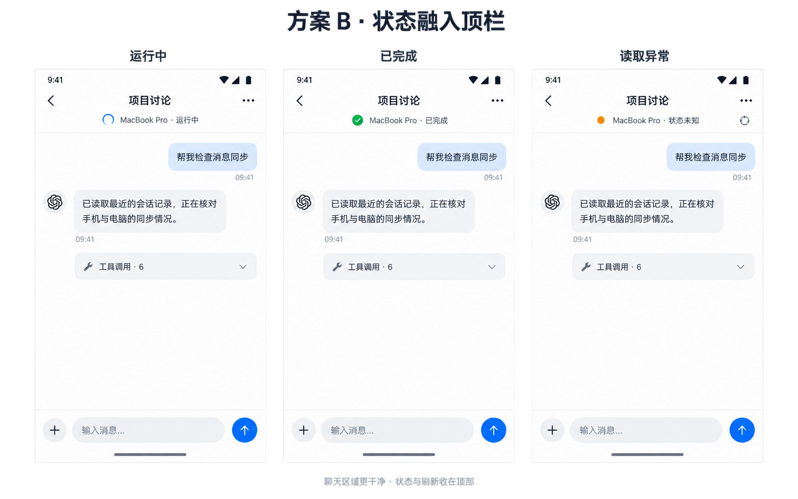

# 对话状态顶栏方案 B

2026-09-25：用户指出底部错误说明、刷新和状态栏堆叠，内容变化使界面尺寸跳动；查看两版设计后明确选择“方案 B：状态放顶部，底部只留输入框”。本页是原手机 UI 设计的局部修订，随既有实施任务继续；不重做消息正文、不新增数据接口。

图为合成视觉参考，运行图标与状态布局为本次确认内容；图中头像、气泡和工具图标不替换现有开放正文方案。静态图不是实际 APK 或动画验收。

## 实施规格

- 标题居中、单行截断；标题下固定一行来源和真实状态，右侧按需显示异常详情、待处理和刷新入口。状态变化不增高顶栏，不推动正文或输入框。
- 底部只保留现有输入区及键盘协同；移除重复状态行和自动展开的大块连接／控制错误。多行输入仍按原规则增长，这与状态导致的跳动分开。
- 点状态或异常入口查看具体原因及重试；待处理入口带真实待办提示，打开现有完整操作说明及允许／拒绝按钮。按钮只提交既有有效请求，不能隐藏已支持能力。
- 状态文字／图标采用短淡入，尊重减少动态效果；不对顶栏高度做动画。触控范围和无障碍文字保留，长电脑名及大字体不得覆盖返回／更多。
- 临时控制读取失败与任务生命周期分开：仍有效的运行事实继续显示；真正缺失或过期则明确未知。不会为了让界面好看而把未知改成完成。
- 复用现有消息、观察、控制与刷新来源，保持唯一键盘布局 owner；不增加后台轮询、协议或依赖。

## 验收

先验证运行／完成／未知与待审批的真实组件行为，再在正式 APK 连续查看顶栏、详情、输入、键盘及返回。记录安装版本，分别说明模拟器、真机、真实审批和合成状态的证据；不得将图片确认或专项通过当成全部功能验收。

## 设计提示词归档

以下是选定图的实施提示词整理，不声称为生成工具原始逐字请求：绘制 Codex Top 安卓对话页三联图，分别为运行中、已完成、读取异常；中文紧凑排版，浅色背景与蓝色强调；标题下同一高度的一行显示电脑与状态，异常详情按需进入；聊天正文与底部输入框位置三图一致，不放大块错误说明和独立刷新卡片，工具调用保持一行折叠。正式实现沿用现有正文、原 Logo、深色模式及轻量动画。
