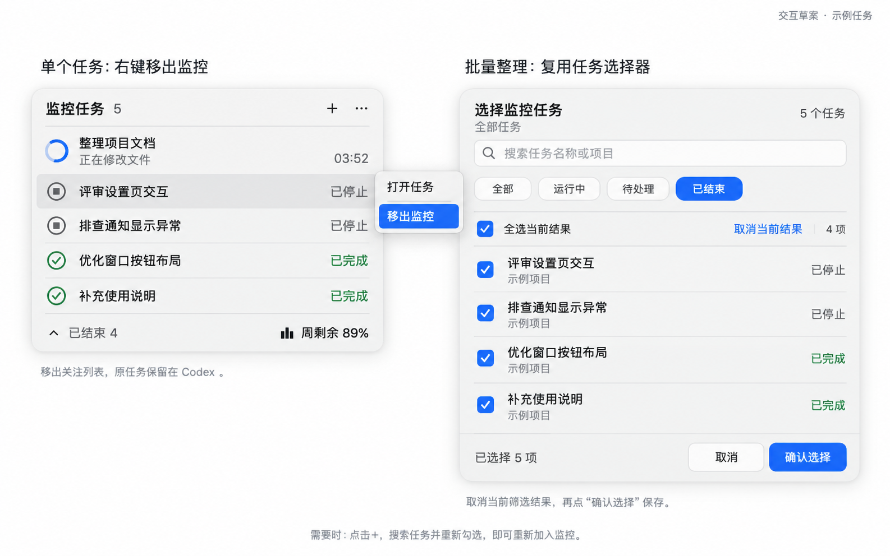

# 任务移出监控：交互方案草案

日期：2026-09-20。状态：**用户随后明确要求“开始实现吧，并解决刚刚的问题”，已在 build 17 实现并验收，build 18 保留**。

用户说明，已停止的任务以后可能不再继续，希望整理不断积累的任务；随后明确要求“你先出方案以及设计图”，并选择“右键手动移出监控”。该选择先确认手动方向；方案展示后，用户给出实施指令。

## 推荐方案

| 场景 | 操作 | 结果 |
| --- | --- | --- |
| 单个任务不再需要关注 | 在任务行右键，选择“移出监控” | 从关注列表移出，计数和面板高度随之更新 |
| 一批结束任务需要整理 | “＋”打开现有选择器，筛选“已结束”，逐项取消勾选，或使用新增的“取消当前结果”，再点“确认选择” | 只保存这次手动修改；筛选范围外的运行、待处理等任务保留 |
| 以后又想关注 | “＋”搜索原任务，重新勾选并确认 | 重新加入监控，恢复正常状态跟踪 |

“已停止”和“已完成”继续表示真实执行状态。是否关注独立于状态，不自动移出停止或完成任务。

“移出监控”只取消 Codex Top 的关注，原任务及内容保留在 Codex。手动移出的任务记入已有排除规则，后续刷新或继续执行时不自动重新加入；用户重新勾选后恢复关注。应用保持对 Codex 数据只读。

## 入口与细节

- 任务行右键菜单包括“打开任务”和“移出监控”；左键仍打开任务。使用普通菜单色，不使用删除图标或破坏性红色。
- 单个移出直接生效，可通过既有“＋”入口重新加入；不添加永久行末按钮，保持紧凑界面。
- 批量整理复用现有选择器、状态筛选和草稿。新增“取消当前结果”明确取消当前筛选结果的勾选，不清空筛选范围外的选择；“取消”放弃草稿，“确认选择”保存。
- “已结束”折叠区继续合并显示停止与完成任务；只整理关注集合，不另造执行状态。
- build 17 起已包含上述右键和批量取消入口。

## 设计图

左图展示 5 个关注任务，其中 1 个运行、4 个已结束；右图仅筛选 4 个已结束任务。右图处于取消勾选之前，因运行任务仍在筛选范围外保持关注，底部“已选择 5 项”是有意保留的总数。

所有任务名均为合成示例，图为内置 imagegen 生成的概念设计，不能作为实机验收证据。生成提示词见 [提示词记录](task-retention-image-prompt.md)。

## 实施与验收

单个移出与重新加入已在真实包核对；批量取消的筛选隔离、草稿取消和重启排除分别有实机与合成回归。见 [实施验收](../validation/task-list-refinement.md)。
