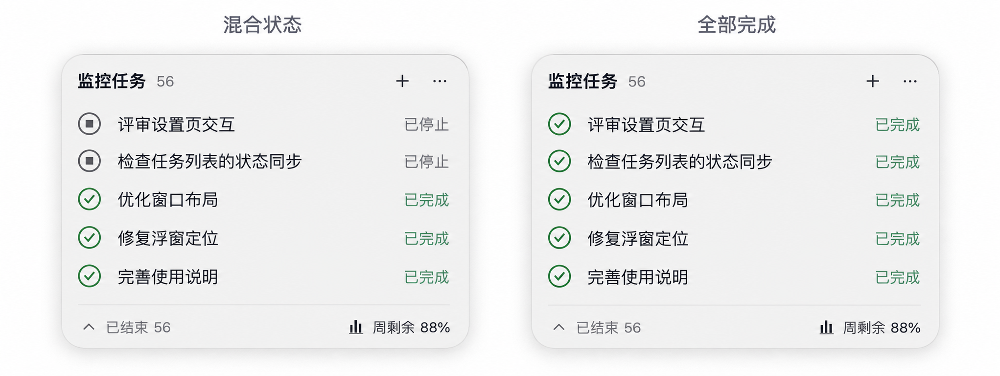

# 任务行视觉草案

日期：2026-09-20。用户要求先看美观度与任务之间的处理。用户随后明确要求开始实现；最终规则已在 build 17 实施并验收，build 18 保留。

## 建议

- 按用户最新建议：只有进行中的任务区域与其他任务区域之间留一条淡横线。各组内部不逐行画线，停止与完成之间也不另加分割线，通过均匀行距形成完整列表。
- 当前单行结束任务的行高先保留 36pt（新 100%（旧 75%）下约 27pt），不靠扩大窗口制造留白。图为放大概念图，像素尺寸不是实施标注。
- 图标中心、任务标题左边、状态右边分别对齐；左右边距一致，同一列的图标尺寸和线宽一致。
- 标题保留强调；任务名由明显粗体降为 regular/medium，状态文字再弱一级。保持原有字号与可读对比度，停止为灰、完成为绿。
- 不使用斑马纹或每行卡片。悬停才显示轻微整行底色。
- 除运行区末尾的分组线外，底栏上方保留一条淡分隔线。没有运行任务或没有其他任务时，不画运行分组线；分组线跟随真实任务边界一起滚动，不固定在视口某个高度。

用户随后提供包含运行任务的截图，建议仅在运行区和其他任务之间分隔。本稿以该最新规则为准；下面的无运行概念图仍然适用，但尚未补画包含运行任务的效果图。

## 滚动位置反馈

用户另反馈有运行任务时上下滚动会出现文字位置变化。初查时两类行高虽已固定，但后续 100 条混合行高的实际视图测试复现了 LazyVStack 滚动时总高度变化 188 点。改为确定高度的 VStack 后回归通过，真实内置与外接屏往返滚动也已核对；逐行线已改为运行区末尾的一条分组线。

验收应区分整行随滚动正常移动与行内相对位置跳动：状态未变时，图标、标题、说明和右侧状态的相对位置与行高应保持稳定；分隔线必须附着在任务分组边界。这是独立于去除逐行横线的检查项，不能宣称改线即修复跳动。

## 设计图

左侧为停止与完成混合，右侧为全部完成。任务名均为合成示例。图片由内置 imagegen 生成，只用于讨论视觉方向，不能作为实机验收。完整提示词见 [生成提示词](task-row-aesthetics-prompt.md)。

右键移出监控仍单独见 [任务整理方案](task-retention-proposal.md)，本稿不增加常驻任务操作按钮。
